# Agent Harness Platform

**现有 OpenCode PDLC 平台的下一代执行架构：保留已建能力、支持无感迁移，新增可组合的专业 Agent 与任务串联。** Coding 能力继续复用 OpenCode，平台层不再与单一 Agent SDK 绑定。

> **架构状态：集成 POC 阶段（LIMITED GO），非生产准入。** 更新依据截至 **2026-10-10**。**当前 Process/Durable SPI 首选实现为 Hatchet Embedded / 私有化集群 + PostgreSQL；DBOS 因许可证约束正式排除（REJECTED），不作为候选或备选。** Hatchet 双 SDK DAG 与两个独立 Engine 的跨 Worker 安全步骤恢复已分别 LIVE PASS；统一平台的 Task Facts 对接、真实模型 SSE、审批、非幂等 Tool Receipt、Cube 恢复和生产隔离仍未整体验收。
> **阅读说明：** 本 README 是项目的**总体方案与项目入口**。正式语义遵循已 Accepted 的 [Architecture Contracts](docs/references/README.md)；正在比较的技术方案、具体实现、历史实验和风险以所链接的专题及 [Backlog](docs/ARCHITECTURE_BACKLOG.md) 为准。本文不将候选方案擅自升级为正式 ADR。

> **当前架构选型与分层图权威增量：** [Hatchet Process/Durable 架构与职责/恢复/部署边界](docs/references/HATCHET_PROCESS_DURABLE_ARCHITECTURE_20261010.md)（候选实施基线，非生产 Accepted ADR）。

> **开发架构护栏：** [G01–G20 架构原则、硬约束和 PR/CI 准入](docs/ARCHITECTURE_GUARDRAILS.md)。开发前从 AGENTS.md 进入；违反 Accepted Contract 必须先经过 ADR，候选选型不得因局部 POC PASS 自动升格。

## 1. 一分钟读懂：为什么做、做什么、现在到哪一步

### 当前建设现状：从一个 Coding Agent 扩展到了多种业务场景

企业内部已建设基于 **OpenCode** 的 PDLC 平台，产品、研发、测试、文档及业务等 Agent **目前统一使用 OpenCode 实现**。这一选择有充分的起步价值：OpenCode 本身是 Coding Agent，在代码阅读、文件修改、Shell、Git、代码执行和研发工具集成方面有成熟能力，帮助现有 PDLC 快速形成可用的 Agent 体验。

但随着应用范围从研发编码扩展到需求分析、结构化文档处理、业务决策、系统协作和审批流程，**OpenCode 以 Coding 为中心的设计逐渐显现适配成本**：一些非 Coding Agent 并不需要完整的文件/Shell 执行环境，却要围绕 OpenCode 的交互和执行模型做额外补充；要实现跨 Agent 编排、持久任务状态及统一治理，还需要持续增强平台外围能力。这不是否定 OpenCode 的编码优势，而是说明**单一 Coding Agent 不适合承担所有业务 Agent 的平台底座职责**。

与此同时，不同 Agent SDK 各有适用领域，合理组合可能比强制统一获得更好的效果：

| Agent 技术 | 相对擅长的方向 | 在新平台中的定位 |
|---|---|---|
| **OpenCode 2** | 代码库分析与修改、Shell/Git、Coding Skills 和研发工具链 | **继续保留**，作为现有 PDLC 的 Coding Runtime |
| **Pydantic AI** | 类型化输入/输出、结构化数据校验、轻量业务 Agent 与工具调用 | 通用业务、文档抽取、规则化结果处理的候选 Runtime |
| **OpenAI Agents SDK** | 工具调用、Agent Handoff、轻量多 Agent 协作与公开扩展接口 | 通用及协作类 Agent 的可选 Runtime |
| **Microsoft Agent Framework（MAF）** | 显式 Workflow/Executor、复杂流程控制与既有 Microsoft 集成 | 工作流型 Agent 和已有系统接入的可选 Runtime |

这里的“擅长”指**SDK 的设计侧重点与可复用能力**，不是已经证明某个 SDK 在所有对应业务的效果都优于其他 SDK；最终效果还取决于模型、Prompt、工具和具体业务验收。相关技术选型与 POC 见[候选技术对比](docs/references/MULTI_HARNESS_TECH_SELECTION_20261009.md)。

### 由此产生的核心问题

1. **单一底座与业务场景不匹配：** 使用 OpenCode 实现所有 Agent，使非编码场景需要越来越多的定制和补丁，长期演进成本上升。
2. **难以发挥专业 SDK 的优势：** Agent 与 OpenCode 的运行模型绑定过深，即使另一套 SDK 更适合某种业务，也难以低成本接入、替换和升级。
3. **缺少平台级任务串联：** 多个 Agent 不只是互相调用一下工具，还需要明确的任务步骤、输入输出交接、验证、审批、失败处理和恢复；这些不能只靠 Prompt/Skill 隐式约定。
4. **执行资源与任务状态耦合：** 轻量业务 Agent 与需要 Shell/Git 的 Coding Agent 采用同样重的执行环境不经济；简单共享宿主机又难以实现工作空间和权限隔离。
5. **已有建设不能丢：** 现有 PDLC 的界面、项目、Agent/Skill/MCP 配置、用户会话和业务资产必须平滑保留。新技术架构如果要求用户重新建立这些内容，就没有达到平台替换的业务目标。

### 我们的答案

**以兼容现有 PDLC 为前提，将平台执行控制从 OpenCode 中解耦：保留其擅长的 Coding 能力，允许不同 Agent 选择合适的 SDK，并由统一 Harness 负责任务串联、状态、恢复和隔离。**

可以把它理解为一套**任务调度台 + 执行记录簿 + 安全工作间租用系统**：

- **调度台（Harness Control Plane）**：记录任务、决定执行顺序、权限、验收、失败处理和恢复。
- **专业执行者（Agent Runtime Adapter）**：使用 Pydantic、OpenAI、OpenCode、MAF 各自擅长的能力做事。
- **工作间（SandboxProvider）**：需要读写文件、运行命令、Git 或编译时才申请 Cube Sandbox；不需要时不占用沙箱。
- **记录簿（PostgreSQL + 对象存储引用）**：保留任务事实、版本、产物与证据；不以某个 SDK 的 Session/Checkpoint 充当唯一任务状态。

**最终目标：** 平台可通过配置 Recipe **串联不同类型的 Agent，形成可验证、可暂停和可恢复的任务**；普通会话共享 Worker，重资源阶段才按需占用隔离沙箱，各 Agent 仅在授权范围内交接工作空间与证据。

**第一期交付原则：存量 PDLC 功能、资产与用户体验不退化，同时提供平台级跨 Agent 串联。** 这是两项独立验收要求，不能仅凭 SDK/Cube 技术 POC 通过就宣布已完成迁移。详见[现有 PDLC 替换与无感迁移设计](docs/references/PDLC_REPLACEMENT_MIGRATION_20261010.md)。

### 当前实际结论

| 判断 | 结论 |
|---|---|
| Cube 真正能提供隔离 MicroVM 与文件/Shell 吗？ | **真实 POC 通过** |
| 一个 Cube 内能运行 OpenCode 2，并创建两个逻辑 V2 Session 吗？ | **真实 POC 通过** |
| Git、文件、Shell 与 Pydantic/OpenAI Tool 能接力吗？ | **真实 POC 通过**；同一 Sandbox、零托管模型调用 |
| 官方 E2B SDK 可直接连接自建 Cube 吗？ | **限定版本通过**：E2B 2.40.0 + 指定 DNS/TLS；2.53.1 创建请求仍 HTTP 405 |
| 两个 Agent SDK 能在统一平台 Run Contract 下运行吗？ | **局部通过**：Pydantic / OpenAI 真实 SDK + 本地确定性模型；Hatchet 真 Engine DAG 顺序交接也已 LIVE PASS |
| Hatchet 多 Engine / PostgreSQL 下 Worker A 强杀、B 接手原 Workflow 吗？ | **真实限定 PASS**：安全步骤、A 不重启、已完成步骤不重复；尚未验证平台同 Run + Cube + 非幂等 Tool 全链 |
| 统一 Agent 运行、真实模型 Token SSE、Tool Receipt、租约接管是否端到端完成？ | **没有**；需继续集成 |
| 可以进入集成开发吗？ | **可以（LIMITED GO）** |
| 可以宣布企业生产上线了吗？ | **不可以（NO-GO）** |

## 2. 这套平台具体怎样工作？

以**研发任务**为例：

> “请分析一个缺陷，修改项目代码，运行测试，生成变更说明，审核后提交。”

| 阶段 | 谁负责 | 平台保留什么 |
|---|---|---|
| 接到用户请求 | 门户 / API / Agent Router | Conversation、Turn、Run、发起人和目标 |
| 制定计划 | Planner / 专业 Agent | 有版本的 Plan、Step、验收标准 |
| 选择执行者 | AgentRuntime SPI | Pydantic / OpenAI / OpenCode 等 Runtime 绑定版本 |
| 分配可执行环境 | SandboxProvider + 外部 Cube | 授权 Scope、Lease、Sandbox ID、WorkspaceRef |
| 读取代码、修改、运行测试 | OpenCode 或其他 Agent，经 Cube 执行 | Attempt、Execution、Tool 调用与实际 Evidence |
| 判断是否完成 | Verifier + Harness 状态机 | Verification、Artifact、失败原因、下一次 Attempt/Replan |
| 审批、暂停或重试 | Harness + Process/Durable SPI（Hatchet Adapter）/ 外部审批输入 | Approval、RecoveryPoint、版本、执行结果及可能的 UNKNOWN 副作用 |
| 返回用户 | Responses-compatible API + SSE | 真实 Text/Activity/Tool/Artifact 事件与可回放序号 |

**一个直观例子：** 产品 Agent 产生需求说明后，研发 Agent 可以在同一**已授权**项目 Workspace 内修改代码，测试 Agent 从相同 Workspace 获取结果继续验证。平台记录“哪一次尝试修改了什么、验证依据是什么”，而不要求三个 Agent 共用一个进程或同一个框架。

### 平台核心业务能力：跨 Agent 串联

**业务目标已经明确：在无感替换现有 PDLC 的同时，让不同专业 Agent 能按步骤串起来完成一项任务。** 首个真实验收应选择现有 PDLC 的需求分析 Agent → 代码实现 Agent → 验证 Agent；同样的机制也能支持文档抽取 → 数据核对 → 业务提交。**PDLC 是优先迁移与验收场景，但串联机制不能写死为 PDLC 专用流程。**

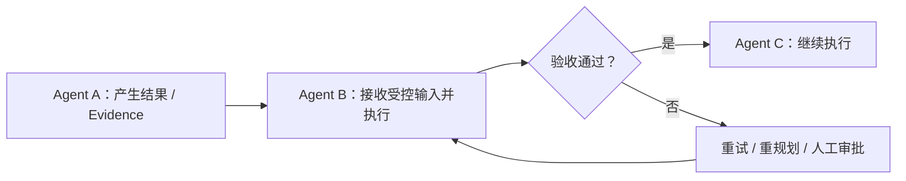

由平台的 **Recipe / Plan / Step** 表达执行依赖及每步的 Runtime 选择；跨 Agent 传递**结构化输出、Artifact/Evidence 引用、必要上下文和受控 WorkspaceRef**，而不是强制共享同一 SDK、OS 进程、完整聊天历史或直接交出 Sandbox ID。交接前需检查输入契约、Scope、权限及冻结版本。

**第一期优先级：** 顺序串联 → 可靠结果交接 → 验收失败阻断/重试 → 审批暂停和任务级恢复。条件分支与独立步骤并行可依同一依赖模型演进；深度递归子 Agent、A2A、完整 BPMN 引擎不作为第一期前提。

**证据边界：** 真实 Cube 上不同 SDK 的 Tool 已能读取同一授权 Workspace；**一个 Run 内由 Harness 按 Recipe 调度 A→B、保存交接事实并完成验收/失败恢复的端到端业务串联尚未实测**，应作为下一阶段 P0 门禁。

> **实施状态提示：** 上表是目标端到端流程，不是声称所有阶段都已被一个统一服务串联。仓库目前包含若干真实专项 POC 和一个最小 Runtime SPI 原型；完整一体化 API/任务执行服务仍属于集成阶段。

## 3. 总体架构：控制平面和执行平面分开

**阅读说明：** 下方在总体架构图和核心组件说明之后，直接展示业务、逻辑、应用、技术、数据、部署、功能与运行架构图（9 张 Mermaid 图）。这些是职责与候选方案的视图，不改变既有 Accepted Contract，也不代表生产能力全部验收。

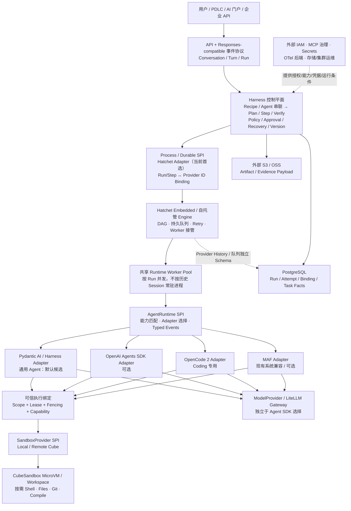

**读图时记住三个“不等于”：**

- **AgentRuntime 不等于 Process/Durable：** Pydantic/OpenCode 负责 Agent 怎么运行；Hatchet 负责持久 DAG、任务队列、重试与 Engine 层 Worker 接管，平台负责 Run/Step/Attempt、审批、Receipt 与恢复裁决。
- **逻辑 Session 不等于 OS 进程，也不等于 Sandbox：** 可以让许多逻辑 Session 由共享 Worker 服务；只有需要实际命令/文件隔离时才拿 Sandbox Lease。
- **Cube 不等于 Harness Control Plane：** Cube 负责启动和销毁 MicroVM，平台负责为什么执行、是否有权限、失败是否允许重试。

### 核心组件及负责范围

| 层 | 平台**拥有**的能力 | 不重复建设的能力 |
|---|---|---|
| API / 协议 | 平台 Run ID、统一事件与客户端进度、重连协议 | 完整聊天前端产品、模型内部推理 |
| Harness Kernel | **Recipe/Step 依赖与 Agent 串联**、Attempt、结果交接/验收、Policy、审批事实、恢复裁决 | 各 SDK 的完整 Agent Loop、重型 BPMN 引擎 |
| AgentRuntime SPI | 能力装配、公开 SDK Adapter、工具执行授权绑定、运行时事件翻译 | 私有 SDK 内核与各 SDK 原生 Session |
| SandboxProvider | 申请/绑定/释放 Sandbox、WorkspaceRef、Scope 和 Lease 检查 | MicroVM 内核、网络、镜像仓库、节点管理 |
| Process / Durable SPI | **Hatchet Adapter（当前首选实现）**：Run/Step 与 Workflow/Task Binding、状态核对/错误映射、领域审批和 Receipt 恢复门禁 | 重造 Hatchet 已有的队列/DAG/重试/调度协调器；把 Hatchet History 当成领域 Task Facts |
| State / Artifact | PostgreSQL 中的任务事实、版本与 Lineage；S3/OSS 引用 | PostgreSQL/OSS 产品本身、备份/DR |
| 外部治理 | 消费 IAM、Secret、MCP、观察性与策略输入 | 企业 IAM、MCP Marketplace、Secret Manager、APM/计费平台 |

详细边界来源：[Control/Data Plane](docs/references/CONTROL_DATA_PLANE.md)、[Harness Scope 对齐](docs/references/HARNESS_SCOPE_ALIGNMENT_REVIEW.md)、[Domain Contract](docs/references/DOMAIN_MODEL_AND_STATE_CONTRACT.md)。


### 3.1 八类分层架构视图

#### 八视图索引与六层逻辑模型

| 架构视图 | 回答的问题 | 明确不表达 |
|---|---|---|
| 业务架构 | 为什么建设、迁移什么、为谁提供价值 | 具体的部署拓扑 |
| 逻辑架构 | 分几层、每层权责、关键依赖与信任边界 | 必须部署六个服务 |
| 应用架构 | 应用模块与公开接口如何协作 | 所有模块已经实现 |
| 技术架构 | SDK/执行器/数据库的候选选择与替换槽位 | 技术候选已成为生产决策 |
| 数据架构 | 领域事实、Payload、外部数据的归属与流转 | 自建完整数据治理产品 |
| 部署架构 | 工作负载、资源、隔离、网络依赖如何布置 | HA/容量已经验收 |
| 功能架构 | 平台应交付的功能能力及 P0 边界 | 重建企业治理平台 |
| 运行架构 | 一次 Run 怎样运行、分配 Sandbox、恢复失败 | 运行拓扑取代业务流程 |

**统一的六层逻辑模型：** L1 业务接入 → L2 协议交互 → L3 Harness 领域控制 → L4 能力装配/Adapter → L5 Agent/Tool 执行 → L6 基础设施与持久化。L3 的 Control Plane 拥有 Run/Step 最终状态裁决；L5 Data Plane 负责真实执行。L6 的 Cube 资源控制面不等于 Harness 控制面。IAM、MCP Governance、Secret、Cost/Quota、观测后端与存储备份均为**外部系统**，不扩张 Harness 职责。

#### 3.1.1 业务架构（Business Architecture）

**两条相互独立的业务目标：** A. 取代现有以 OpenCode 为核心的 PDLC 平台执行架构，兼容现有用户体验、项目、会话、Agent/Skill/Prompt/MCP 等资产；B. 新增专业 Agent 可配置串联，先验收产品 → 研发 → 测试，再扩展文档/业务场景。当前存量专业 Agent 均使用 OpenCode，并非已经运行在多套 SDK 上。

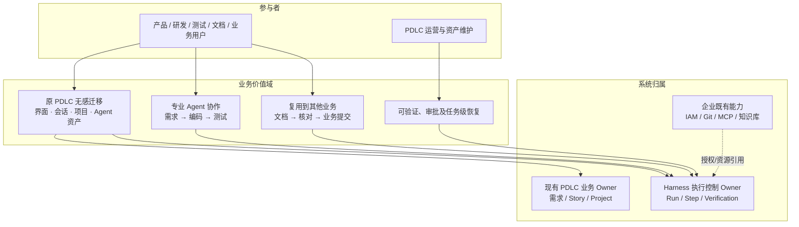

业务价值链为：接收意图 → 保留原产品能力 → 根据 Recipe 串联专业 Agent → 结构化成果交接 → Verification/Approval → 完成或安全恢复 → 回传可追溯 Evidence。迁移采用 M0–M4 灰度、单一 Writer 和回退门禁；**旧 PDLC 等价回归及新 Agent 串联业务 E2E 尚未验收**。

#### 3.1.2 逻辑架构（Logical Architecture）

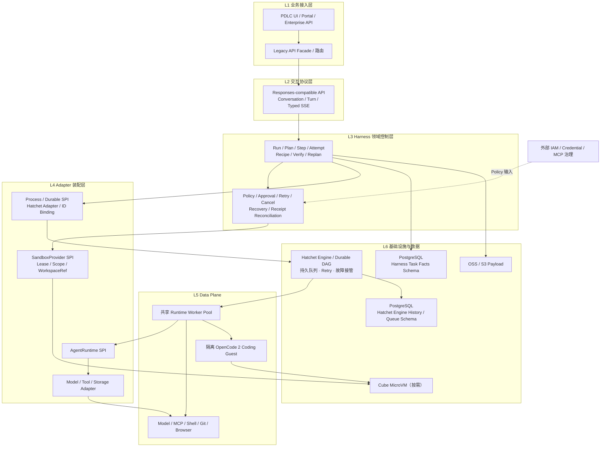

**不变式：** Session ≠ Run ≠ OS Process ≠ Workspace ≠ Sandbox；Runtime Session ID 与 Sandbox ID 是绑定引用而不是权限凭据。AgentRuntime SPI（如何运行 Agent）和 Process/Durable SPI（任务怎样耐久执行）分开；不重写 SDK 内核，不让 Cube 决定 Run 终态。Version/Capability Directory 是逻辑能力，不必建独立注册中心。

#### 3.1.3 应用架构（Application Architecture）

以下是模块/接口图，**不是强制的微服务拆分**。兼容入口和核心 API 可以合部署，Worker 可单独弹性扩容。

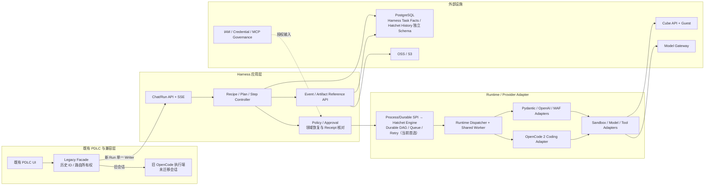

关键公开合同：旧 API 兼容、Responses-compatible + Harness Events、AgentRuntime SPI、Process/Durable SPI、SandboxProvider SPI、Model/Tool Adapter、Artifact/Evidence Reference。旧的 OpenCode Session 不自动等价于已发生的平台 Run，存量消息与执行事实必须分别迁移/核对。

#### 3.1.4 技术架构（Technology Architecture）

这里展示的是**可替换技术槽位**而不是要同时安装全部候选。Python 侧为平台优先，Java 原生不作首轮评分项。

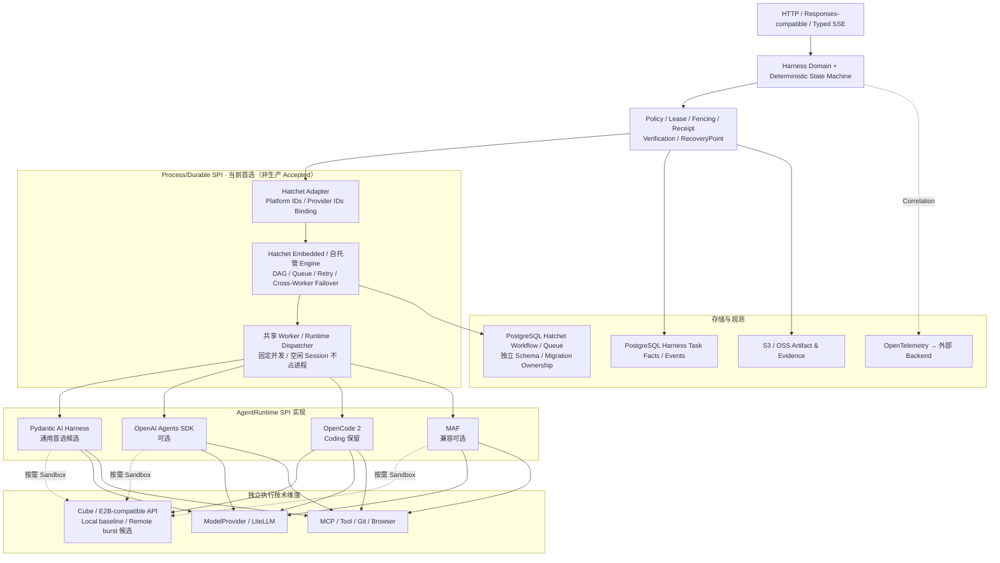

**已知证据与限制：** Hatchet v0.110.5（Python SDK 1.42.1）在真实 Engine、PostgreSQL、双 SDK DAG 与双 Engine 跨 Worker 安全步骤接管均获得**分项 LIVE PASS**，但不是同一 Run 全链 PASS。Cube v0.7.2 + E2B Python 2.40.0 在指定 DNS/TLS 条件下有真实功能 PASS；E2B 2.53.1 创建接口仍 405。平台任务级 Approval / SideEffectReceipt UNKNOWN、真实 Token SSE、可信 Lease/Cube 跨 Worker 重绑和容量仍 OPEN；**DBOS REJECTED，Hatchet 仅为当前实施首选，尚非生产 Accepted**。详见 [Hatchet 架构决议](docs/references/HATCHET_PROCESS_DURABLE_ARCHITECTURE_20261010.md)及[版本矩阵](docs/references/VERIFIED_STACK_BASELINE_20261010.md)。

#### 3.1.5 数据架构（Data Architecture）

平台拥有 Task Facts 与 Metadata，OSS/S3 承载大 Payload；**Hatchet Engine 使用独立 Workflow/Queue History Schema**，平台只存 Provider Workflow/Task ID Binding 与状态核对事实；旧 PDLC 业务数据、Git Revision 和 SDK 原生 Checkpoint 归各自 Owner。

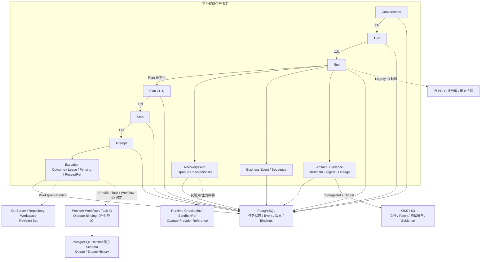

**交接数据合同：** Agent A 的结构化输出通过 Verification，附 ArtifactRef/Digest/Scope/版本信息后才交给 Agent B；不能将整段原生 Chat History 或 Sandbox ID 直接当成可复用可信授权。Run 创建冻结 Recipe/Runtime/Model/Tool/Policy/Environment 版本；UNKNOWN 必须查询 Receipt 或人工对账，不盲重试。业务 Event 是事实；Trace/Log/Metric 是诊断。Harness 只做任务恢复，不做数据库/存储备份和灾备。

#### 3.1.6 部署架构（Deployment Architecture）

私有化**候选拓扑**，不预设 K8s/容器具体节点数与 HA；Local Cube baseline + Remote Cube burst 是目标策略，后者尚未按生产门禁完成验证。

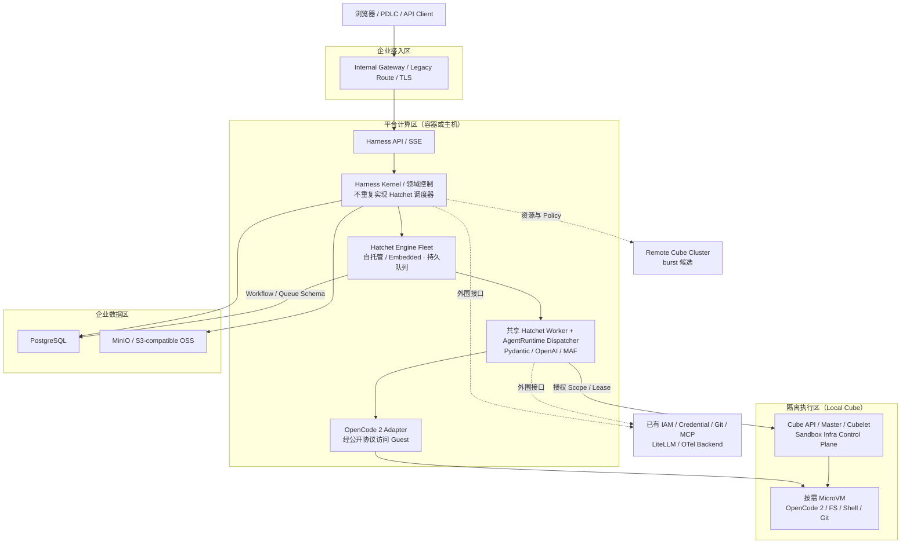

**节省资源和隔离：** 轻量 Agent 可以零 Sandbox；一个共享 Worker 服务多个逻辑 Session，不要求一个历史 Session 永久一个 Agent OS 进程或 Cube。需要 FS/Shell/Git 的 Coding 执行优先 Harness-in-Cube；同 Scope 的多个逻辑 Session 是否复用同 Sandbox 需显式授权，不能跨用户/项目/秘密边界共享。OpenCode 在共享 Host 的原生 Shell **不会**自动随 Session ID 转发到 Cube，这条替代拓扑不能当作生产隔离已通过。环境采用 immutable OCI digest 与版本对照，生产一致性、Burst、容量仍需单独 Gate。

#### 3.1.7 功能架构（Functional Architecture）

业务 Agent 按能力和 Recipe 装配，不为产品/研发/测试/文档/业务分别复制一套 Harness。

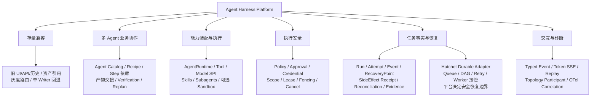

第一期 P0 必须独立通过：① 原 PDLC 真实功能、资产、历史、API、权限回归；② 一个 Run 内至少两个不同 Runtime 按 Recipe 交接 Artifact/Evidence，验证失败阻断下游、审批等待和任务级恢复安全。功能图**不**包含企业 IAM、MCP Marketplace、计费、镜像安全或运维监控产品的自建任务。

#### 3.1.8 运行架构（Runtime Architecture）

运行架构展示**动态时序和恢复决策**；[Runtime Topology Contract](docs/references/RUNTIME_TOPOLOGY.md) 只记录 Participant 身份/生命周期和 OWNS、SPAWNS、RUNS_ON、HANDOFF_TO 等稳定关系，不能取代 Plan/Workflow/Scheduler。

##### 3.1.8.1 正常执行：轻量 Agent → Coding → 测试 Agent

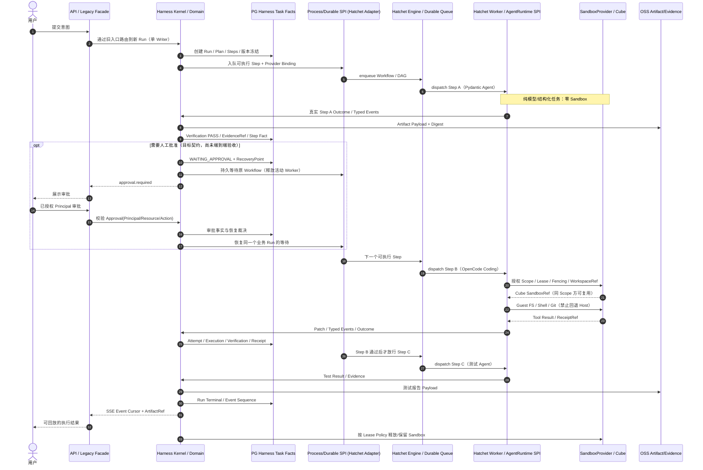

##### 3.1.8.2 故障路径：UNKNOWN 不能直接重试

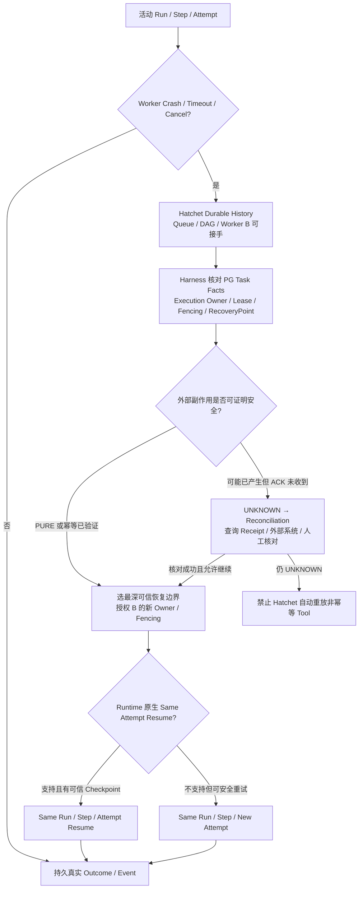

Runtime State、Workspace State、Sandbox State 彼此独立；**Hatchet 的引擎恢复和平台领域恢复分别由 Engine 与 Harness Domain 负责**，不能把两个 Owner 合并。平台只拥有任务级 RecoveryPoint 与 SDK 原生 checkpoint 的 Opaque Reference，不重写框架恢复引擎，不引入跨组件 2PC。Cancel Request 不等于下游已终止。SSE 只能反映真实执行事件。此时序是**目标一体化链路**，现有多个局部 POC 不能拼成一个已经完成的 E2E 生产证据。

#### 3.1.9 跨视图一致性门禁

| 不变式 | 核心视图 | 当前状态 |
|---|---|---|
| 原 PDLC 无感兼容和跨 Agent 串联分别验收 | 业务/应用/功能 | 业务目标已确认，真实 E2E OPEN |
| Conversation → Turn → Run → Plan(vN) → Step → Attempt，Run 终态不重开 | 逻辑/数据/运行 | Accepted Contract |
| AgentRuntime、Process/Durable、SandboxProvider 三个 SPI 相互独立 | 逻辑/应用/技术 | Accepted 边界；Process/Durable 当前首选 Hatchet Adapter（未生产 Accepted） |
| Control Plane 才能最终裁决 Run 状态 | 逻辑/应用/运行 | Accepted Contract |
| 轻量 Agent 零 Sandbox；Coding 默认隔离 | 技术/部署/运行 | 局部 Cube/OpenCode 功能 POC PASS，生产隔离 OPEN |
| Session ID 非授权；Binding 要校验 Scope / Lease / Fencing | 数据/部署/运行 | Accepted 合同；Hatchet 跨 Engine 安全任务接管已 LIVE PASS，平台可信 Lease/Cube 接管仍 OPEN |
| PG 保存任务事实，OSS 保存大 Payload，Native Checkpoint 是 Opaque 引用 | 数据/部署 | Accepted Contract，全链集成 OPEN |
| UNKNOWN → Reconciliation；禁止非幂等盲重试 | 数据/功能/运行 | Accepted Contract，真实回执全链 OPEN |
| IAM / MCP 治理 / Secret / 观测后端 / Backup 不由 Harness 自建 | 全视图 | 明确 Ownership Boundary |

**维护原则：** 新的局部验证结果先更新专项 Findings、Admission、Architecture Backlog；修改 Accepted Contract 须走 ADR，不能仅通过修改本视图产生新决策。
## 4. 为什么采用这样的技术方案？

### 4.1 为什么不是直接选择一个 Agent Framework？

**必要性不是“框架不够强”，而是“框架所处层级不同”。** OpenCode 擅长写代码，Pydantic 擅长轻量、类型化工具及 Agent Run，MAF 擅长特定 Workflow 集成，但它们不应分别拥有整个企业的任务身份、审批事实、执行权限及恢复决策。

| 方案 | 优势 | 代价 / 风险 | 本项目选择 |
|---|---|---|---|
| 直接采用单一 Agent SDK | 启动快、代码少、社区能力可直接使用 | 框架升级与平台主状态强绑定，跨 Coding/业务/测试 SDK 的能力难统一 | **不作为统一 Control Plane**；SDK 作为 Adapter |
| **平台自有小型 Harness Kernel + 多 Adapter** | 状态、权限、证据及协议统一；允许按场景换 Runtime | 需要维护 SPI、测试矩阵和执行正确性 | **当前目标架构候选** |
| 完全自行重写 Agent Loop、Durable、Sandbox | 理论上完全可控 | 重复建设大、复杂度和运维成本高 | **明确不做** |
| 仅用流程编排器或聊天应用 | 对简单固定流程最省事 | 无法自然覆盖多 Runtime、复杂 Coding、执行租约与任务级恢复契约 | 简单场景可直接用，不必全部接入本平台 |

因此本平台的关键原则是：**统一“应该由平台统一的内容”，不统一各专业 Agent 已经做得很好的内部实现。**

### 4.2 Runtime：Pydantic / OpenCode / OpenAI / MAF 各司其职

| 候选 | 优势与适用场景 | 已知不足及取舍 | 当前证据 |
|---|---|---|---|
| **Pydantic AI Harness + Pydantic AI** | 新建通用、产品、文档、测试类 Agent；有公开 Tool、类型化输出、Run-scoped Workspace；适合共享 Worker | Harness 仍是 0.x；内置 E2BSandbox/Coder 对 Cube 的真实路径仍待验 | 基础 Pydantic Agent Tool 真实 Cube PASS；Harness 20 Run/Linux 本地工具 PASS；**默认候选，非正式定案** |
| **OpenCode 2** | 现成 Coding Session/Skills/Subagents、原生 FS/Shell/Git，避免重写 Coding Agent | 在共享 Host 上原生 Shell 不会因 Session ID 自动转发到 Cube；必须选择正确隔离拓扑 | **Harness-in-Cube** 真机双 Session/FS/Shell/Git PASS |
| **OpenAI Agents SDK** | 公开 Runner、Tool/Handoff 与 E2B Client，作为通用可替换 Runtime 选择 | 最新 E2B 客户端与当前 Cube 协议存在版本差异；跨平台状态仍需 Adapter | 公开 Runner 本地模型 PASS、原生 E2B 2.40 真机 PASS |
| **Microsoft Agent Framework（MAF）** | Workflow/Executor、既有系统集成、LiteLLM 真模型、Durable/HITL 局部能力 | 若以它拥有全部控制面，会绑定特定框架和 MSSQL Durable 依赖 | POC-A 有真实证据；**保留独立可选 Adapter，不作统一内核** |

**两个常见误解：** 当前真正执行过基础 Pydantic Agent 的 `@tool` → Cube POC，不等于 **Pydantic AI Harness 自带 E2BSandbox/Coder** 已完整通过；当前 Runtime SPI 中 `OpenCodeV2SessionAdapter` 仅验证了离线的 Session Factory 合同，而 OpenCode V2 在 Cube 内的真实运行通过的是**单独真机脚本**。两份 PASS 不可未经集成就合并成“一体化 Runtime 已完成”。

相关研究：[多 Harness 选型与取舍](docs/references/MULTI_HARNESS_TECH_SELECTION_20261009.md)；[真实 Runtime SPI](poc/runtime_spi/README.md)。

### 4.3 Sandbox：为什么是 Cube？E2B 处于什么位置？

**CubeSandbox 是执行基础设施候选；E2B 是兼容接口/SDK，不是本项目要维护的第二套生产 Sandbox 池。**

| 路线 | 好处 | 局限 | 决策 |
|---|---|---|---|
| 每个 Agent 直接访问宿主机文件和 Shell | 最简单，节省 VM 创建成本 | 不可信代码、不同 Workspace/凭据容易串扰，生产不可接受 | 仅显式低风险开发调试 |
| 每历史 Session 永久一进程 + Sandbox | 会话绑定直观 | 空闲资源高、扩缩容与清理复杂 | **不采用强制 1:1 常驻映射** |
| 共享 Host + 所有 Tool 自动远端执行 | 理论上资源利用好 | OpenCode 原生 FS/Shell/PTY/Git/LSP/插件并未被 Session ID 透明重定向 | OpenCode 路线**未过隔离门禁** |
| **按需 Cube MicroVM + Runtime Adapter** | 执行环境和 Worker 生命周期分离；可以按授权 Scope 复用 | 需要 Guest 镜像、Lease、DNS/TLS、回收与运维；并发隔离仍需验证 | **当前优先方案** |
| Remote Cube / 弹性容量 | 能在本地资源不足时按规则扩容 | 跨地域延迟、网络、模板一致性和成本尚无同负载数据 | 后续候选，不宣称已验 |

对 **Coding Runtime** 采用 **Harness-in-Sandbox**：需要的 OpenCode 服务运行在 Cube Guest 内；平台 Worker 通过公开接口管理它。普通无需 Shell 的 Pydantic/OpenAI Agent 可直接在共享 Worker 中调用模型，**不申请 Sandbox**。

**一个 Sandbox 能挂多逻辑 Session 已被真实证明**；但跨不同用户、项目或安全边界共享同一 Sandbox 的授权策略与安全性**没有**因此通过。共享的前提是同一个已批准的 Isolation Scope，而不只是知道 Sandbox ID。

E2B 官方 SDK 兼容要**按版本说话**：Cube v0.7.2 + `e2b==2.40.0` + `E2B_DOMAIN=cube.app`、专用 DNS 与可信 CA，真实 Files/Commands/原生 OpenAI E2B Client PASS；`e2b==2.53.1` 对 `POST /v2/sandboxes` 返回 405。详见 [完整兼容证据](poc/opencode_sandbox/E2B_PRIVATE_DNS_VERIFICATION_20261010.md)。

### 4.4 Durable：为何以 Hatchet 作为当前首选实现？

Agent 能写文件，并不意味着它能在**Worker 异常退出后正确继续**。经过版本/许可核验与两轮真实 Hatchet Engine CI，目前明确一条实施路线，不再开发手写通用 PG Scheduler，也不以 Temporal/MAF Durable 与 Hatchet 同时维护多套候选实现。

| 方案 | 现阶段定位 | 工程边界 |
|---|---|---|
| **Hatchet Embedded / Self-hosted + PostgreSQL** | **唯一优先实施候选（分项 LIVE PASS，尚未生产 Accepted）** | 复用持久 DAG、任务队列、Worker 派发/故障接管与 Retry；平台自有 Run/Step/Attempt、审批事实、SideEffectReceipt/UNKNOWN 和事件序号 |
| **Temporal OSS / MAF Durable / 手写 PG Worker** | 历史 POC / 备用调研资料，不并行推进 | 若 Hatchet 存在不可接受的新门禁问题，先提出新的架构决策再考虑重启其他方案 |
| **DBOS** | **REJECTED / OUT OF SCOPE** | 自托管 Conductor 多 Executor 涉及商业许可；不再作为备选，不再继续 POC |

**证据切分：** [真实 Hatchet Embedded 双 SDK DAG](https://github.com/Bulls1986/Agent-Harness-Platform/actions/runs/38020725053) 和 [两个独立 Engine 共用外部 PostgreSQL，A 故障 B 接管原 Workflow](https://github.com/Bulls1986/Agent-Harness-Platform/actions/runs/38021093089) 是**两个分别通过的 POC**，不可拼接为“同一业务 Run 已实现跨 Agent、审批、Cube 和非幂等操作完整恢复”。生产缺口仍是 WAITING_APPROVAL、UNKNOWN Receipt → Reconciliation、实时 SSE / Cancel、Cube Lease/Fencing 与资源容量。

**职责切分：** Harness 的 State Machine 和 Task Facts 不由 Hatchet 托管；Hatchet 的 Workflow/Task ID 是独立 Binding，Engine/Queue 数据库历史也不替代平台的 Event/Run 数据表。跨 Worker 恢复必须先经平台 Scope/Execution Owner/Fencing 和 Side Effect Gate；除 PURE/可证明幂等步骤外，禁止让 Hatchet 自动 Retry 外部不可确认副作用。Session 空闲不占 Worker/Agent 进程，不需 Sandbox 的 Agent 不创建 Sandbox。详见 [完整 Hatchet 分层与时序设计](docs/references/HATCHET_PROCESS_DURABLE_ARCHITECTURE_20261010.md)。


### 4.5 Multica 设计参考边界（已决定 ADR-030）

**2026-10-10 已 Accepted 的源码使用边界：** Multica 仅作为 Queue/Worker 生命周期、任务状态、并发与容量治理的**架构思想参考**，不复制、改写、提取或引入其源码/依赖，不采用其 CLI/Daemon 执行层。Harness 的领域状态机、Execution 授权/Lease/Fencing/资源容量规则与对外调度合同由本项目独立设计；**可复用 Hatchet 的开源 Durable Engine、DAG、Queue、Worker 调度与故障接管作为 Process/Durable SPI 的当前实现，不再从零开发这些通用引擎能力。** 两者不冲突：ADR-030 限定的是 Multica 源码和平台自有领域/策略，而 Hatchet 是经独立技术评估选中的 SPI Provider。

这条 ADR **不构成 Hatchet 生产 Accepted ADR**；技术准入继续追踪 [ARCH-TODO-028](docs/ARCHITECTURE_BACKLOG.md)。见 [Multica 设计参考和独立实现决定](docs/references/MULTICA_DESIGN_REFERENCE_DECISION_20261010.md)。

## 5. 平台最重要的设计契约

### 5.1 统一任务语义：Conversation / Turn / Run / Plan / Step / Attempt

```text
Conversation（长期对话）
  └── Turn（一次用户意图）
       └── Run（执行实例；同一次 Turn 可重新运行多次）
            ├── Plan v1 / v2 / ...（重规划保留旧计划）
            │    └── Step（要做什么）
            │         └── Attempt 1 / 2 / ...（第几次尝试）
            ├── RecoveryPoint（安全恢复边界）
            ├── Artifact / Evidence（产物与验证证据）
            └── Terminal Result（终态，不得重开）
```

举例：一次“修复问题”是一个 Run；测试失败后调整计划是新的 Plan Version；重新执行“运行测试”产生新的 Attempt，而不是覆盖上一次失败记录。用户在已完成任务后要求“再优化”，属于新的 Turn/Run。**Framework 原生 Session ID 只是绑定字段，不是平台的 Run ID。**

### 5.2 执行权限：Session ID 不等于授权

一次执行需要可信的 `run_id / execution_id / isolation_scope / owner_id / fencing_token / capabilities` 以及必要的 `SandboxLease`。Worker 换人接管时，旧 Fencing Token 必须失效；未经授权的请求**拒绝执行**，不能“找不到 Sandbox 就在宿主机 Shell 上运行”。

内部企业使用不意味着可以省掉项目、用户、任务或凭据的隔离范围。当前不强制引入外部 SaaS 的 `tenant_id`，但必须保留可验证的 **Isolation Scope**。

现在的 [Runtime SPI 原型](poc/runtime_spi/contract.py) 已有六类错误 Grant 的离线 Fail Closed 验证；**可信 Lease 签发、持久绑定和真实跨 Worker 接管仍未实现**。

### 5.3 失败与恢复：超时不等于可以重试

一次外部 Tool 调用超时后，可能**已经发送成功，只是结果没有传回来**。如果盲目重试“提交 MR”“发送邮件”“支付”会出现重复副作用。

因此恢复策略至少区分：

- **可以确认未执行：** 可以安全重试。
- **已确认成功或失败：** 使用可信 Receipt 更新事实。
- **结果 UNKNOWN：** 先查询/对账；不能自动重新发起非幂等动作。

平台持久化 Run/Attempt/Execution/RecoveryPoint/Receipt **引用与事实**，不是把 PostgreSQL、S3 的磁盘备份或企业级 DR 包揽进来。当前可恢复粒度以实际 Runtime 能力和最后可信恢复点为上限，不承诺精确从中断的任意 Token 原地继续。

详见 [失败/幂等契约](docs/references/FAILURE_IDEMPOTENCY_AND_RECOVERY.md)、[Lease/Fencing](docs/references/EXECUTION_LEASE_FENCING_HEARTBEAT.md)、[任务级恢复](docs/references/TASK_RECOVERY_COVERAGE_AND_SEMANTICS.md)。

### 5.4 工作空间和版本：文件环境与任务状态分开

项目仓库、Workspace/Worktree、Sandbox 不是同一概念。Git 仓库是代码事实来源；Sandbox 只是某个活动执行阶段可以挂载或承载的工作环境。重要变更必须对应 Repository Revision、Patch/Artifact/Evidence 和可追溯的 Run/Attempt。

Run 创建时须冻结 **Recipe、AgentRuntime/Adapter、SDK、Model、Prompt、Policy、Tool、Environment、OCI Digest**。恢复不能自动跟随 `latest`；版本升级只影响后续新 Run。**这项版本冻结语义是 Accepted Contract，但数据库级冻结和升级接管还需实现。**

详见 [Workspace/Git 契约](docs/references/WORKSPACE_AND_GIT_MODEL.md)、[版本冻结契约](docs/references/REGISTRY_AND_VERSIONING.md)。

### 5.5 模型、客户端协议和可观测性

- **模型接入**经 ModelProvider/LiteLLM Gateway，与 Agent SDK 可替换性分开处理；不能把“能换 Pydantic/OpenAI SDK”误称“已经换了第二家模型”。
- **客户端协议**建议 Responses-compatible Item/ContentPart + Harness 任务事件，通过 HTTP + SSE 传递文本、Plan、Tool、Verify、Approval 和 Artifact；WebSocket 留给 Terminal 等需要双向流的场景。
- **真实 Activity**必须源于执行事件，不能由 LLM 编造“正在运行测试”的 UI 文案。
- **OpenTelemetry**用于性能诊断/跨组件 Trace；PostgreSQL Task Facts/Event 才是权威任务事实，不能用 Trace 代替审计状态。

已有 MAF 专项完成**真实 LiteLLM 文本 Delta → PostgreSQL Typed Event → SSE → 第二 HTTP 进程游标回放**的有限 POC；但**当前新 Runtime SPI**仅把两个本地模型 SDK 的完整字符串映射成标记为 `mode=buffered` 的事件，不是真正逐 Token SSE。见 [MAF G3 真实模型证据](poc/maf/G3_LIVE_PROTOCOL_FINDINGS.md) 和 [Runtime SPI 限制](poc/runtime_spi/README.md)。

## 6. 已验证版本：升级不能直接跟随 latest

**版本的唯一权威入口：** [已验证技术栈基线、兼容矩阵、OCI Digest 与 Cube Template](docs/references/VERIFIED_STACK_BASELINE_20261010.md)；[机器可读 JSON](poc/compatibility/verified_stack.json) 与 [防漂移检查](poc/compatibility/verify_stack.py)。

| 已验证组件 | 版本 | 必须记住的限制 |
|---|---|---|
| CubeSandbox Server / Cube SDK | **0.7.2 / 0.7.0** | 自建 WSL2/KVM 的本地 MicroVM POC |
| E2B SDK | **2.40.0** | 需 `cube.app` DNS、可信 CA；**2.53.1 → HTTP 405** |
| OpenAI Agents SDK | **0.23.1** | 与 E2B 2.40 原生 Client / FunctionTool 合约经真机验证 |
| OpenCode 2 / Guest Git | **2.0.24 / 2.39.5** | 专用 Cube Guest，非共享 Host 自动重定向 |
| Pydantic AI Slim / Pydantic AI Harness | **2.54.0 / 0.54.0** | 后者为候选，内置 E2BSandbox/Coder 真机未验 |

真实 Git-enabled Cube Guest 镜像 Manifest：

```text
sha256:9e4bde62fad22f2b22a2bd858ec865e403caccead740d113afc8c9a9e89e284f
```

本地已通过 Template：`tpl-363306ce3b21432cb1ae6536`；该 ID **不跨 Cube 环境通用**。生产需要重新验证可信 Registry、证书、身份授权和 Artifact Digest。

本地只读版本门禁：

```bash
python -B poc/compatibility/verify_stack.py
python -B poc/compatibility/verify_stack.py --self-test
# 已安装特定 SDK 的隔离 venv 中：
python -B poc/compatibility/verify_stack.py --profile cube_e2b_native
```

## 7. 关键 POC：有什么证据，证明到什么程度？

**证据等级：** `LIVE` = 真实服务/设备/SDK 调用；`SDK-LOCAL` = 真实 SDK，但模型/外部系统为本地确定性替身；`DOCKER/CI` = 真实本地进程/容器或 CI，非生产 Cube；`OFFLINE/MOCK` = 合同/路由/失败处理模拟；`GAP` = 未验。**各专项结果不能随意叠加当作完整端到端 PASS。**

| 专项 | 已验证的关键事实 | 未证明 / 证据类型 | 核心材料 |
|---|---|---|---|
| **POC-A：MAF Runtime/Workflow** | 真 LiteLLM 双轮模型；确定性 Plan→Verify→Replan；有限 Workflow/HITL | 作为整个 Harness 主控制面的 G1/G2/G3/G6 不全过；非生产 Accepted（LIVE + fixture） | [MAF 决策型收口](poc/maf/POC_A_DECISION_CLOSEOUT.md) |
| **POC-A：真实模型协议** | 真 LiteLLM → MAF → PG Event → HTTP Token SSE → 跨进程游标重放 | 仅受限文本，不是统一新 Runtime SPI 或完整 Responses（LIVE） | [G3 报告](poc/maf/G3_LIVE_PROTOCOL_FINDINGS.md) |
| **POC-A：恢复** | MSSQL TaskHub Worker 接管、Approval 与未知副作用安全阻断的受控验证 | 真实外部业务的全部 Receipt / HA 未验（局部 LIVE） | [恢复矩阵](docs/POC_A_RECOVERY_MATRIX.md)、[POC-A Findings](docs/POC_A_STAGE_FINDINGS.md) |
| **POC-C：Temporal** | Temporal OSS + PG 的 Workflow/Worker、故障与 Replay，HITL/UNKNOWN 控制点 | PG Worker 与 Temporal 同负载成本/所有恢复窗口尚未等价比较（LIVE/CI） | [C14 技术比较](poc/temporal/C14_COMPARATIVE_DECISION.md) |
| **POC-C：Runtime 可替换** | MAF 与 OpenAI SDK 分别使用真实内网 LiteLLM 完成受限 SDK 替换 | 同一模型网关；不等于跨 Provider Swap（LIVE） | [C09](poc/temporal/C09_REAL_RUNTIME_FINDINGS.md) |
| **POC-C：Artifact/Evidence** | Docker 执行模式切换 + 真实 S3 Artifact、SHA256/Lineage/Tombstone | 不等于 Cube↔Docker 两种生产沙箱已通过（Docker/CI） | [C11](poc/temporal/C11_SANDBOX_ARTIFACT_FINDINGS.md) |
| **POC-C：可观测性** | 原生 Temporal OTel 与 Harness IDs 关联 | 不是生产 OTel Collector/APM 性能测试（LIVE/CI） | [C13](poc/temporal/C13_OTEL_FINDINGS.md) |
| **Pydantic AI Harness 并发** | 共享 Agent 20 个并发 Run、Run 级工具路由；Linux 本地双 Workspace 真执行 | E2B WorkspaceRef 连接仍有 Mock，非 100 人负载或安全隔离（OFFLINE/CI） | [Pydantic Findings](poc/pydantic_harness/README.md) |
| **Cube MicroVM / OpenCode 2** | 真 Cube Template READY；一台 VM、两个 OpenCode V2 Session、FS/Shell/Git、重连与销毁 | 零远程模型；生产多 Scope、安全、容量未验（LIVE） | [Cube/OpenCode V2 全验收](poc/opencode_sandbox/opencode2_cube_template/VERIFICATION_20261010.md) |
| **跨 SDK Tool 接力** | Pydantic Agent Tool、OpenAI FunctionTool 读取同一 Cube Workspace 的 OpenCode 文件 | 公开 Tool Bridge，不是多 SDK 模型 Agent Loop 或原生 SDK 跨 Worker 恢复（LIVE） | [同 VM 验收](poc/opencode_sandbox/opencode2_cube_template/VERIFICATION_20261010.md)、[Pydantic 原生工具](poc/pydantic_harness/README.md) |
| **E2B 原生 Client** | Cube + E2B 2.40 的真实 FS/Shell/双沙箱隔离，OpenAI Native E2BSandboxClient create/exec/aclose | E2B 2.53.1 仍 405；生产 TLS/IAM 未验（LIVE） | [E2B DNS/CA 报告](poc/opencode_sandbox/E2B_PRIVATE_DNS_VERIFICATION_20261010.md) |
| **平台 Runtime SPI 原型** | 真实 Pydantic/OpenAI SDK Run 的归一化输出；Scope/Fencing/Grant 错误拒绝、Cancel UNKNOWN | 事件仅 buffered；OpenCode Session SPI 为 Mock，未落 PG Receipt（SDK-LOCAL/OFFLINE） | [Runtime SPI](poc/runtime_spi/README.md) |
| **Hatchet Engine 双 SDK DAG** | Embedded v0.110.5、Pydantic→OpenAI Agents SDK 真实公开 API/父子任务交接 | 本地确定性模型，不是远程真模型，也未验证 Token SSE/Cube（LIVE/CI） | [CI PASS](https://github.com/Bulls1986/Agent-Harness-Platform/actions/runs/38020725053) |
| **Hatchet 双 Engine 自动接管** | 外部 PostgreSQL 16，A 第二步中 SIGKILL 且不重启；B 接管原 Workflow，已完成步骤不重复 | 安全可重试步骤，未验证 Receipt/Approval/复杂 Agent/Cube（LIVE/CI） | [CI PASS](https://github.com/Bulls1986/Agent-Harness-Platform/actions/runs/38021093089) |
| **版本防漂移** | 已通过版本/负例、镜像 Digest/Template 证据校验；实际虚拟环境 SDK Pin Check | 不等于跨生产集群镜像供应链/不可变安装包锁定（OFFLINE/ENV） | [版本基线](docs/references/VERIFIED_STACK_BASELINE_20261010.md) |

### 特别值得保留的“失败证据”

失败能避免下一次走弯路：**Cube v0.7.2 与 E2B 2.53.1 的创建路径 HTTP 405**；OpenCode 在共享 Host 的原生 Shell 不会随 Session 迁往 Cube；第一次 Cube Guest `BUILDING_EXT4 40%` 由于 WSL/systemd 关停导致 `context canceled` 且失败回调丢失；原 Jupyter 启动路径曾触发端口健康超时，后改成 envd + 轻量 Probe 并成功 READY。这些既说明**为什么当前做法必要**，也定义了不能回退的约束。

详细参见 [Cube 故障 RCA](poc/opencode_sandbox/opencode2_cube_template/INCIDENT_20261009.md)、[全版本兼容专项](poc/opencode_sandbox/CUBE_E2B_COMPATIBILITY_FINDINGS.md)。

## 8. 仓库结构：哪里是正式契约、哪里是 POC？

```text
/
├─ README.md                         ← 当前架构总方案与项目入口
├─ AGENTS.md                         ← 开发/架构边界与变更约束
├─ docs/
│  ├─ ARCHITECTURE.md                ← 已接受 V1 架构及历史基线（详细）
│  ├─ POC.md                         ← 首轮 POC 范围/统一硬门禁（保留）
│  ├─ ARCHITECTURE_BACKLOG.md        ← 当前待办与待决策唯一清单
│  ├─ README.md                      ← 文档导航
│  └─ references/                   ← Accepted Contracts / 讨论 / 技术决策
└─ poc/
   ├─ maf/                          ← POC-A：MAF/Workflow/MSSQL/PG/真实模型
   ├─ temporal/                     ← POC-C：Temporal/PG/S3/重放/恢复/OTel
   ├─ pydantic_harness/             ← 并发与 Workspace/Pydantic Tool
   ├─ opencode_sandbox/             ← Cube/OpenCode/E2B SDK/Guest 真机
   ├─ runtime_spi/                  ← 最小平台 Runtime Contract 与 Adapter
   ├─ durable_engine/               ← Hatchet Embedded 双 SDK/DAG 与双 Engine 真实 PG 恢复 POC
   ├─ compatibility/                ← 已验证版本、Digest 与防漂移验证
   └─ README.md                     ← POC 命令、状态、入口
```

> **重要：** 当前仓库主体是**架构契约 + 分阶段验证实现**，而不是已经上线的一套完整平台服务。源代码是否真实对接在各自 POC 的 `--live`/环境门禁与报告中明示。新业务功能应遵循 [AGENTS.md](AGENTS.md) 与 [Accepted Contract 索引](docs/references/README.md)，不要把实验脚本直接当成生产实现。

## 9. 下一阶段怎么集成？按门禁推进，而不是一次建设所有外围平台

| 顺序 | 交付重点 | 完成标准（必须用证据证明） | 状态 |
|---|---|---|---|
| **P0 / 029** | **现有 OpenCode PDLC 无感替换** | 真实现网功能/API/历史会话/项目/Agent与 Skill/MCP/Workspace 清单；原入口和权限兼容、灰度接管、禁止副作用双写，回退演练通过 | **业务目标确定；现网源码与数据迁移尚未验收** |
| **P0 / 025** | **跨 Agent 串联 + AgentRuntime SPI + 执行 API** | 一个 Run 中至少两个不同 Runtime 按 Recipe/Step 串联，Artifact/Evidence 交接可追踪；失败阻断/重试/审批暂停和真正 Token SSE | **Tool 接力真机通过；统一业务串联待集成** |
| **P0 / 025–027** | SandboxProvider/Execution Lease 集成 | 从可信 Scope 签发 Lease、绑定 Workspace、同 Sandbox 接力；未知/过期/跨 Scope 拒绝；无执行需求不申请 Sandbox | **原生 Cube 功能已过；平台授权集成未过** |
| **P0 / 026** | E2B 版本兼容与原生 SDK 续连 | 固定 2.40 已验组合；补官方 `connect(same_id)`、Pydantic Harness E2B Coder 和生产 DNS/TLS 契约；2.53 明确不支持或升级 Cube | **2.40 最小 LIVE PASS / 后续 OPEN** |
| **P0 / 028** | **Hatchet Process/Durable SPI + Task Facts / RecoveryPoint / Receipt** | Hatchet 两 Engine 故障接管已过；继续同 Run 的 HITL、非幂等 UNKNOWN 对账、Scope/Lease/Fencing、资源回收和 Cube 接力，禁止并行重造 Scheduler | **真实 Hatchet DAG/跨 Engine 安全接管分项 LIVE PASS；统一新链路未验** |
| **P1** | 真实模型/协议/全场景验收 | LiteLLM 真模型→当前 Runtime SPI→真正逐 Token SSE/Tool/Artifact；Snapshot/Last-Event-ID/Cancellation 完整核对 | **MAF 专项有受限实证，新链路待集成** |
| **P1** | 上线门禁与容量 | 目标约 100 人并发场景下 Worker/Sandbox 数、启动耗时、P95、失败回收、隔离负例、镜像与证书部署检查 | **未进行新架构等价压测，不虚构指标** |

**不建议**此时增加第二套自建 MCP Marketplace、IAM、Quota/Billing、MicroVM Control Plane、对象存储备份或 APM 产品。这些由已有企业系统提供，Harness 只定义必要接入点。否则会把“建设 Harness Platform”扩张成“重做所有企业基础设施”。

验收与决策持续记录到 [Architecture Backlog](docs/ARCHITECTURE_BACKLOG.md)；准入状态看 [分层 GO/NO-GO](docs/references/MULTI_HARNESS_ADMISSION_20261009.md)。

## 10. 决策状态与仍需确认的业务取舍

**已经确认或由 Accepted Contract 冻结的：** 厂商无关、平台拥有 Run/Plan/Step/Attempt/RecoveryPoint 事实；Coding 默认隔离；Runtime/Sandbox/Model 解耦；只做任务级恢复而非底层灾备；E2B 兼容作为 Cube 对外接口；仅按需使用沙箱；内部系统不必引入 SaaS 租户模型；版本创建时冻结；生产不能把工具权限授权给 Session ID 本身。

**当前是优先候选、尚非 Accepted ADR 的：** 通用 Agent 默认使用 Pydantic AI Harness；Coding 使用 OpenCode 2 Harness-in-Cube；Cube 作为 SandboxProvider；Process/Durable 优先使用 Hatchet（DBOS 已排除）；以及是否在某些受限 Runtime 使用共享 Host + Remote Sandbox Tool Adapter。

**需要业务方最终明确的取舍**（不阻断现有架构/POC 收口）：

1. **业务目标已确认：替换既有 OpenCode PDLC 并实现已有能力无感迁移，同时新增可复用的跨 Agent 串联。** 需要从旧 PDLC 的现网源码和正式功能盘点中确定迁移等价基线及第一个真实串联验收任务，不能只使用新建 Demo 证明成功。
2. **恢复目标到什么粒度？** 当前 Accepted 定位为任务级恢复，但需要业务确认“从最近 Step/RecoveryPoint 继续”是否足够，还是某些交互式 Coding 场景必须做到更细粒度恢复。
3. **100 人并发的含义？** 是同时保持 100 个逻辑 Session，还是同时有 100 个执行模型/代码/测试的活动任务？两者决定非常不同的资源与容量规划；未测之前不填容量结论。

这些问题不改变 **核心技术 POC 已打通、可进入集成** 的判断，但会影响第一期系统边界、实际开发量及最终生产门禁。

---

### 继续阅读 / 评审资料

- **正式语义**：[V1 领域/状态契约](docs/references/DOMAIN_MODEL_AND_STATE_CONTRACT.md) · [失败与副作用](docs/references/FAILURE_IDEMPOTENCY_AND_RECOVERY.md) · [执行租约](docs/references/EXECUTION_LEASE_FENCING_HEARTBEAT.md) · [恢复](docs/references/TASK_RECOVERY_COVERAGE_AND_SEMANTICS.md) · [版本](docs/references/REGISTRY_AND_VERSIONING.md)
- **最新候选图与技术取舍**：[2026-10-09 多 Harness 目标架构](docs/references/MULTI_HARNESS_TARGET_ARCHITECTURE_20261009.md) · [候选比较](docs/references/MULTI_HARNESS_TECH_SELECTION_20261009.md)
- **准入和复验**：[POC 全入口](poc/README.md) · [阶段性 GO/NO-GO](docs/references/MULTI_HARNESS_ADMISSION_20261009.md) · [锁定版本与兼容矩阵](docs/references/VERIFIED_STACK_BASELINE_20261010.md)
- **历史详细方案与全部研究**：[V1 架构与契约](docs/ARCHITECTURE.md) · [原始 POC 验证范围](docs/POC.md) · [References 索引](docs/references/README.md)