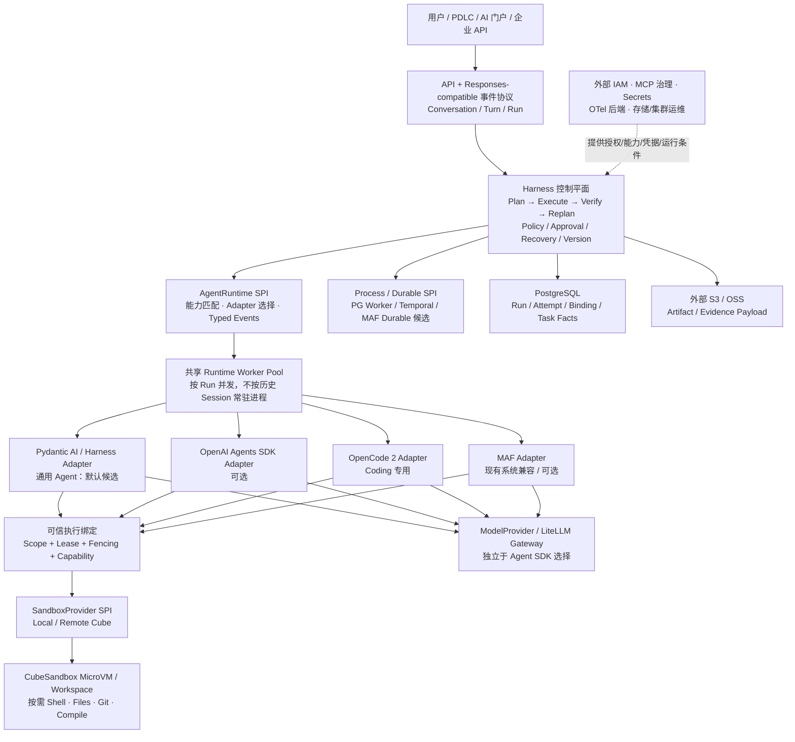

# Agent Harness Platform

**面向企业内部 AI Agent 的统一执行与任务恢复平台。** 让不同 Agent 框架可以使用同一套任务记录、执行权限、工作空间、工具和沙箱，而不必把整个平台绑定到某一家 SDK。

> **架构状态：集成 POC 阶段（LIMITED GO），非生产准入。** 更新依据截至 **2026-10-10**。已证明关键技术路径可运行；统一平台的持久化、真实模型全链、跨 Worker 恢复、生产级隔离尚未整体验收。
> **阅读说明：** 本 README 是项目的**总体方案与项目入口**。正式语义遵循已 Accepted 的 [Architecture Contracts](docs/references/README.md)；正在比较的技术方案、具体实现、历史实验和风险以所链接的专题及 [Backlog](docs/ARCHITECTURE_BACKLOG.md) 为准。本文不将候选方案擅自升级为正式 ADR。

## 1. 一分钟读懂：为什么做、做什么、现在到哪一步

### 我们遇到的问题

企业内部逐渐出现产品、研发、测试、文档和业务 Agent。它们可能分别使用 Pydantic AI、OpenAI Agents SDK、OpenCode 或 Microsoft Agent Framework（MAF）。

如果每个 Agent 都各自处理聊天历史、文件目录、Shell、审批和故障恢复，就会产生三个问题：

1. **能力重复建设：** 每套 Agent 都重做执行环境、任务状态和 UI 事件。
2. **协作割裂：** 产品 Agent 的结果难以安全地交给研发/测试 Agent；切换框架容易丢失上下文或执行证据。
3. **成本与风险：** 如果每个历史会话长期占用独立 Agent 进程/沙箱，资源浪费；如果所有 Agent 共用宿主机 Shell，又缺少执行隔离与可恢复性。

### 我们的答案

**不再自研一个包揽所有功能的 Agent SDK，而是建设各 Agent SDK 之上的“执行控制层”。**

可以把它理解为一套**任务调度台 + 执行记录簿 + 安全工作间租用系统**：

- **调度台（Harness Control Plane）**：记录任务、决定执行顺序、权限、验收、失败处理和恢复。
- **专业执行者（Agent Runtime Adapter）**：使用 Pydantic、OpenAI、OpenCode、MAF 各自擅长的能力做事。
- **工作间（SandboxProvider）**：需要读写文件、运行命令、Git 或编译时才申请 Cube Sandbox；不需要时不占用沙箱。
- **记录簿（PostgreSQL + 对象存储引用）**：保留任务事实、版本、产物与证据；不以某个 SDK 的 Session/Checkpoint 充当唯一任务状态。

**最终目标：** 平台可以承载不同类型的 Agent，普通会话共享有限 Worker 资源，需要重资源执行的阶段才占用隔离沙箱；各 Agent 可以在授权范围内复用同一工作空间与证据。

### 当前实际结论

| 判断 | 结论 |
|---|---|
| Cube 真正能提供隔离 MicroVM 与文件/Shell 吗？ | **真实 POC 通过** |
| 一个 Cube 内能运行 OpenCode 2，并创建两个逻辑 V2 Session 吗？ | **真实 POC 通过** |
| Git、文件、Shell 与 Pydantic/OpenAI Tool 能接力吗？ | **真实 POC 通过**；同一 Sandbox、零托管模型调用 |
| 官方 E2B SDK 可直接连接自建 Cube 吗？ | **限定版本通过**：E2B 2.40.0 + 指定 DNS/TLS；2.53.1 创建请求仍 HTTP 405 |
| 两个 Agent SDK 能在统一平台 Run Contract 下运行吗？ | **局部通过**：Pydantic / OpenAI 真实 SDK + 本地确定性模型 |
| 统一 Agent 运行、真实模型 Token SSE、Tool Receipt、租约接管是否端到端完成？ | **没有**；需继续集成 |
| 可以进入集成开发吗？ | **可以（LIMITED GO）** |
| 可以宣布企业生产上线了吗？ | **不可以（NO-GO）** |

## 2. 这套平台具体怎样工作？

以**研发任务**为例：

> “请分析一个缺陷，修改项目代码，运行测试，生成变更说明，审核后提交。”

| 阶段 | 谁负责 | 平台保留什么 |
|---|---|---|
| 接到用户请求 | 门户 / API / Agent Router | Conversation、Turn、Run、发起人和目标 |
| 制定计划 | Planner / 专业 Agent | 有版本的 Plan、Step、验收标准 |
| 选择执行者 | AgentRuntime SPI | Pydantic / OpenAI / OpenCode 等 Runtime 绑定版本 |
| 分配可执行环境 | SandboxProvider + 外部 Cube | 授权 Scope、Lease、Sandbox ID、WorkspaceRef |
| 读取代码、修改、运行测试 | OpenCode 或其他 Agent，经 Cube 执行 | Attempt、Execution、Tool 调用与实际 Evidence |
| 判断是否完成 | Verifier + Harness 状态机 | Verification、Artifact、失败原因、下一次 Attempt/Replan |
| 审批、暂停或重试 | Harness / 外部审批输入 / Durable Adapter | Approval、RecoveryPoint、版本、执行结果及可能的 UNKNOWN 副作用 |
| 返回用户 | Responses-compatible API + SSE | 真实 Text/Activity/Tool/Artifact 事件与可回放序号 |

**一个直观例子：** 产品 Agent 产生需求说明后，研发 Agent 可以在同一**已授权**项目 Workspace 内修改代码，测试 Agent 从相同 Workspace 获取结果继续验证。平台记录“哪一次尝试修改了什么、验证依据是什么”，而不要求三个 Agent 共用一个进程或同一个框架。

> **实施状态提示：** 上表是目标端到端流程，不是声称所有阶段都已被一个统一服务串联。仓库目前包含若干真实专项 POC 和一个最小 Runtime SPI 原型；完整一体化 API/任务执行服务仍属于集成阶段。

## 3. 总体架构：控制平面和执行平面分开



**读图时记住三个“不等于”：**

- **AgentRuntime 不等于 Process/Durable：** Pydantic/OpenCode 负责 Agent 怎么运行；Temporal/Worker 负责任务怎样持久地等待、重试和恢复。
- **逻辑 Session 不等于 OS 进程，也不等于 Sandbox：** 可以让许多逻辑 Session 由共享 Worker 服务；只有需要实际命令/文件隔离时才拿 Sandbox Lease。
- **Cube 不等于 Harness Control Plane：** Cube 负责启动和销毁 MicroVM，平台负责为什么执行、是否有权限、失败是否允许重试。

### 核心组件及负责范围

| 层 | 平台**拥有**的能力 | 不重复建设的能力 |
|---|---|---|
| API / 协议 | 平台 Run ID、统一事件与客户端进度、重连协议 | 完整聊天前端产品、模型内部推理 |
| Harness Kernel | Plan/Step/Attempt 状态、Verify/Replan、Policy、审批事实、恢复裁决 | 各 SDK 的完整 Agent Loop |
| AgentRuntime SPI | 能力装配、公开 SDK Adapter、工具执行授权绑定、运行时事件翻译 | 私有 SDK 内核与各 SDK 原生 Session |
| SandboxProvider | 申请/绑定/释放 Sandbox、WorkspaceRef、Scope 和 Lease 检查 | MicroVM 内核、网络、镜像仓库、节点管理 |
| Process / Durable SPI | 统一任务事实、恢复点引用、执行结果/副作用语义 | 重造 Temporal/MAF 的 History/Scheduler |
| State / Artifact | PostgreSQL 中的任务事实、版本与 Lineage；S3/OSS 引用 | PostgreSQL/OSS 产品本身、备份/DR |
| 外部治理 | 消费 IAM、Secret、MCP、观察性与策略输入 | 企业 IAM、MCP Marketplace、Secret Manager、APM/计费平台 |

详细边界来源：[Control/Data Plane](docs/references/CONTROL_DATA_PLANE.md)、[Harness Scope 对齐](docs/references/HARNESS_SCOPE_ALIGNMENT_REVIEW.md)、[Domain Contract](docs/references/DOMAIN_MODEL_AND_STATE_CONTRACT.md)。

## 4. 为什么采用这样的技术方案？

### 4.1 为什么不是直接选择一个 Agent Framework？

**必要性不是“框架不够强”，而是“框架所处层级不同”。** OpenCode 擅长写代码，Pydantic 擅长轻量、类型化工具及 Agent Run，MAF 擅长特定 Workflow 集成，但它们不应分别拥有整个企业的任务身份、审批事实、执行权限及恢复决策。

| 方案 | 优势 | 代价 / 风险 | 本项目选择 |
|---|---|---|---|
| 直接采用单一 Agent SDK | 启动快、代码少、社区能力可直接使用 | 框架升级与平台主状态强绑定，跨 Coding/业务/测试 SDK 的能力难统一 | **不作为统一 Control Plane**；SDK 作为 Adapter |
| **平台自有小型 Harness Kernel + 多 Adapter** | 状态、权限、证据及协议统一；允许按场景换 Runtime | 需要维护 SPI、测试矩阵和执行正确性 | **当前目标架构候选** |
| 完全自行重写 Agent Loop、Durable、Sandbox | 理论上完全可控 | 重复建设大、复杂度和运维成本高 | **明确不做** |
| 仅用流程编排器或聊天应用 | 对简单固定流程最省事 | 无法自然覆盖多 Runtime、复杂 Coding、执行租约与任务级恢复契约 | 简单场景可直接用，不必全部接入本平台 |

因此本平台的关键原则是：**统一“应该由平台统一的内容”，不统一各专业 Agent 已经做得很好的内部实现。**

### 4.2 Runtime：Pydantic / OpenCode / OpenAI / MAF 各司其职

| 候选 | 优势与适用场景 | 已知不足及取舍 | 当前证据 |
|---|---|---|---|
| **Pydantic AI Harness + Pydantic AI** | 新建通用、产品、文档、测试类 Agent；有公开 Tool、类型化输出、Run-scoped Workspace；适合共享 Worker | Harness 仍是 0.x；内置 E2BSandbox/Coder 对 Cube 的真实路径仍待验 | 基础 Pydantic Agent Tool 真实 Cube PASS；Harness 20 Run/Linux 本地工具 PASS；**默认候选，非正式定案** |
| **OpenCode 2** | 现成 Coding Session/Skills/Subagents、原生 FS/Shell/Git，避免重写 Coding Agent | 在共享 Host 上原生 Shell 不会因 Session ID 自动转发到 Cube；必须选择正确隔离拓扑 | **Harness-in-Cube** 真机双 Session/FS/Shell/Git PASS |
| **OpenAI Agents SDK** | 公开 Runner、Tool/Handoff 与 E2B Client，作为通用可替换 Runtime 选择 | 最新 E2B 客户端与当前 Cube 协议存在版本差异；跨平台状态仍需 Adapter | 公开 Runner 本地模型 PASS、原生 E2B 2.40 真机 PASS |
| **Microsoft Agent Framework（MAF）** | Workflow/Executor、既有系统集成、LiteLLM 真模型、Durable/HITL 局部能力 | 若以它拥有全部控制面，会绑定特定框架和 MSSQL Durable 依赖 | POC-A 有真实证据；**保留独立可选 Adapter，不作统一内核** |

**两个常见误解：** 当前真正执行过基础 Pydantic Agent 的 `@tool` → Cube POC，不等于 **Pydantic AI Harness 自带 E2BSandbox/Coder** 已完整通过；当前 Runtime SPI 中 `OpenCodeV2SessionAdapter` 仅验证了离线的 Session Factory 合同，而 OpenCode V2 在 Cube 内的真实运行通过的是**单独真机脚本**。两份 PASS 不可未经集成就合并成“一体化 Runtime 已完成”。

相关研究：[多 Harness 选型与取舍](docs/references/MULTI_HARNESS_TECH_SELECTION_20261009.md)；[真实 Runtime SPI](poc/runtime_spi/README.md)。

### 4.3 Sandbox：为什么是 Cube？E2B 处于什么位置？

**CubeSandbox 是执行基础设施候选；E2B 是兼容接口/SDK，不是本项目要维护的第二套生产 Sandbox 池。**

| 路线 | 好处 | 局限 | 决策 |
|---|---|---|---|
| 每个 Agent 直接访问宿主机文件和 Shell | 最简单，节省 VM 创建成本 | 不可信代码、不同 Workspace/凭据容易串扰，生产不可接受 | 仅显式低风险开发调试 |
| 每历史 Session 永久一进程 + Sandbox | 会话绑定直观 | 空闲资源高、扩缩容与清理复杂 | **不采用强制 1:1 常驻映射** |
| 共享 Host + 所有 Tool 自动远端执行 | 理论上资源利用好 | OpenCode 原生 FS/Shell/PTY/Git/LSP/插件并未被 Session ID 透明重定向 | OpenCode 路线**未过隔离门禁** |
| **按需 Cube MicroVM + Runtime Adapter** | 执行环境和 Worker 生命周期分离；可以按授权 Scope 复用 | 需要 Guest 镜像、Lease、DNS/TLS、回收与运维；并发隔离仍需验证 | **当前优先方案** |
| Remote Cube / 弹性容量 | 能在本地资源不足时按规则扩容 | 跨地域延迟、网络、模板一致性和成本尚无同负载数据 | 后续候选，不宣称已验 |

对 **Coding Runtime** 采用 **Harness-in-Sandbox**：需要的 OpenCode 服务运行在 Cube Guest 内；平台 Worker 通过公开接口管理它。普通无需 Shell 的 Pydantic/OpenAI Agent 可直接在共享 Worker 中调用模型，**不申请 Sandbox**。

**一个 Sandbox 能挂多逻辑 Session 已被真实证明**；但跨不同用户、项目或安全边界共享同一 Sandbox 的授权策略与安全性**没有**因此通过。共享的前提是同一个已批准的 Isolation Scope，而不只是知道 Sandbox ID。

E2B 官方 SDK 兼容要**按版本说话**：Cube v0.7.2 + `e2b==2.40.0` + `E2B_DOMAIN=cube.app`、专用 DNS 与可信 CA，真实 Files/Commands/原生 OpenAI E2B Client PASS；`e2b==2.53.1` 对 `POST /v2/sandboxes` 返回 405。详见 [完整兼容证据](poc/opencode_sandbox/E2B_PRIVATE_DNS_VERIFICATION_20261010.md)。

### 4.4 Durable：为什么仍未确定 PG Worker / Temporal / MAF Durable？

Agent 能写文件，并不意味着它能在**Worker 异常退出后正确继续**。

| 候选 | 长处 | 负担与风险 | 当前定位 |
|---|---|---|---|
| **PG Task Facts + 轻量 Worker/Scheduler** | 与平台只需任务级恢复的范围契合；少维护一套专门 Workflow 基础设施 | 执行领取、Lease、Retry、Timer、回执对账需要自行实现和验证 | **待等价 POC 的轻量候选** |
| **Temporal OSS** | 原生 History/Workflow Replay、定时等待、HITL、Worker 恢复证据丰富 | 独立 Server/数据库与运维、Workflow 版本兼容、升级/HA 复杂度 | **较成熟的 Durable 备选；未决定为默认** |
| **MAF Durable + MSSQL/Functions** | 既有 MAF Worker/HITL/MSSQL POC 可用 | 与专有 TaskHub/MSSQL、许可及运维模型绑定更深 | 保留兼容能力，**不作为当然默认** |

**不选定的原因是诚实的工程取舍：** POC-A 和 POC-C 已分别证明多项原生恢复能力，但**还没有在同一真实任务、同一故障注入、同负载下**对“任务级恢复正确性、非幂等 Tool Receipt、开发和维护成本”作完一致比较。不能单纯因 Temporal 功能多或 PG 更轻，就宣布最终胜出。

来源：[MAF 决策报告](poc/maf/POC_A_DECISION_CLOSEOUT.md)、[MAF vs Temporal 同口径比较](poc/temporal/C14_COMPARATIVE_DECISION.md)。

## 5. 平台最重要的设计契约

### 5.1 统一任务语义：Conversation / Turn / Run / Plan / Step / Attempt

```text
Conversation（长期对话）
  └── Turn（一次用户意图）
       └── Run（执行实例；同一次 Turn 可重新运行多次）
            ├── Plan v1 / v2 / ...（重规划保留旧计划）
            │    └── Step（要做什么）
            │         └── Attempt 1 / 2 / ...（第几次尝试）
            ├── RecoveryPoint（安全恢复边界）
            ├── Artifact / Evidence（产物与验证证据）
            └── Terminal Result（终态，不得重开）
```

举例：一次“修复问题”是一个 Run；测试失败后调整计划是新的 Plan Version；重新执行“运行测试”产生新的 Attempt，而不是覆盖上一次失败记录。用户在已完成任务后要求“再优化”，属于新的 Turn/Run。**Framework 原生 Session ID 只是绑定字段，不是平台的 Run ID。**

### 5.2 执行权限：Session ID 不等于授权

一次执行需要可信的 `run_id / execution_id / isolation_scope / owner_id / fencing_token / capabilities` 以及必要的 `SandboxLease`。Worker 换人接管时，旧 Fencing Token 必须失效；未经授权的请求**拒绝执行**，不能“找不到 Sandbox 就在宿主机 Shell 上运行”。

内部企业使用不意味着可以省掉项目、用户、任务或凭据的隔离范围。当前不强制引入外部 SaaS 的 `tenant_id`，但必须保留可验证的 **Isolation Scope**。

现在的 [Runtime SPI 原型](poc/runtime_spi/contract.py) 已有六类错误 Grant 的离线 Fail Closed 验证；**可信 Lease 签发、持久绑定和真实跨 Worker 接管仍未实现**。

### 5.3 失败与恢复：超时不等于可以重试

一次外部 Tool 调用超时后，可能**已经发送成功，只是结果没有传回来**。如果盲目重试“提交 MR”“发送邮件”“支付”会出现重复副作用。

因此恢复策略至少区分：

- **可以确认未执行：** 可以安全重试。
- **已确认成功或失败：** 使用可信 Receipt 更新事实。
- **结果 UNKNOWN：** 先查询/对账；不能自动重新发起非幂等动作。

平台持久化 Run/Attempt/Execution/RecoveryPoint/Receipt **引用与事实**，不是把 PostgreSQL、S3 的磁盘备份或企业级 DR 包揽进来。当前可恢复粒度以实际 Runtime 能力和最后可信恢复点为上限，不承诺精确从中断的任意 Token 原地继续。

详见 [失败/幂等契约](docs/references/FAILURE_IDEMPOTENCY_AND_RECOVERY.md)、[Lease/Fencing](docs/references/EXECUTION_LEASE_FENCING_HEARTBEAT.md)、[任务级恢复](docs/references/TASK_RECOVERY_COVERAGE_AND_SEMANTICS.md)。

### 5.4 工作空间和版本：文件环境与任务状态分开

项目仓库、Workspace/Worktree、Sandbox 不是同一概念。Git 仓库是代码事实来源；Sandbox 只是某个活动执行阶段可以挂载或承载的工作环境。重要变更必须对应 Repository Revision、Patch/Artifact/Evidence 和可追溯的 Run/Attempt。

Run 创建时须冻结 **Recipe、AgentRuntime/Adapter、SDK、Model、Prompt、Policy、Tool、Environment、OCI Digest**。恢复不能自动跟随 `latest`；版本升级只影响后续新 Run。**这项版本冻结语义是 Accepted Contract，但数据库级冻结和升级接管还需实现。**

详见 [Workspace/Git 契约](docs/references/WORKSPACE_AND_GIT_MODEL.md)、[版本冻结契约](docs/references/REGISTRY_AND_VERSIONING.md)。

### 5.5 模型、客户端协议和可观测性

- **模型接入**经 ModelProvider/LiteLLM Gateway，与 Agent SDK 可替换性分开处理；不能把“能换 Pydantic/OpenAI SDK”误称“已经换了第二家模型”。
- **客户端协议**建议 Responses-compatible Item/ContentPart + Harness 任务事件，通过 HTTP + SSE 传递文本、Plan、Tool、Verify、Approval 和 Artifact；WebSocket 留给 Terminal 等需要双向流的场景。
- **真实 Activity**必须源于执行事件，不能由 LLM 编造“正在运行测试”的 UI 文案。
- **OpenTelemetry**用于性能诊断/跨组件 Trace；PostgreSQL Task Facts/Event 才是权威任务事实，不能用 Trace 代替审计状态。

已有 MAF 专项完成**真实 LiteLLM 文本 Delta → PostgreSQL Typed Event → SSE → 第二 HTTP 进程游标回放**的有限 POC；但**当前新 Runtime SPI**仅把两个本地模型 SDK 的完整字符串映射成标记为 `mode=buffered` 的事件，不是真正逐 Token SSE。见 [MAF G3 真实模型证据](poc/maf/G3_LIVE_PROTOCOL_FINDINGS.md) 和 [Runtime SPI 限制](poc/runtime_spi/README.md)。

## 6. 已验证版本：升级不能直接跟随 latest

**版本的唯一权威入口：** [已验证技术栈基线、兼容矩阵、OCI Digest 与 Cube Template](docs/references/VERIFIED_STACK_BASELINE_20261010.md)；[机器可读 JSON](poc/compatibility/verified_stack.json) 与 [防漂移检查](poc/compatibility/verify_stack.py)。

| 已验证组件 | 版本 | 必须记住的限制 |
|---|---|---|
| CubeSandbox Server / Cube SDK | **0.7.2 / 0.7.0** | 自建 WSL2/KVM 的本地 MicroVM POC |
| E2B SDK | **2.40.0** | 需 `cube.app` DNS、可信 CA；**2.53.1 → HTTP 405** |
| OpenAI Agents SDK | **0.23.1** | 与 E2B 2.40 原生 Client / FunctionTool 合约经真机验证 |
| OpenCode 2 / Guest Git | **2.0.24 / 2.39.5** | 专用 Cube Guest，非共享 Host 自动重定向 |
| Pydantic AI Slim / Pydantic AI Harness | **2.54.0 / 0.54.0** | 后者为候选，内置 E2BSandbox/Coder 真机未验 |

真实 Git-enabled Cube Guest 镜像 Manifest：

```text
sha256:9e4bde62fad22f2b22a2bd858ec865e403caccead740d113afc8c9a9e89e284f
```

本地已通过 Template：`tpl-363306ce3b21432cb1ae6536`；该 ID **不跨 Cube 环境通用**。生产需要重新验证可信 Registry、证书、身份授权和 Artifact Digest。

本地只读版本门禁：

```bash
python -B poc/compatibility/verify_stack.py
python -B poc/compatibility/verify_stack.py --self-test
# 已安装特定 SDK 的隔离 venv 中：
python -B poc/compatibility/verify_stack.py --profile cube_e2b_native
```

## 7. 关键 POC：有什么证据，证明到什么程度？

**证据等级：** `LIVE` = 真实服务/设备/SDK 调用；`SDK-LOCAL` = 真实 SDK，但模型/外部系统为本地确定性替身；`DOCKER/CI` = 真实本地进程/容器或 CI，非生产 Cube；`OFFLINE/MOCK` = 合同/路由/失败处理模拟；`GAP` = 未验。**各专项结果不能随意叠加当作完整端到端 PASS。**

| 专项 | 已验证的关键事实 | 未证明 / 证据类型 | 核心材料 |
|---|---|---|---|
| **POC-A：MAF Runtime/Workflow** | 真 LiteLLM 双轮模型；确定性 Plan→Verify→Replan；有限 Workflow/HITL | 作为整个 Harness 主控制面的 G1/G2/G3/G6 不全过；非生产 Accepted（LIVE + fixture） | [MAF 决策型收口](poc/maf/POC_A_DECISION_CLOSEOUT.md) |
| **POC-A：真实模型协议** | 真 LiteLLM → MAF → PG Event → HTTP Token SSE → 跨进程游标重放 | 仅受限文本，不是统一新 Runtime SPI 或完整 Responses（LIVE） | [G3 报告](poc/maf/G3_LIVE_PROTOCOL_FINDINGS.md) |
| **POC-A：恢复** | MSSQL TaskHub Worker 接管、Approval 与未知副作用安全阻断的受控验证 | 真实外部业务的全部 Receipt / HA 未验（局部 LIVE） | [恢复矩阵](docs/POC_A_RECOVERY_MATRIX.md)、[POC-A Findings](docs/POC_A_STAGE_FINDINGS.md) |
| **POC-C：Temporal** | Temporal OSS + PG 的 Workflow/Worker、故障与 Replay，HITL/UNKNOWN 控制点 | PG Worker 与 Temporal 同负载成本/所有恢复窗口尚未等价比较（LIVE/CI） | [C14 技术比较](poc/temporal/C14_COMPARATIVE_DECISION.md) |
| **POC-C：Runtime 可替换** | MAF 与 OpenAI SDK 分别使用真实内网 LiteLLM 完成受限 SDK 替换 | 同一模型网关；不等于跨 Provider Swap（LIVE） | [C09](poc/temporal/C09_REAL_RUNTIME_FINDINGS.md) |
| **POC-C：Artifact/Evidence** | Docker 执行模式切换 + 真实 S3 Artifact、SHA256/Lineage/Tombstone | 不等于 Cube↔Docker 两种生产沙箱已通过（Docker/CI） | [C11](poc/temporal/C11_SANDBOX_ARTIFACT_FINDINGS.md) |
| **POC-C：可观测性** | 原生 Temporal OTel 与 Harness IDs 关联 | 不是生产 OTel Collector/APM 性能测试（LIVE/CI） | [C13](poc/temporal/C13_OTEL_FINDINGS.md) |
| **Pydantic AI Harness 并发** | 共享 Agent 20 个并发 Run、Run 级工具路由；Linux 本地双 Workspace 真执行 | E2B WorkspaceRef 连接仍有 Mock，非 100 人负载或安全隔离（OFFLINE/CI） | [Pydantic Findings](poc/pydantic_harness/README.md) |
| **Cube MicroVM / OpenCode 2** | 真 Cube Template READY；一台 VM、两个 OpenCode V2 Session、FS/Shell/Git、重连与销毁 | 零远程模型；生产多 Scope、安全、容量未验（LIVE） | [Cube/OpenCode V2 全验收](poc/opencode_sandbox/opencode2_cube_template/VERIFICATION_20261010.md) |
| **跨 SDK Tool 接力** | Pydantic Agent Tool、OpenAI FunctionTool 读取同一 Cube Workspace 的 OpenCode 文件 | 公开 Tool Bridge，不是多 SDK 模型 Agent Loop 或原生 SDK 跨 Worker 恢复（LIVE） | [同 VM 验收](poc/opencode_sandbox/opencode2_cube_template/VERIFICATION_20261010.md)、[Pydantic 原生工具](poc/pydantic_harness/README.md) |
| **E2B 原生 Client** | Cube + E2B 2.40 的真实 FS/Shell/双沙箱隔离，OpenAI Native E2BSandboxClient create/exec/aclose | E2B 2.53.1 仍 405；生产 TLS/IAM 未验（LIVE） | [E2B DNS/CA 报告](poc/opencode_sandbox/E2B_PRIVATE_DNS_VERIFICATION_20261010.md) |
| **平台 Runtime SPI 原型** | 真实 Pydantic/OpenAI SDK Run 的归一化输出；Scope/Fencing/Grant 错误拒绝、Cancel UNKNOWN | 事件仅 buffered；OpenCode Session SPI 为 Mock，未落 PG Receipt（SDK-LOCAL/OFFLINE） | [Runtime SPI](poc/runtime_spi/README.md) |
| **版本防漂移** | 已通过版本/负例、镜像 Digest/Template 证据校验；实际虚拟环境 SDK Pin Check | 不等于跨生产集群镜像供应链/不可变安装包锁定（OFFLINE/ENV） | [版本基线](docs/references/VERIFIED_STACK_BASELINE_20261010.md) |

### 特别值得保留的“失败证据”

失败能避免下一次走弯路：**Cube v0.7.2 与 E2B 2.53.1 的创建路径 HTTP 405**；OpenCode 在共享 Host 的原生 Shell 不会随 Session 迁往 Cube；第一次 Cube Guest `BUILDING_EXT4 40%` 由于 WSL/systemd 关停导致 `context canceled` 且失败回调丢失；原 Jupyter 启动路径曾触发端口健康超时，后改成 envd + 轻量 Probe 并成功 READY。这些既说明**为什么当前做法必要**，也定义了不能回退的约束。

详细参见 [Cube 故障 RCA](poc/opencode_sandbox/opencode2_cube_template/INCIDENT_20261009.md)、[全版本兼容专项](poc/opencode_sandbox/CUBE_E2B_COMPATIBILITY_FINDINGS.md)。

## 8. 仓库结构：哪里是正式契约、哪里是 POC？

```text
/
├─ README.md                         ← 当前架构总方案与项目入口
├─ AGENTS.md                         ← 开发/架构边界与变更约束
├─ docs/
│  ├─ ARCHITECTURE.md                ← 已接受 V1 架构及历史基线（详细）
│  ├─ POC.md                         ← 首轮 POC 范围/统一硬门禁（保留）
│  ├─ ARCHITECTURE_BACKLOG.md        ← 当前待办与待决策唯一清单
│  ├─ README.md                      ← 文档导航
│  └─ references/                   ← Accepted Contracts / 讨论 / 技术决策
└─ poc/
   ├─ maf/                          ← POC-A：MAF/Workflow/MSSQL/PG/真实模型
   ├─ temporal/                     ← POC-C：Temporal/PG/S3/重放/恢复/OTel
   ├─ pydantic_harness/             ← 并发与 Workspace/Pydantic Tool
   ├─ opencode_sandbox/             ← Cube/OpenCode/E2B SDK/Guest 真机
   ├─ runtime_spi/                  ← 最小平台 Runtime Contract 与 Adapter
   ├─ compatibility/                ← 已验证版本、Digest 与防漂移验证
   └─ README.md                     ← POC 命令、状态、入口
```

> **重要：** 当前仓库主体是**架构契约 + 分阶段验证实现**，而不是已经上线的一套完整平台服务。源代码是否真实对接在各自 POC 的 `--live`/环境门禁与报告中明示。新业务功能应遵循 [AGENTS.md](AGENTS.md) 与 [Accepted Contract 索引](docs/references/README.md)，不要把实验脚本直接当成生产实现。

## 9. 下一阶段怎么集成？按门禁推进，而不是一次建设所有外围平台

| 顺序 | 交付重点 | 完成标准（必须用证据证明） | 状态 |
|---|---|---|---|
| **P0 / 025** | 统一 AgentRuntime SPI + 实际执行 API | Pydantic/OpenAI/OpenCode 三个 Runtime 真实进入同一平台 Run/Task Facts/Typed Event 合同；不支持能力显式拒绝；真正 Token SSE | **部分代码与 SDK-LOCAL PASS** |
| **P0 / 025–027** | SandboxProvider/Execution Lease 集成 | 从可信 Scope 签发 Lease、绑定 Workspace、同 Sandbox 接力；未知/过期/跨 Scope 拒绝；无执行需求不申请 Sandbox | **原生 Cube 功能已过；平台授权集成未过** |
| **P0 / 026** | E2B 版本兼容与原生 SDK 续连 | 固定 2.40 已验组合；补官方 `connect(same_id)`、Pydantic Harness E2B Coder 和生产 DNS/TLS 契约；2.53 明确不支持或升级 Cube | **2.40 最小 LIVE PASS / 后续 OPEN** |
| **P0 / 028** | Task Facts / RecoveryPoint / Receipt | Worker SIGKILL、跨 Worker 接管、HITL、非幂等 UNKNOWN Tool 对账；选择 PG Worker 或 Temporal/MAF Durable | **历史子项有实证，统一新链路未验** |
| **P1** | 真实模型/协议/全场景验收 | LiteLLM 真模型→当前 Runtime SPI→真正逐 Token SSE/Tool/Artifact；Snapshot/Last-Event-ID/Cancellation 完整核对 | **MAF 专项有受限实证，新链路待集成** |
| **P1** | 上线门禁与容量 | 目标约 100 人并发场景下 Worker/Sandbox 数、启动耗时、P95、失败回收、隔离负例、镜像与证书部署检查 | **未进行新架构等价压测，不虚构指标** |

**不建议**此时增加第二套自建 MCP Marketplace、IAM、Quota/Billing、MicroVM Control Plane、对象存储备份或 APM 产品。这些由已有企业系统提供，Harness 只定义必要接入点。否则会把“建设 Harness Platform”扩张成“重做所有企业基础设施”。

验收与决策持续记录到 [Architecture Backlog](docs/ARCHITECTURE_BACKLOG.md)；准入状态看 [分层 GO/NO-GO](docs/references/MULTI_HARNESS_ADMISSION_20261009.md)。

## 10. 决策状态与仍需确认的业务取舍

**已经确认或由 Accepted Contract 冻结的：** 厂商无关、平台拥有 Run/Plan/Step/Attempt/RecoveryPoint 事实；Coding 默认隔离；Runtime/Sandbox/Model 解耦；只做任务级恢复而非底层灾备；E2B 兼容作为 Cube 对外接口；仅按需使用沙箱；内部系统不必引入 SaaS 租户模型；版本创建时冻结；生产不能把工具权限授权给 Session ID 本身。

**当前是优先候选、尚非 Accepted ADR 的：** 通用 Agent 默认使用 Pydantic AI Harness；Coding 使用 OpenCode 2 Harness-in-Cube；Cube 作为 SandboxProvider；Process/Durable 默认究竟 PG Worker 还是 Temporal；以及是否在某些受限 Runtime 使用共享 Host + Remote Sandbox Tool Adapter。

**需要业务方最终明确的取舍**（不阻断现有架构/POC 收口）：

1. **第一期主要交付给谁？** 产品/研发/测试一体化 PDLC，还是先只完成通用 Agent 平台基础能力？它决定第一个端到端真实验收用例及 UI/工作空间优先级。
2. **恢复目标到什么粒度？** 当前 Accepted 定位为任务级恢复，但需要业务确认“从最近 Step/RecoveryPoint 继续”是否足够，还是某些交互式 Coding 场景必须做到更细粒度恢复。
3. **100 人并发的含义？** 是同时保持 100 个逻辑 Session，还是同时有 100 个执行模型/代码/测试的活动任务？两者决定非常不同的资源与容量规划；未测之前不填容量结论。

这些问题不改变 **核心技术 POC 已打通、可进入集成** 的判断，但会影响第一期系统边界、实际开发量及最终生产门禁。

---

### 继续阅读 / 评审资料

- **正式语义**：[V1 领域/状态契约](docs/references/DOMAIN_MODEL_AND_STATE_CONTRACT.md) · [失败与副作用](docs/references/FAILURE_IDEMPOTENCY_AND_RECOVERY.md) · [执行租约](docs/references/EXECUTION_LEASE_FENCING_HEARTBEAT.md) · [恢复](docs/references/TASK_RECOVERY_COVERAGE_AND_SEMANTICS.md) · [版本](docs/references/REGISTRY_AND_VERSIONING.md)
- **最新候选图与技术取舍**：[2026-10-09 多 Harness 目标架构](docs/references/MULTI_HARNESS_TARGET_ARCHITECTURE_20261009.md) · [候选比较](docs/references/MULTI_HARNESS_TECH_SELECTION_20261009.md)
- **准入和复验**：[POC 全入口](poc/README.md) · [阶段性 GO/NO-GO](docs/references/MULTI_HARNESS_ADMISSION_20261009.md) · [锁定版本与兼容矩阵](docs/references/VERIFIED_STACK_BASELINE_20261010.md)
- **历史详细方案与全部研究**：[V1 架构与契约](docs/ARCHITECTURE.md) · [原始 POC 验证范围](docs/POC.md) · [References 索引](docs/references/README.md)
