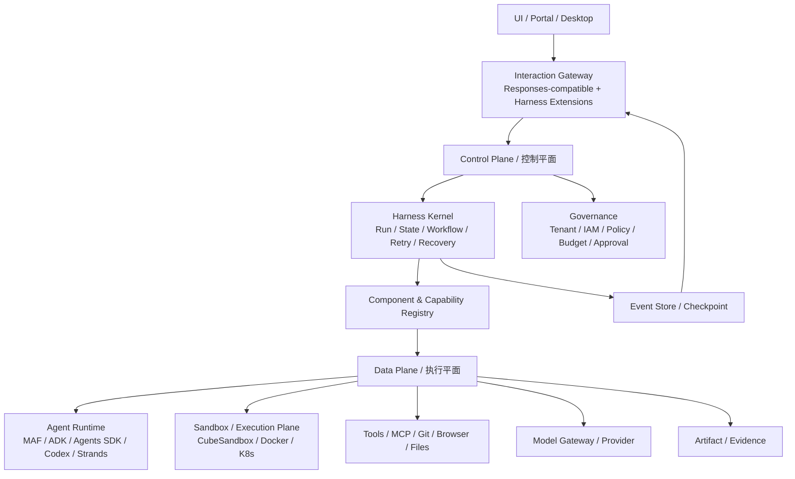
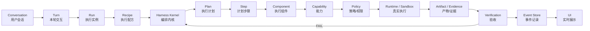

| 文档版本 | V1.0                                 |
|----------|--------------------------------------|
| 文档日期 | 2026-09-29                           |
| 适用范围 | 企业内部 Agent / Harness / PDLC 平台 |
| 状态     | 架构评审稿                           |

**架构基线：厂商无关、控制/执行解耦、协议优先、可恢复、可替换、可审计**

# 文档控制

| **版本** | **日期**   | **变更说明**             | **责任范围**                                        |
|----------|------------|--------------------------|-----------------------------------------------------|
| V1.0     | 2026-09-29 | 首次形成正式架构/POC基线 | 正式架构设计、首轮技术筛选与后续 POC 的统一架构基线 |

**说明：本文件记录的是截至 2026-09-29 的技术事实与首轮架构决策。框架能力、许可和托管策略变化较快，进入采购或正式落地前必须重新核验。**

# 执行摘要

**本设计目标不是选择某一个 Agent Framework 作为企业平台本体，而是建设一个厂商无关的 Agent Harness Platform：控制平面掌握任务生命周期、策略、状态、恢复和审计；执行平面承载 Agent Runtime、模型、工具与 Sandbox。任何具体框架均通过 Adapter / SPI 接入。**

- 核心生命周期：Plan → Execute → Verify → Replan，并允许 WAIT_HUMAN、RETRY、ABORT、COMPLETE 等明确状态。
- 核心边界：Control Plane 不直接执行 shell；Sandbox / Data Plane 不拥有业务 Workflow 的最终状态迁移权。
- UI 协议：采用 Responses-compatible Item/Content 模型作为基础，增加 Plan、Activity、Verification、Artifact、Approval 等 Harness 扩展事件。
- 部署原则：Deployment Independence、Data Independence、Protocol Independence 为一级架构门禁。
- 首轮筛选后，POC 仅进入 Microsoft Agent Framework、Google ADK、Temporal 三条路线；LangGraph 因生产部署平台绑定及商业能力断层，本轮排除。

# 1. 背景、目标与范围

## 1.1 建设背景

企业内部 Agent 能力正在从“单轮模型调用”演进为长任务、工具执行、文件处理、代码执行、多 Agent 协作与人工审批。若直接以单一厂商 SDK 作为平台核心，后续容易形成模型、Sandbox、状态、协议和托管平台的复合绑定。

## 1.2 架构目标

1. 建立统一 Harness Kernel，负责 Run 生命周期、状态迁移、调度、恢复、预算和事件。
2. 将 Planner、Executor、Verifier、Replanner、Context、Sandbox、Model、Artifact 等能力定义为可替换组件。
3. 建立 UI/平台统一交互协议，能够承载文本、图片、文件、Reasoning Summary、Tool、Plan、Artifact 和审批。
4. 支持企业私有环境、Docker/Kubernetes、自有数据库及自有 IAM，不以任何厂商托管控制平面为必选条件。
5. 支持面向 Coding、Document、Data、Ops 等不同场景通过 Recipe 组合，而不是复制多套 Agent 平台。

## 1.3 非目标

- 本阶段不决定最终模型厂商；模型由 Model Provider / Gateway 解耦。
- 本阶段不要求一次性自研所有 Agent Runtime；优先复用框架和 OSS Harness。
- 本阶段不把 raw chain-of-thought 作为产品协议；仅承载可展示的 Reasoning Summary 与真实 Activity。
- 本阶段不建设重型低代码 Agent Studio；先确定平台内核、协议和可运维性。

# 2. 核心架构原则

| **主题**              | **约定**                                                                                 |
|-----------------------|------------------------------------------------------------------------------------------|
| P1 厂商无关           | 任何框架、模型、Sandbox、Tool 都必须通过 Adapter/SPI 接入，领域对象不得直接依赖厂商 ID。 |
| P2 控制/执行分离      | Control Plane 决定做什么、谁执行、失败后如何处理；Data Plane 只负责真实执行并返回证据。  |
| P3 状态迁移由代码控制 | LLM 参与智能判断，但最终 workflow transition、重试预算、审批和结束条件由确定性代码控制。 |
| P4 事件是系统事实     | Typed Event 不仅用于 UI 推送，还用于审计、恢复、重放和状态重建。                         |
| P5 状态外置           | Plan、Run、Artifact、Evidence、Approval 等不能只存在模型上下文中。                       |
| P6 协议优先           | UI 与平台之间使用稳定协议；底层框架事件必须经过 Event Translator。                       |
| P7 部署独立性         | 不用厂商托管平台也必须能完成核心流程；生产关键能力不能依赖不可替代的 SaaS。              |
| P8 安全边界外置       | Capability 表示“能否做”，Policy 表示“允不允许做”，不能把安全规则只写在 Prompt。          |
| P9 Coding 隔离执行    | 生产 Coding Execution 默认必须进入隔离 Sandbox；裸 LocalShell 仅限开发/显式低风险场景。 |
| P10 执行容量独立治理  | Agent logical concurrency 与 build/test 等 Execution concurrency 分开治理。             |
| P11 环境版本一致      | Local/Remote Sandbox 使用 Environment Registry + immutable OCI digest 建立可验证契约。   |

# 3. 总体目标架构

图 1 企业级 Agent Harness Platform 总体架构

平台分为交互层、控制平面与执行平面。Interaction Gateway 负责协议适配与事件转换；Control Plane 是系统最终控制者；Data Plane 是可替换的执行能力集合。

# 4. 端到端主链

图 2 一条用户请求从会话进入到执行完成的主链

| **主题**                  | **约定**                                             |
|---------------------------|------------------------------------------------------|
| Conversation / 用户会话   | 用户与系统的长期会话容器。                           |
| Turn / 本轮交互           | 一次用户输入及其对应输出范围。                       |
| Run / 执行实例            | 真正执行一次 Harness 生命周期的唯一实例。            |
| Recipe / 执行配方         | 定义使用哪些组件、策略、模型、Sandbox 和验收链。     |
| Harness Kernel / 编排内核 | 执行状态机、预算、重试、调度、恢复、审批。           |
| Plan / Step               | 显式计划与可追踪步骤；Plan 必须持久化并版本化。      |
| Component / Capability    | 组件实现能力，Capability Registry 负责依赖解析。     |
| Policy                    | 在真实执行前进行权限、租户、风险和审批判断。         |
| Runtime / Sandbox         | 实际运行 Agent、模型、Shell、Git、Browser、MCP。     |
| Evidence / Artifact       | 真实命令结果、测试报告、Diff、文档和生成文件。       |
| Verification              | 根据 Acceptance Criteria / Gate 做确定性或智能验收。 |
| Event Store / UI          | 所有状态变化形成事件并可重放到 UI。                  |

# 5. Control Plane / 控制平面设计

## 5.1 职责

- Task / Run 生命周期、状态机、队列、优先级和并发控制。
- Recipe 解析、组件装配、Capability 依赖检查。
- Plan/Step 生命周期、Retry / Replan / Abort / Complete 决策。
- Policy、Approval、Budget、Tenant、IAM、Secret 引用。
- Checkpoint、恢复、事件存储与 Replay。
- Artifact/Evidence 元数据与 Lineage。

## 5.2 “Control Plane 不跑 shell”的含义

**控制平面可以下发“运行 pnpm test”的执行命令，但不能在 Harness Kernel 进程中直接调用 Runtime.exec。所有具有副作用的 shell/git/filesystem/browser 操作都必须进入 Data Plane，通过可审计的 Executor/Sandbox 完成。**

这样可以避免 Harness Kernel 逐渐长成包含 Git、Docker、npm、浏览器和部署逻辑的巨型单体，也让执行环境、权限和隔离策略可以单独替换。

# 6. Data Plane / 执行平面设计

## 6.1 职责

- 模型调用与 Agent Runtime 执行。
- Shell、Filesystem、Git、Browser、Database、MCP、Code Execution。
- Sandbox workspace、snapshot、artifact staging 和资源限制。
- 返回结构化 ExecutionResult / ToolResult / Evidence，不决定业务 Run 是否完成。

## 6.2 “Sandbox 不决定业务 Workflow”的含义

Executor 可以在一个 Step 内部进行有限的 agent loop，但不能无限自行修改目标、扩大范围或决定整个 Run 的最终状态。是否 Retry、Replan、等待人工、回滚或结束由 Control Plane 根据结果和策略决定。

## 6.3 Coding Execution 是独立重资源区

Agent Runtime 的 Session、Workflow、Context、模型 HTTP、MCP 和事件流主要属于逻辑并发与 I/O 并发；Coding 场景真正显著消耗 CPU、内存与 I/O 的通常是编译、构建、测试、浏览器、Electron、Docker build 与大型仓库分析。

因此容量规划必须区分 **Agent Capacity** 与 **Execution Capacity**。100 个用户不等于 100 个永久 Sandbox，更不等于 100 个同时 heavy build；平台应按实际同时执行的重资源任务进行压测与配额。

## 6.4 ExecutionScheduler

平台增加独立 ExecutionScheduler，负责：

- admission control
- resource class
- priority / quota / fair scheduling
- local / remote placement
- queue SLO
- timeout / cancel
- backpressure
- burst / spillover

ExecutionScheduler 只决定 ExecutionRequest 进入哪个容量池，不直接执行 shell。建议至少区分 LIGHT / MEDIUM / HEAVY / SPECIAL 四类资源等级，并将 interactive、normal verification、heavy verification、background queue 隔离，避免长时间 full build/E2E 阻塞秒级交互任务。[R14]

## 6.5 Local CubeSandbox baseline + Remote CubeSandbox burst

生产 Coding Execution 默认进入隔离 Sandbox。本地 CubeSandbox 承担 baseline capacity；当本地 CPU/内存、Sandbox slot 或 queue wait 达到阈值时，在 Policy 允许的前提下切换到 Remote CubeSandbox cluster。

当前 Provider 定位：

- **CubeSandboxProvider**：生产默认候选；既可连接 Local Cube cluster，也可连接 Remote Cube cluster。
- **DockerProvider**：开发、兼容与 fallback。
- **K8sProvider**：后续基础设施适配。
- **HyperlightProvider**：小型不可信函数/WASM/CodeAct 类专项执行，不承担完整 Coding workstation。

E2B 不作为独立 Provider 或生产依赖。CubeSandbox 的 E2B-compatible REST/SDK 能力只作为兼容协议价值，用于降低客户端和生态适配成本。[R13]

CubeSandbox 自身的 CubeAPI/CubeMaster/Cubelet 属于 **Sandbox Infrastructure Control Plane**，只负责 Sandbox 节点选择、资源与生命周期；它不替代 Harness Control Plane 的 Run/Plan/Verify/Replan 状态机。

## 6.6 Environment Registry 与环境一致性

Local/Remote CubeSandbox cluster 不要求底层 VM snapshot 二进制完全相同，但必须遵守同一个 Execution Environment Contract。

建议采用：

~~~text
Dockerfile / OCI build definition
        ↓
immutable OCI image digest
        ↓
Environment Registry
       /             \
Local Cube Template  Remote Cube Template
~~~

Environment Registry 至少管理 profile、version、OCI digest、cluster/template mapping、capabilities、architecture、resource profile、verification status 与 deprecation status。[R15]

每个 ExecutionResult 必须记录 environment fingerprint，至少包含 environment profile/version、OCI digest、provider/cluster、template、architecture、resource profile、network policy 与关键 toolchain version。一次 Run 启动后应 freeze 环境版本，禁止使用不可追踪的 `latest` 漂移。

## 6.7 Sandbox 生命周期

平台至少支持：

- Ephemeral：create → execute → verify → collect evidence → destroy。
- Session：create → execute → idle → pause → resume → destroy。
- Snapshot/Branching：在关键 Step 建 checkpoint，支持 rollback 或从同一状态 fork 多条候选执行路径。

Sandbox snapshot 只保存执行环境状态；Plan/Step/Artifact/Event 等 Harness 业务状态仍由平台持久化，不能依赖 Sandbox snapshot 代替 Control Plane checkpoint。

# 7. Harness Kernel 与组件模型

## 7.1 Kernel 核心能力

- State Machine
- Scheduler / Queue
- Retry / Timeout / Cancellation
- Checkpoint / Recovery
- Budget
- Event
- Approval
- Component Invocation

## 7.2 Capability Components

| **组件接口**    | **输入**                       | **输出**           | **典型实现**                                |
|-----------------|--------------------------------|--------------------|---------------------------------------------|
| Planner         | TaskContext                    | PlanResult         | LLM Planner / Rule Planner / Human Planner  |
| Executor        | ExecutionContext + Step        | ExecutionResult    | MAF / ADK / OpenAI Agents / Codex / Strands |
| Verifier        | Evidence + Acceptance Criteria | VerificationResult | Test / Lint / Architecture / LLM Review     |
| Replanner       | Failure + Current Plan         | PlanResult         | Step Replan / Subtree Replan / Human        |
| ContextProvider | Task + Step + Budget           | ContextBundle      | Conversation / Repo / Memory / RAG          |
| SandboxProvider | SandboxSpec                    | Workspace          | CubeSandbox / Docker / K8s / Vendor Sandbox  |

## 7.3 Recipe / Profile

Recipe 是组件组合层，而不是新的 Agent。示例：software-development recipe 可以选择 Planner=MAF、Executor=CodexAdapter、Verifier=CompositeVerifier、Sandbox=CubeSandbox、StateStore=PostgreSQL。

# 8. Run 状态机

- CREATED → PLANNING → EXECUTING → VERIFYING → COMPLETED
- VERIFYING → RETRY → EXECUTING
- VERIFYING → REPLANNING → EXECUTING
- 任意受控节点 → WAITING_APPROVAL → RESUME
- 不可恢复错误 → FAILED / ABORTED

Plan、Step、Attempt 均需要 ID、版本、状态、时间戳、输入摘要、产物引用与失败分类。Replan 不是“重新问一次模型”的同义词，应由 FailureClassifier + ReplanPolicy 决定重试层级。

# 9. Conversation / UI 交互协议

## 9.1 协议策略

**采用 “Responses-compatible core + Harness Extensions”，而不是直接把 OpenAI Responses API 当作平台内部唯一协议。**

- Command：UI → Server，建议 HTTP POST；Stop/Retry/Approval/Widget action 均为 Command。
- Event：Server → UI，常规 Chat/Agent 输出使用 SSE；Terminal/语音/Computer Use 等强双向场景使用 WebSocket。
- ContentPart：Text、Markdown、Image、File、Audio、Citation、Artifact、Widget。
- Item：Message、ReasoningSummary、ToolCall、ToolResult、Plan、Activity、Verification、Approval、Artifact。
- 平台自有 conversation_id / turn_id / run_id / item_id；provider response_id 仅作为 metadata。

## 9.2 Reasoning 与 Activity

协议不暴露模型 raw chain-of-thought。前端可展示 Reasoning Summary；而“正在读取文件/运行测试/检查 Diff”应来自 Harness 的真实 Activity/Event，而不是模型生成的伪状态。

## 9.3 典型 Event

| **类别**     | **事件示例**                                 | **用途**         |
|--------------|----------------------------------------------|------------------|
| Run          | run.created / run.completed / run.failed     | 顶层执行生命周期 |
| Message      | message.text.delta / done                    | 文本流           |
| Reasoning    | reasoning.summary.delta                      | 可展示思考摘要   |
| Plan         | plan.created / step.started / step.completed | 计划进度         |
| Tool         | tool.started / output.delta / completed      | 真实工具活动     |
| Verification | verification.started / failed / passed       | 验收状态         |
| Approval     | approval.requested / approved / rejected     | HITL             |
| Artifact     | artifact.created / versioned                 | 文件与产物       |

# 10. Durable Execution 与 Event Store

- Event 必须有 event_id、run_id、sequence、type、schema_version、actor、timestamp、payload。
- UI 断线后使用 sequence replay，不依赖内存中的 SSE 连接。
- Task State、Agent RunState、Sandbox State 分层保存；服务重启不丢 Run。
- Tool/Activity 必须考虑幂等性；至少提供 idempotency_key / attempt_id。
- 长任务必须支持 timeout、cancellation、heartbeat、retry budget 和 wait-human。

# 11. Context / Memory Engine

Context Engine 不等于 conversation history。每次模型调用由 ContextBuilder 根据 Task、Step、Role、Token Budget 动态组装：Instruction Context、Task Context、Plan、Working Memory、Conversation、Repo/RAG、Tool Evidence 和 Compressed History。Raw logs 默认不进入上下文，只保留引用。

结合 MAF 的 ContextProvider / Memory 设计，本平台进一步把 Context/Memory 拆为：

- Session Context：本轮会话历史与 Session State。
- Working Memory：Plan、Todo、Current Step、Run State。
- Long-Term Memory：显式长期记忆与语义历史记忆。
- Retrieval Context：RAG、Repository、Enterprise Data。
- User/Tenant Context：用户画像、租户策略和业务背景。
- Compaction：Context Window 管理，不与 Long-Term Memory 混为一体。

平台建议采用 ContextProvider SPI 作为统一扩展模型，通过 scope、lifecycle、retrieval、persistence、priority、token budget 和 update policy 控制不同上下文来源。

# 12. Artifact、Evidence 与 Lineage

- FileResource：上传文件、图片、音频等原始资源。
- Artifact：Agent/Workflow 生成的可版本化业务产物，如报告、代码补丁、PPT、PDF。
- Evidence：用于验收的事实证据，如命令退出码、测试报告、git diff、扫描结果。
- Lineage：Requirement → Plan → Step → Artifact/Evidence → Verification → Final Output。

# 13. Capability、Policy、Approval 与 Secret

Capability 表示组件具备的技术能力；Policy 决定当前用户/租户/环境是否允许调用该能力。Secret 只通过 SecretProvider 注入执行环境，模型上下文仅拿到引用或临时凭证。

- git.push 可以是 Capability，但对 main/develop 的允许规则属于 Policy。
- production.deploy 可以要求 approval.requested 后进入 WAITING_APPROVAL。
- Sandbox 执行权限、网络出口、文件挂载、CPU/内存/PID 均由 Policy/SandboxSpec 控制。

# 14. Observability、Budget 与 Evaluation

- Trace/Span：Run → Step → Agent Call → Tool Call → Sandbox Command。
- Metrics：TTFT、总时延、token/cost、tool latency、replan count、test pass rate、sandbox failure rate。
- Budget：max_cost、max_runtime、max_iterations、max_replans、max_subagents。
- Evaluation：Golden task、回归数据集、故障注入、稳定性/恢复性测试，禁止只用 LLM 自评。

# 15. 推荐部署拓扑

推荐采用“企业平台控制层 + 独立 Agent Runtime 服务”的服务边界。Platform Layer 负责 Tenant、IAM、Policy、Recipe、Artifact、API Gateway；具体实现语言不作为本轮架构选型因素，Agent Runtime 可按框架最适合的语言以独立容器部署。

| **层**              | **建议技术职责**                                    | **说明**             |
|---------------------|-----------------------------------------------------|----------------------|
| Platform Layer      | Tenant/IAM/Policy/Recipe/Artifact/Portal API        | 语言中立，由企业自行实现 |
| Durable Control     | MAF Workflow / ADK orchestration / Temporal         | 由 POC 决定          |
| Agent Runtime       | MAF / ADK / OpenAI Agents / Strands / Codex Adapter | 独立进程/容器        |
| Sandbox / Execution | CubeSandbox 为生产默认候选；Docker/K8s 为 fallback/扩展 | Local/Remote Cube cluster 可替换，不绑定云服务 |
| Storage             | PostgreSQL + Object Storage + Event/Audit Store     | 数据掌握在企业       |
| Model               | LiteLLM/Provider Adapter                            | 模型可替换           |

# 16. 首轮技术选型

以下为架构 POC 前的初筛，不代表最终结论。评分 1~5 仅用于暴露结构性差异；最终结论由 POC 硬门禁和实测数据决定。

> 首轮选型不再把 Java 原生能力作为评分项。正式 POC 关注架构匹配、部署独立、Durable、扩展稳定性和企业补齐成本。

| **候选**                  | **角色定位**                  | **部署独立性** | **Durable** | **Harness成熟度** | **POC前匹配估算** | **首轮处理**         |
|---------------------------|-------------------------------|----------------|-------------|-------------------|-------------------|----------------------|
| Microsoft Agent Framework | Harness + Workflow            | 4              | 4           | 5                 | 原生~80% / 适配~89% | POC-A，第一优先      |
| Temporal + Agent Runtime  | Durable Control Plane         | 5              | 5           | 2                 | 原生~72% / 适配~92% | POC-C，第二优先      |
| Google ADK                | Agent Runtime + Orchestration | 4              | 3           | 4                 | 原生~68% / 适配~75% | POC-B，第三优先      |
| OpenAI Agents SDK         | 轻量 Agent/Sandbox Runtime    | 4              | 2           | 4                 | Runtime 候选         | 保留为 Runtime 组件  |
| Codex OSS                 | Coding Executor/Harness       | 4              | 2           | 5(编码)           | Coding Executor      | 二阶段 Executor 候选 |
| Strands Agents            | 轻量 Agent Runtime            | 5              | 2           | 4                 | Runtime 候选         | 二阶段 Runtime 候选  |
| LangGraph / Deep Agents   | Graph/Harness                 | 2              | 4           | 5                 | 不进入首轮           | 本轮排除             |
| CrewAI                    | 业务 Agent/Flow               | 3              | 3           | 3                 | 不作为 Kernel        | 不作为 Kernel        |
| PydanticAI                | 类型安全 Agent Runtime        | 5              | 2           | 3                 | 观察                 | 观察/备选            |

> 上述匹配比例为 2026-09-29 的 POC 前架构映射估算，建议按 ±5 个百分点理解，不作为最终选型结论。

# 17. LangGraph 本轮排除说明

LangGraph OSS 的编程模型本身仍具有参考价值，但本轮不进入 POC。原因不是 Graph 能力不足，而是生产部署路径与平台能力存在明显绑定风险：官方 Self-Hosted Lite/Enterprise 需要 LangGraph Server 形态，常见部署要求 PostgreSQL + Redis；Enterprise 使用许可证密钥，Lite 也存在 LangSmith API key/节点规模等限制。对“企业内建、平台层掌握控制权”的目标，容易形成第二套控制平面与 Managed Feature Cliff。[R12]

**决策：保留 LangGraph/Deep Agents 作为设计参考和可插拔 Runtime 的未来可能性，但不作为 Control Plane / Platform Kernel 的首轮候选。**

# 18. 架构决策记录（ADR 摘要）

| **ADR** | **决策**                                                                     | **状态**         |
|---------|------------------------------------------------------------------------------|------------------|
| ADR-001 | Harness Platform 不以单一 Agent Framework 为核心域模型。                     | Accepted for POC |
| ADR-002 | 采用 Control Plane / Data Plane 分离；Shell 只存在于执行平面。               | Accepted for POC |
| ADR-003 | Conversation Protocol 采用 Responses-compatible core + Harness Extensions。  | Accepted for POC |
| ADR-004 | Run/Plan/Step/Artifact/Event 为平台自有 ID；Provider ID 仅为 metadata。      | Accepted for POC |
| ADR-005 | Deployment Independence 为硬门禁，不以厂商 Managed Platform 作为生产必选项。 | Accepted for POC |
| ADR-006 | 首轮 POC：MAF、ADK、Temporal；LangGraph 不进入。                             | Accepted for POC |
| ADR-007 | Coding Execution 生产默认必须进入隔离 Sandbox；裸 LocalShell 不作为默认路径。 | Accepted for POC |
| ADR-008 | Sandbox 生产第一候选统一为 CubeSandbox；Local/Remote 通过不同 cluster/endpoint 承载。 | Accepted for POC |
| ADR-009 | E2B 仅保留兼容 API/SDK 语义，不作为独立 Sandbox Provider 或生产依赖。         | Accepted for POC |
| ADR-010 | 增加 ExecutionScheduler，独立治理重资源 build/test/browser 工作负载。          | Accepted for POC |
| ADR-011 | 增加 Environment Registry，以 immutable OCI digest 管理执行环境一致性。        | Accepted for POC |

# 19. MAF 扩展性验证要求

若 MAF 作为首选一体化路线，必须验证企业补齐能力是否可以只依赖 public extension points 完成。至少实现：

- Custom ContextProvider
- Custom SessionStore
- Custom CheckpointStorage
- Custom ChatClient / Model Adapter
- Custom Workflow Executor
- Custom Middleware
- Custom Sandbox Adapter

硬性观察项：

- 不 fork MAF
- 不 monkey patch
- 不依赖 Foundry 才能完成核心链路
- 不复制大量框架内部代码
- Streaming、Persistence、HITL、Checkpoint 能同时工作
- 升级时 public abstraction 的兼容性可控

# 20. 后续演进

1. 完成三条 POC，以相同业务场景、相同测试集和相同部署约束进行对比。
2. 确定 Durable Control Plane 的最终归属：框架内建还是 Temporal 独立承担。
3. 确定 Agent Runtime SPI、Sandbox SPI、Conversation Event Protocol 的 V1 Schema。
4. 完成 CubeSandbox、ExecutionScheduler、Environment Registry 专项 POC，验证 Local/Remote Cube cluster 切换、容量调度、环境一致性和故障恢复。
5. 进入 Coding/Document 两个真实 Recipe 试点，验证是否真正避免框架耦合。
6. 最后再决定是否引入 Codex OSS、Strands、OpenAI Agents SDK 作为标准 Runtime Adapter。

# 参考资料与事实基线

以下资料用于确认框架当前能力、部署模式和许可/托管边界；访问日期均为 2026-09-29。

[R1] Microsoft Agent Framework - Self-host applications  
https://learn.microsoft.com/en-us/agent-framework/hosting/self-hosting

[R2] Microsoft Agent Framework - Agent Harness  
https://learn.microsoft.com/agent-framework/agents/harness

[R3] Microsoft Agent Framework - Durable Extension  
https://learn.microsoft.com/en-us/agent-framework/hosting/azure-functions

[R4] Google ADK Java Quickstart  

[R13] TencentCloud CubeSandbox Repository / README  
https://github.com/TencentCloud/CubeSandbox

[R14] CubeSandbox Architecture Overview  
https://github.com/TencentCloud/CubeSandbox/blob/master/docs/architecture/overview.md

[R15] CubeSandbox Templates Overview  
https://github.com/TencentCloud/CubeSandbox/blob/master/docs/guide/templates.md
