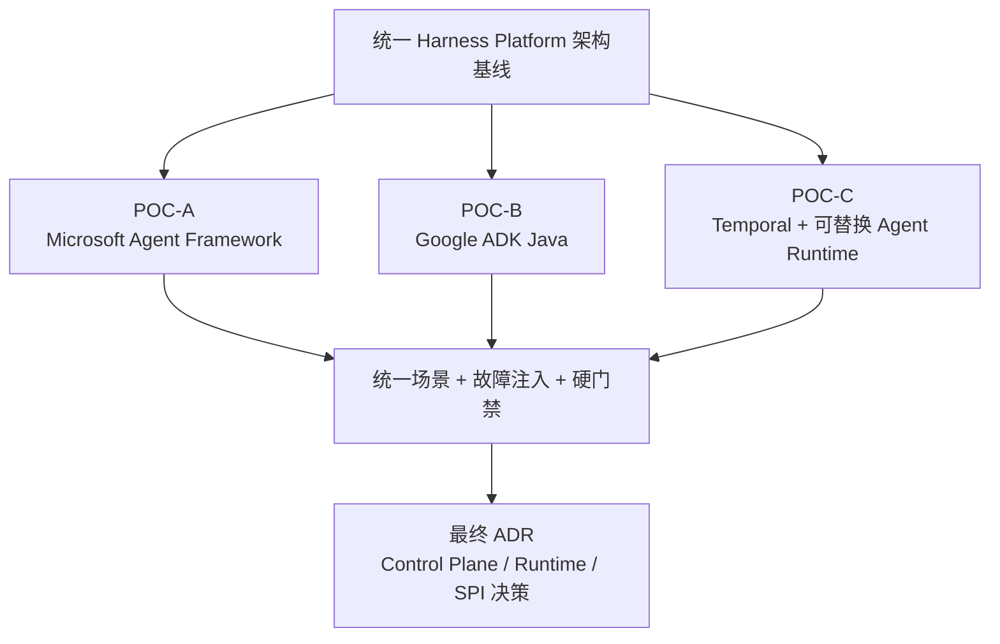

| 文档版本 | V1.0                                 |
|----------|--------------------------------------|
| 文档日期 | 2026-09-29                           |
| 适用范围 | 企业内部 Agent / Harness / PDLC 平台 |
| 状态     | 架构评审稿                           |

**架构基线：厂商无关、控制/执行解耦、协议优先、可恢复、可替换、可审计**

# 文档控制

| **版本** | **日期**   | **变更说明**             | **责任范围**                            |
|----------|------------|--------------------------|-----------------------------------------|
| V1.0     | 2026-09-29 | 首次形成正式架构/POC基线 | 首轮 POC 统一实施、验收、对比与退出标准 |

**说明：本文件记录的是截至 2026-09-29 的技术事实与首轮架构决策。框架能力、许可和托管策略变化较快，进入采购或正式落地前必须重新核验。**

> **2026-10-09 增量专项（不回写历史首轮 Gate）：** OpenCode 2 /
> OpenAI Agents SDK / MAF 的共享 Sandbox 与高密度 Runtime 候选已登记
> [ARCH-TODO-024](references/MULTI_HARNESS_SANDBOX_RUNTIME_DENSITY_CANDIDATE.md)。
> [可执行专项 POC](../poc/opencode_sandbox/README.md) 先验证
> OpenCode 2 真实 Sandbox 与跨 Harness 同 Workspace 接力，
> 再检查共享 SDK Host 安全边界和资源效率；局部 PASS 不等于 G5 全面通过。

# 执行摘要

本 POC 不以“谁的 Demo 最快跑起来”为目标，而是验证三条架构路线在企业内建场景下是否满足可自托管、可恢复、可替换、可审计、可桥接 UI 协议等关键约束。所有候选必须使用同一组场景和失败注入测试，避免因示例复杂度不同导致结论失真。

图 1 三条首轮 POC 路线

# 1. POC 范围与候选

| **方案**         | **主要验证对象**                              | **核心问题**                                                        | **当前优先级** |
|------------------|-----------------------------------------------|---------------------------------------------------------------------|---------------|
| POC-A MAF        | HarnessAgent + Workflow + Self-host           | 一体化框架能否在不依赖 Foundry 的情况下覆盖大部分 Harness，并通过公开扩展点补齐企业能力 | 1 |
| POC-C Temporal   | Durable Control Plane + Runtime Adapter       | Control Plane 与 Agent Runtime 完全解耦是否更稳、更适合企业长期建设 | 2 |
| POC-B Google ADK | Agent + Session/Event/A2A                     | 不依赖 Java 原生加分后，ADK 的 Runtime/Event/A2A 能力是否仍具有足够差异化价值 | 3 |

> 本轮不再把 Java Native / Java 原生支持作为评分或优先级因素。

## 1.1 POC 架构前置状态

当前 POC 以前序已冻结的 P0/P1 Contracts 为架构基线。

P2 Backlog 整体标记为 **DEFERRED / NON-BLOCKING FOR POC**，不作为 POC 启动或完成的前置条件。

只有当 POC 实测证明某个 P2 问题直接影响 correctness、recoverability、provider/runtime replaceability 或 production viability 时，才将对应条目重新提升为 active architecture blocker。

当前优先级转为执行 POC、收集实测证据、验证 Framework/Provider public extension points 与既有 Contracts；不为了“架构完整”继续设计外围能力。

## 1.2 首轮 POC Scope Boundary

首轮 POC **不扩展为企业治理/基础设施产品 POC**。其核心判定对象是 Harness 能否稳定拥有任务生命周期，并通过薄 Adapter / Reference 边界消费外部能力。

核心验证范围：

- Plan → Execute → Verify → Replan 与确定性状态迁移；
- Run / Plan / Step / Attempt / Execution 等任务事实持久化；
- Task-level Recovery、WAITING_APPROVAL / HITL 与故障后的安全继续；
- Responses-compatible + Harness Event Protocol；
- Runtime / Model / Sandbox 的 Adapter 解耦；
- 完全自托管核心链路与 Public Extension Point 可行性。

非首轮 POC 产品建设范围：

- 企业 IAM / SSO / User Directory；
- MCP Governance / Marketplace / Trust Engine；
- Cost / Quota / Billing / Chargeback；
- Secret Manager、DLP、SIEM；
- APM / Logging Backend / Alerting 产品；
- PostgreSQL / Object Storage / Disk / K8s / Region Backup/DR。

这些外围能力只做 Ownership Boundary / Adapter / Reference / telemetry integration 验证。除非实测证明其边界无法成立，并直接破坏 correctness、recoverability、replaceability 或 production viability，否则不得升级为首轮 POC blocker。

# 2. 明确排除项

**LangGraph / Deep Agents 不进入本轮 POC。**

原因：本轮重点是企业内建与部署独立性。LangGraph 的生产部署路径容易进入 LangGraph Server / Platform、自托管依赖 PostgreSQL + Redis，以及 Lite/Enterprise/License 边界，对平台 Kernel 形成额外控制平面。该框架保留为设计参考，但不消耗本轮实施资源。[R8]

# 3. POC 一级硬门禁

| **主题**          | **约定**                                                                                                     |
|-------------------|--------------------------------------------------------------------------------------------------------------|
| G1 自托管         | 不使用厂商托管 Agent Platform，必须可在本地 Docker 或企业 K8s 运行核心流程。                                 |
| G2 状态自主       | Run/Session/RecoveryPoint/Checkpoint Reference/Artifact-Evidence Metadata 等任务事实必须落企业掌控的持久化层；大 Payload 通过 ArtifactStore/ObjectStorage Adapter 外置到 OSS/S3-compatible。 |
| G3 协议可桥接     | 必须能映射到平台自有 Responses-compatible + Harness Event Protocol。                                         |
| G4 模型可替换     | 至少证明模型调用层不是框架不可替换的单一云模型绑定；优先验证 LiteLLM/OpenAI-compatible 或 Provider Adapter。 |
| G5 Sandbox 可替换 | Shell/Code Execution 通过 SandboxProvider SPI；生产候选以 CubeSandbox 为基线。可用 Docker/其他 Adapter 做兼容性 smoke，第二套 production-grade Sandbox 不是首轮通过条件。 |
| G6 任务级恢复     | Worker/Runtime 故障后，必须基于持久化任务事实与真实 Runtime Capability 恢复到可证明安全的边界，或明确返回 unsupported/failure；不要求 Harness 承担数据库、OSS、磁盘、K8s/Region Backup/DR。 |
| G7 HITL           | 能够暂停等待人工审批，并在批准后继续。                                                                       |
| G8 License Cliff  | POC 记录从 OSS 到生产是否存在关键 Enterprise/Cloud-only 功能断层。                                           |

任何方案未通过 G1/G2/G3/G6 中任意一项，即不得作为平台主架构进入第二轮；其余项若失败，需要形成明确替代实现与成本评估。

# 4. 统一 POC 基线环境

| **主题** | **约定**                                                                                 |
|----------|------------------------------------------------------------------------------------------|
| 部署     | Docker Compose 为最低基线；有条件追加企业 K8s。                                          |
| 存储     | PostgreSQL 保存 Task Facts / metadata / lineage / references；Artifact/Evidence 大 Payload 使用企业 OSS/S3-compatible Object Storage。底层 HA/Backup/DR 不在本 POC。 |
| 模型     | 优先通过企业现有 Model Gateway/LiteLLM；若框架限制则记录为 Gap。                         |
| Sandbox  | CubeSandbox 为生产 POC 基线；Local/Remote 使用不同 Cube cluster；Docker 作为开发/兼容对照。 |
| 代码仓   | 准备统一 Demo Repo，包含可复现缺陷、单测、E2E/集成测试与 lint。                          |
| UI       | 统一测试页面消费自有 SSE Event Protocol；不直接使用框架自带 Dev UI 作为最终结论。        |
| 观测     | 优先复用 Runtime/Framework 原生 OpenTelemetry 并输出 OTLP；Harness 只补 run/step/attempt/execution correlation 与平台边界缺口，不建设 APM/Logging Backend。 |

# 5. 统一测试场景

| **编号** | **场景**                | **验收重点**                                                             |
|----------|-------------------------|--------------------------------------------------------------------------|
| S01      | Streaming Chat          | 流式文本输出；验证 TTFT、取消、重连。                                    |
| S02      | Multimodal              | 用户输入文本 + 图片 + 文件，产出文本 + Artifact。                        |
| S03      | Plan                    | 生成显式 Plan，并展示 Step 状态。                                        |
| S04      | Execute                 | 在 Sandbox 中读取 repo、修改文件、运行 shell。                           |
| S05      | Verify                  | 单测/lint/自定义验收失败时输出 Evidence，不允许只用 Agent 自我宣告成功。 |
| S06      | Replan                  | 制造错误实现，验证失败分类与 replan。                                    |
| S07      | Task Recovery           | 执行中杀 Worker/Runtime/容器，验证同一 Run 能按真实 Capability 恢复到最深且安全的任务边界；不测试底层 Storage Backup/DR。 |
| S08      | HITL                    | 模拟 git push / 高风险操作，进入 WAITING_APPROVAL 后跨进程恢复。         |
| S09      | Provider Swap           | 切换第二种模型/provider，不改 Harness 领域模型。                         |
| S10      | Sandbox Adapter Swap    | CubeSandbox → Docker/其他兼容 Adapter 做 smoke，业务 workflow/领域模型不改；验证 SPI 边界即可，第二套 production-grade Sandbox 不作为首轮通过条件。 |
| S11      | UI Protocol             | 事件映射为 run/plan/tool/verification/artifact typed events。            |
| S12      | Deployment Independence | 完全禁用厂商托管平台后仍通过核心链路。                                   |

# 6. 统一目标业务任务

建议用一个“软件工程 correctness 修复任务”作为主任务，同时准备一个“文档分析/抽取任务”作为非 Coding 对照。Coding 主任务示例：修复一个可稳定复现的编辑器光标/状态恢复类缺陷；要求读取仓库规则、定位根因、修改代码、补测试、运行验证并输出 Diff 与测试证据。

- 禁止让不同方案使用不同难度 Demo。
- Acceptance Criteria 由平台侧固定，不允许框架自行改变。
- 测试失败必须触发明确 Failure Type，而不是把所有失败都归为“模型继续尝试”。
- 限制 max_iterations、max_replans、max_runtime，观察每个框架的控制能力。

# 7. POC-A：Microsoft Agent Framework

本路线的实施任务拆解、依赖、独立验收和 Milestone 详见 [POC_A_TASK_PLAN.md](POC_A_TASK_PLAN.md)。以下章节是评价约束，具体执行按该任务计划推进。

## 7.1 验证假设

MAF 的价值在于 HarnessAgent、Workflow、Self-host、Responses/A2A/AG-UI 与 Durable Extension 组合得较完整。POC 重点验证：不用 Foundry Hosted Agents 时，是否仍能作为企业内建 Runtime/Harness 使用；生产所需持久化和 Durable 能否掌握在自有基础设施中。[R1][R2][R3]

## 7.2 建议拓扑

- MAF Runtime Service：Python 优先，降低 POC 开发成本；如果组织计划引入 .NET，可补做 C# 对照。
- HarnessAgent：开启 Plan/Todo/Compaction/Approval 等可用能力。
- Self-host：FastAPI/ASP.NET 仅作为宿主，不使用 Foundry Hosted Agent。
- SessionStore：实现 PostgreSQL-backed store，避免仅使用 in-memory。
- 协议：优先暴露 Responses-compatible endpoint；可补 AG-UI/A2A。
- 执行：自定义 Sandbox Adapter 对接 CubeSandbox；生产 Coding 命令默认进入 Cube MicroVM，Docker 仅作为开发/兼容对照；所有命令输出形成 Evidence。

## 7.3 必测项

1. HarnessAgent 是否能稳定维护 plan/todo，并在多轮 session 中保持状态。
2. Workflow 是否能承担 Verify/Replan 的确定性状态迁移，而不是把控制权全部给 Harness。
3. Memory/Context 分层是否清晰：Session、Working Memory、Long-Term Memory、ContextProvider、Compaction 是否可以独立替换和持久化。
4. SessionStore/HistoryProvider 是否可完全使用自有数据库。
5. Self-host 模式下是否无需 Foundry 即可完成 Responses/AG-UI/A2A 接入。
6. Durable Extension 的 self-host / BYOC 路线需要哪些 Durable Task 基础设施，运维成本多少。
7. Python hosting/durable 相关包的 prerelease/stability 风险是否可接受。
8. 至少实现 Custom ContextProvider、SessionStore、CheckpointStorage、ChatClient、Workflow Executor、Middleware、Sandbox Adapter。
9. 所有企业补齐能力是否都能仅依赖 public extension points 完成，不 fork、不 monkey patch、不复制大量内部代码。

### Python Durable 私有化门禁

当前 Python MAF Durable 的生产私有化能力单独作为硬门禁，不把本地 DTS Emulator 等同于生产自托管能力。

必须验证：

- Standalone `agent-framework-durabletask` 不被假定可以直接使用 PostgreSQL 作为 production backend。
- 完全私有化候选优先验证 `Python MAF → Durable Functions Runtime → MSSQL Provider → SQL Server`。
- 不自行实现 TaskHub gRPC backend、Durable Scheduler、replay engine 或 PostgreSQL compatibility layer。
- Harness Kernel 通过 DurableRuntime Adapter 隔离 Durable Task 专有语义。
- 如果 Functions + MSSQL 路线的运维、支持等级或私有化门禁不能接受，MAF 降级为 Agent Runtime / Harness Runtime，由其他成熟 Durable Engine 承担 Durable Control Plane。

详见：`docs/references/MAF_PYTHON_DURABLE_PRIVATE_DEPLOYMENT.md`.

## 7.4 MAF 退出条件

若核心 Durable、Session、协议或 Harness 生产能力必须依赖 Foundry；或自托管 Durable Task 的运维/许可成本与自建 Control Plane 相当，则 MAF 降级为 Data Plane/Harness Runtime，而不作为平台 Control Plane。

# 8. POC-B：Google ADK

## 8.1 验证假设

ADK 的重点不再是 Java 原生优势，而是 Agent、Runner、Session、Event、A2A、Tool、Streaming 与部署独立性。POC 重点验证：在不依赖 Google Agent Runtime / GCP 特有托管能力的情况下，ADK 是否仍值得作为通用 Agent Runtime / Orchestration 组件。[R4][R5]

## 8.2 建议拓扑

- 使用 ADK 当前主力语言实现即可，不把语言作为评分因素。
- ADK Agent + Session/Event 模型；由平台侧生成 run_id/turn_id。
- A2A / ADK SSE 作为框架边界，外部再转换为统一 Conversation Protocol。
- 代码执行优先 ContainerCodeExecutor / Docker，不使用 Vertex Agent Runtime 作为通过条件。
- 模型层至少尝试 Gemini + 第二 Provider；如果第二 Provider 需要额外适配，记录真实工作量。
- Session/Event 等任务状态映射到企业掌控的持久化层；Artifact/Evidence Payload 通过平台 ArtifactStore/ObjectStorage Adapter 外置，框架内置 Dev UI 仅用于调试。

## 8.3 必测项

1. Agent/Runner/Session/Event 完整性、生命周期和并发模型。
2. Sequential/Parallel/Loop 等编排能否表达 Plan/Execute/Verify/Replan，还是需要外置状态机。
3. Session/Event 状态能否映射到企业掌控的持久化层；Artifact/Evidence 是否能只保留平台 metadata/reference，而将 Payload 外置到 Object Storage。
4. A2A、SSE、MCP/Tool 与企业 Gateway 的协议适配成本。
5. Container Code Executor 的安全边界、网络、文件挂载和资源限制。
6. 不使用 GCP Agent Runtime、Cloud Run/GKE 特有服务时是否仍具备完整核心能力。

## 8.4 ADK 退出条件

若关键 Session/Artifact/Sandbox/Observability 只能在 Google 托管能力中获得，或非 Gemini / 非 GCP 环境下适配成本明显高于收益，则 ADK 仅保留为备选 Agent Runtime，而不承担平台统一 Control Plane。

# 9. POC-C：Temporal + 可替换 Agent Runtime

## 9.1 验证假设

Temporal 不提供 Agent Harness，而提供 Durable Execution。该路线验证“平台 Control Plane 与 Agent Runtime 完全解耦”是否更适合长期企业建设。Temporal 官方支持自托管或 Temporal Cloud，Workflow 可在 Java 实现，Durable AI 也明确覆盖长任务 Agent、Tool、HITL 和框架集成。[R6][R7]

## 9.2 建议拓扑

- Platform Service：Platform API、Recipe、Policy、Artifact/Evidence Metadata、SSE Gateway；Artifact/Evidence Payload 通过外部 Object Storage Adapter 承载；实现语言不计入评分。
- Temporal Workflow：Plan → Execute → Verify → Replan 状态机；选择团队最合适的官方 SDK 完成 POC。
- Activity：调用独立 Agent Runtime Service；POC 可选择 OpenAI Agents SDK 或极简自研 Adapter。
- Sandbox SPI：CubeSandbox 为生产默认候选；Local/Remote 通过不同 Cube cluster/endpoint 承载；Docker 作为开发/兼容 fallback。
- Temporal Service：优先本地/self-host 基线，确保不是 Temporal Cloud 才能运行。
- HITL：使用 Signal/Update 等模式暂停并恢复。

## 9.3 推荐 Workflow 边界

**Workflow 只保存确定性状态和调度决策；所有模型调用、HTTP、Shell、Git、文件 I/O 都必须进入 Activity / Data Plane。**

这与平台原则完全一致：Temporal Workflow = Control Plane；Agent/Sandbox Activity = Data Plane。

## 9.4 必测项

1. 杀死 Agent Worker、Temporal Worker、API 服务，分别验证任务级恢复位置、Same Attempt Resume / New Attempt / Reconciliation 的真实边界；不把基础设施 Backup/DR 纳入结论。
2. Activity retry 与业务 Replan 的边界：基础设施失败自动 retry，语义失败进入 Verifier/Replan。
3. WAITING_APPROVAL 跨小时/跨进程恢复。
4. Workflow versioning / replay 对 Agent 平台长期升级的约束。
5. Task Queue/Worker 隔离能否用于 project/execution class、priority、runtime 类型；不引入 Tenant Domain。
6. Agent Runtime 从 A 实现切换到 B 实现时，Workflow 和 UI 是否保持不变。

## 9.5 Temporal 退出条件

若引入 Temporal Service、数据库和 Worker 体系带来的运维复杂度明显高于长任务可靠性收益，或团队无法接受 Workflow 的确定性/replay 编程约束，则 Temporal 不作为默认内核；但仍可作为高可靠长任务的专用执行层。

# 10. POC 统一数据采集

| **主题** | **约定**                                                     |
|----------|--------------------------------------------------------------|
| 部署     | 组件数量、镜像数量、外部依赖、配置项、启动时间、K8s 对象数量 |
| 可靠性   | 恢复成功率、重复执行次数、幂等问题、丢事件/丢状态情况        |
| 开发效率 | 核心场景代码量、Adapter 代码量、框架特殊代码占比             |
| 运行效率 | TTFT、总时延、额外 orchestration 开销、内存/CPU、queue wait、sandbox create/resume latency |
| 可替换性 | 换模型/换 Sandbox/换 Runtime 的改动文件数与代码行            |
| 协议     | 映射到统一 Event Protocol 的字段损失与自定义事件数量         |
| 治理     | 外部 IAM/Credential 接入 + Harness Policy/Approval/Audit 边界完整度 |
| 生产断层 | 需要商业版/托管平台才能获得的关键能力清单                    |

# 11. 故障注入矩阵

| **故障**           | **注入方式**         | **期望**                       | **不得发生**               |
|--------------------|----------------------|--------------------------------|----------------------------|
| Model timeout      | 让模型 endpoint 超时 | 按 RetryPolicy 重试，不丢 Run  | 整个任务重头执行           |
| Agent Worker crash | kill -9 worker       | 恢复到未完成 Step              | 已完成 Step 重复产生副作用 |
| Sandbox crash      | 销毁执行容器         | 按 Sandbox State/Step 策略恢复 | 控制平面状态丢失           |
| Verifier fail      | 固定测试失败         | 进入 RETRY/REPLAN              | Agent 自称成功并完成       |
| UI disconnect      | 断开 SSE 后重连      | sequence replay                | 看不到历史活动             |
| Approval wait      | 暂停后重启服务       | 仍保持 WAITING_APPROVAL        | 审批请求消失               |
| Unknown side effect | 模拟 git push/外部写操作已发出但响应丢失 | Attempt 进入 UNKNOWN → Reconciliation，核验后再决策 | UNKNOWN 直接 blind retry |
| Duplicate delivery | 重复投递同一 execution/idempotency key | 幂等/去重生效，不产生重复副作用 | 重复创建资源/重复 push |
| Worker resurrection | 旧 Worker 在 Retry/迁移后恢复 | 旧执行被 fencing/ownership 机制拒绝；具体实现由后续待办验证 | 两个 Worker 同时产生副作用 |

# 12. 评分与决策规则

硬门禁先于评分。通过硬门禁的方案再进入加权比较。建议权重如下，评审时可以调整，但必须在看结果前冻结权重。

| **维度**               | **建议权重** | **核心证据**                         |
|------------------------|--------------|--------------------------------------|
| 部署独立性/生产断层    | 25%          | 无 Managed Platform 情况下的真实部署 |
| 恢复与可靠性           | 20%          | 故障注入结果                         |
| Harness 原生覆盖率     | 15%          | Plan/Context/Memory/Workflow/HITL 等直接覆盖 |
| 扩展稳定性             | 15%          | Public API 补齐能力；是否需要 fork/patch |
| 协议与可替换性         | 10%          | Provider/Sandbox/UI Adapter 替换     |
| 运维复杂度             | 10%          | 组件/依赖/升级/监控                  |
| 生态与成熟度           | 5%           | 版本、文档、社区、长期风险           |

# 13. POC 交付物

1. 三套独立可启动的 POC repo/目录，包含 Docker/K8s 启动说明。
2. 统一 Demo UI 或事件查看器，消费相同 Harness Event Protocol。
3. 统一 POC Task Dataset 和 Acceptance Criteria。
4. 故障注入记录、恢复证据、日志、截图/trace。
5. 各方案部署拓扑、依赖清单、License/Managed Feature Cliff 清单。
6. 最终对比矩阵与 ADR：选用、组合或放弃某方案的依据。

# 14. 建议实施顺序

1. 先定义统一 Run/Plan/Step/Event/Artifact 数据结构和 POC Demo Task，避免三组各自发挥。
2. **POC-A MAF 第一优先**：验证约 80% 原生覆盖是否成立，以及剩余企业能力能否只通过 public extension points 补齐。
3. **POC-C Temporal 第二优先**：验证更纯粹的 Durable Control Plane 是否值得增加组合与运维复杂度。
4. **POC-B ADK 第三优先**：在不计 Java-native 优势的前提下，验证其 Runtime/Event/A2A 的独立价值。
5. 所有 POC 完成后再决定最终组合，不在过程中因某个 Demo “看起来更快”提前定框架。

# 15. POC 前匹配度基线

以下为架构映射估算，不是实测：

| 方案 | 原生覆盖率 | 架构适配率 | 说明 |
|---|---:|---:|---|
| MAF | ~80% | ~89% | 当前完成度最高的一体化方案 |
| Temporal + Runtime | ~72% | ~92% | 架构边界最纯粹，但组合/运维复杂度更高 |
| Google ADK | ~68% | ~75% | Runtime 基础较好，Harness/Durable 仍需补 |

> 按 ±5 个百分点理解。POC 结束后必须用实测替换该表。

# 16. 专项 POC / Integration Gates

本章保留既有专项 Gate，但**不把所有 Gate 等价为首轮框架选型硬门禁**。

- **Core correctness / recovery gates**：直接影响任务正确性、恢复与状态控制，失败时可升级为 blocker。
- **Production viability / replaceability gates**：用于评估生产可行性和 Adapter 边界，形成 PASS/FAIL/Gap 与成本结论。
- **Ownership-boundary checks**：只证明 Harness 不需要吸收外围企业产品；不得要求为了通过 POC 自建对应治理系统。

G1/G2/G3/G6 仍是首轮架构硬门禁。其他专项 Gate 只有在实测问题直接破坏 correctness、recoverability、replaceability 或 production viability 时，才升级为 blocker。

CubeSandbox / Execution Plane 专项仍可并行推进，但除 G5/S04/S10 所需的 Adapter 与执行正确性证据外，不作为 MAF / Temporal / ADK 三条框架路线开始比较的前置条件。

该专项与 MAF/Temporal/ADK 框架 POC 解耦，目标是确认 Coding Execution 的生产底座，而不是重新选择 Agent Framework。

## 16.1 拓扑

~~~text
Harness / MAF / Temporal / ADK
          ↓
ExecutionScheduler
          ↓
SandboxProvider SPI
          ↓
CubeSandboxProvider
      /               \
Local Cube Cluster   Remote Cube Cluster
~~~

E2B 不作为独立 Provider。POC 只验证 CubeSandbox 的 E2B-compatible API/SDK 是否覆盖平台需要的兼容面。

## 16.2 必测 Gate

1. **Isolation**：错误/恶意命令不得影响宿主与其他 Sandbox。
2. **Template**：指定 immutable OCI digest 可构建可重复的 Cube Template。
3. **Lifecycle**：create/destroy/pause/resume 稳定，资源正确回收。
4. **Capacity**：20~30 concurrent coding runs、多个 HEAVY build 下节点调度稳定。
5. **Burst**：Local Cube 达到容量/SLO 阈值后，无业务 Workflow 修改即可切到 Remote Cube。
6. **Queue Isolation**：heavy queue 饱和时 interactive queue 仍满足目标 SLO。
7. **Snapshot**：snapshot/clone/rollback 可重复，并与 Harness checkpoint 分层。
8. **Network/Credential Integration**：Sandbox Provider 能消费企业网络/凭据约束，验证 egress/private-network enforcement 与 scoped credential injection；Harness 不实现 Network/Secret 产品。
9. **E2B Compatibility**：目标兼容面通过 contract tests，但不引入 E2B Cloud 依赖。
10. **Environment Parity**：Local/Remote Cube 均从同一 Environment Profile / OCI digest 构建，并通过 conformance suite。
11. **Failure**：CubeMaster/Cubelet/compute node 故障不会导致 Harness Run/Plan/Step 状态丢失。
12. **Upgrade**：版本升级后 template rebuild/redo、兼容矩阵与回滚有明确 runbook。

## 16.3 容量压测

至少模拟：

- 100 logical sessions，低执行负载。
- 20~30 concurrent coding runs。
- 多个 full build / Playwright / Electron workload 同时启动。
- Local CPU/Memory 高水位。
- Local Cube saturation → Remote Cube burst。
- Remote Cube 不可用 → backpressure/queue。
- cancellation 后资源回收。
- pause/resume 后执行容量释放。
- Scheduler 重启后 pending/running 状态一致。

初始工程观察目标可采用 interactive queue p95 < 5s、normal p95 < 15s、heavy p95 < 60s，最终以实测 workload 修正，不作为预先承诺的生产 SLA。

## 16.4 环境一致性

执行环境通过 Environment Registry 管理，至少包含：

- profile/version
- immutable OCI digest
- Local/Remote Cube template mapping
- architecture
- toolchain capability
- resource profile
- verification status

ExecutionResult 必须记录 environment fingerprint。Run 启动后 freeze 环境版本，禁止依赖不可追踪的 latest。

## 16.5 Workspace / Git POC Gate

Workspace / Git Contract 至少验证：

1. **Multi-repo Materialization**：Project Manifest 可稳定拉取多个 Repository Workspace，并记录 Repository Revision Set。
2. **Writable Isolation**：两个并发可写 Run / 子 Agent 不共享同一 Worktree，不发生源码污染。
3. **Sandbox Rebind**：销毁 Sandbox 后，可重新绑定/恢复同一 Workspace，代码状态不丢失。
4. **Mainline Refresh**：Run 执行中不隐式追主干；交付前可显式刷新 upstream、处理冲突并重新 Verify。
5. **Git Side Effects**：本地 commit 与 push/merge/force-push 的 Policy / Side Effect Contract 边界可验证；force-push 默认拒绝。
6. **Authority Boundary**：Repository Mirror / Cache 丢失后可从权威 Git Server 重建，且不会成为主干事实源。

E2E / Integration Environment 不在本 Gate 验证，单独按 ARCH-TODO-023 讨论。

## 16.6 Runtime Topology POC Gate

至少验证：

1. **Dynamic Participant**：Agent / Subagent / Executor / Sandbox / MCP Server 可在 Run 中动态加入和退出。
2. **Relationship Accuracy**：OWNS / SPAWNS / CALLS / RUNS_ON 等关系与真实运行一致。
3. **No Invocation Flood**：高频 Tool/MCP/Shell 调用不会导致 Topology 节点/边按调用次数膨胀。
4. **Failure Localization**：Sandbox / Agent / Executor 故障可从 Topology 定位到归属 Run 和 Owner。
5. **Trace Correlation**：Topology participant_id 可与 Trace/Span/Evidence 关联。
6. **Final Snapshot**：Run 完成后可生成最终拓扑快照和关键生命周期事件。

该 Gate 不验证 Workflow 调度、Multi-Agent 协商或长期 Retention Policy。

## 16.7 Recovery Adapter POC Gate

至少验证：

1. **Opaque Checkpoint**：平台无需解析 Runtime checkpoint 内部结构即可保存引用并调用恢复。
2. **Capability Declaration**：Runtime Adapter 可以明确声明 checkpoint / resume 等能力是否支持。
3. **Unsupported Means Unsupported**：不支持的恢复能力不得由平台伪装、模拟或通过 Framework fork 补齐。
4. **Workspace/Sandbox Separation**：Workspace Restore、Sandbox Snapshot 与 Runtime Resume 可以通过独立 Adapter/Provider 组合，而不修改平台领域模型。
5. **Optional Snapshot**：Sandbox Snapshot 缺失时不会导致平台模型本身失效；是否能够继续恢复由 Runtime/Recipe 实际 Capability 决定。
6. **Standard Failure Result**：checkpoint 丢失、不可用或不兼容时，Adapter 返回统一恢复失败结果，不由平台猜测 Framework 内部状态。
7. **No Distributed Recovery Transaction**：POC 不引入 Runtime / Workspace / Sandbox 跨系统 2PC。

该 Gate 验证的是隔离和可替换性，不要求所有候选 Runtime 具备相同恢复能力。

## 16.8 Security Isolation POC Gate

至少验证：

1. **Untrusted Repository**：Repository 内容不能绕过平台指令/Policy 边界取得更高权限。
2. **Instruction/Data Separation**：Tool/MCP/Web/Repo 输出不能直接升级为 Platform Instruction。
3. **Control/Data Plane Boundary**：Sandbox/Agent Runtime 返回的自声明结果不能直接修改 Run/Step 最终状态。
4. **Public Extension Point Only**：MAF 等 Runtime 的安全接入只能使用公开 Middleware / Hook / Provider / Approval / Adapter 等扩展点，不 fork、不 monkey patch。
5. **Infrastructure Separation**：Sandbox、Network、Secret 等安全能力可以由外围 Provider 承担，无需修改 Agent Framework 内核。
6. **Bounded Blast Radius**：单个 Sandbox / Runtime / Tool 被攻破时，不应自然获得 Control Plane 或其他 Project/Resource 的全局权限。

该 Gate 只验证 Harness 隔离与集成边界是否成立，不实现 IAM、DLP、MCP Governance、Supply Chain Security、Secret/Network 产品能力。

## 16.9 Version Freeze POC Gate

至少验证：

1. **Resolve Once**：Run 创建时逻辑配置可解析为确定 Recipe / Component / Runtime / Policy / Tool / Protocol / Environment 版本。
2. **No Drift**：Run 执行过程中默认版本变化不会改变已运行 Run 的绑定。
3. **No latest Binding**：Run 持久化记录中不存在未解析的 latest/default 作为最终版本。
4. **Recovery Consistency**：恢复已有 Run 时仍能读取其原始冻结版本信息。
5. **Capability Match**：Recipe Requirement 与 Runtime/Component Capability 在 Run 开始前完成匹配，不满足时明确拒绝启动。
6. **No Registry Product Dependency**：以上能力不依赖建设中心化 Registry 服务即可成立。

该 Gate 不验证 Service Discovery、热升级或复杂依赖求解。

## 16.10 Execution Lease / Fencing POC Gate

至少验证：

1. **Single Owner**：同一个 Execution 在任一时刻只有一个有效 Owner。
2. **Heartbeat Renew**：当前 Owner 可以续租；停止 heartbeat 后 Lease 能按策略失效。
3. **Monotonic Fencing**：ownership transfer 后 fencing token 单调增加，旧 token 永久失效。
4. **Zombie Worker Rejection**：旧 Worker 恢复后，其状态更新、结果提交和新的平台控制副作用请求均被拒绝。
5. **No Blind Handoff**：RUNNING Execution 丢失 Lease 后，如果无法证明副作用未发生，进入 UNKNOWN → Reconciliation，而不是直接重放。
6. **No Duplicate Coordination Layer**：MAF / Temporal / CubeSandbox 内部 ownership 不由 Harness 重新实现。
7. **Existing Store First**：POC 优先证明现有权威持久化层可以通过原子 claim / CAS 支撑 V1，不预先引入独立分布式锁服务。

Lease TTL、heartbeat interval 和 grace period 由 POC 实测确定，不作为预先冻结的生产常量。

## 16.11 Identity & Authorization Propagation POC Gate

至少验证：

1. **External Authentication**：平台可以消费企业 IdP / IAM 的认证结果，不要求自建账号或 SSO。
2. **Initiator Attribution**：Run 能永久关联真实 Initiator Principal，Worker 代执行不会覆盖发起者身份。
3. **Executor Separation**：Execution 能记录实际 Executor / Service Principal，并与 Initiator 区分。
4. **Authorization Re-evaluation**：Run 创建后撤销用户/项目权限，后续敏感 Execution 必须重新评估并被 DENY 或 REQUIRE_APPROVAL。
5. **No User Token Leakage**：用户长期登录 Token / Refresh Token 不进入 Model Context、Agent Prompt、Sandbox、Artifact 或普通 Tool 日志。
6. **Scoped Credential Integration**：外部 Git/API 等执行通过 Credential Provider Adapter 消费企业现有 Credential/Repository Provider 提供的短期、最小权限、资源范围明确的 Credential；Harness 不实现 Credential lifecycle。
7. **Approval Attribution**：Approval 记录真实 approver、resource、action、policy version；Agent / Worker 不能伪造人工审批。
8. **Repository Authorization**：Project Manifest 不自动授予 Repository 权限；无 repo write 权限时 git.push 必须失败在 Policy / Provider 权限边界。
9. **Single-Organization Baseline**：V1 核心链路不依赖 tenant_id，也不要求实现 Multi-Tenant partition。

该 Gate 不验证 SCIM、完整 Role Management UI、DLP、跨组织管理或自建 Secret Manager 产品。

## 16.12 Task Recovery Coverage POC Gate

至少验证：

1. **Waiting State Recovery**：WAITING_INPUT / WAITING_APPROVAL 在 Runtime/Worker 重启后仍恢复为同一个 Run。
2. **Step Boundary Recovery**：无 Runtime checkpoint 时，已完成 Step 不重复执行，当前可安全重试 Step 使用 Same Step + New Attempt。
3. **Same Attempt Resume**：Runtime 声明 checkpoint/resume 时，Worker 故障后能恢复 Same Run + Same Step + Same Attempt，且不错误创建 Retry Attempt。
4. **Capability Truthfulness**：不支持 runtime checkpoint / workspace restore 的 Adapter 必须明确返回 unsupported，平台不得模拟。
5. **Workspace Independence**：Sandbox 销毁后，在 Workspace 可恢复时能够创建新 Sandbox 并继续，不要求恢复原 Sandbox 实例。
6. **Checkpoint Unavailable Degradation**：checkpoint 丢失/不兼容时按 Same Step + New Attempt → Reconciliation → Fail/Wait Human 安全降级，不从整个 Run 起点盲重跑。
7. **RUNNING Side Effect Safety**：故障前 RUNNING 的非 PURE Execution 如果结果未知，恢复后进入 UNKNOWN → Reconciliation，不 blind resume/retry。
8. **Recovery Facts**：Run/Plan/Step/Attempt/Execution、RuntimeBinding、RecoveryPoint、Approval、SideEffectReceipt 等恢复所需事实均能在进程重启后重新读取。
9. **No Infrastructure Backup Dependency**：测试任务恢复不要求 Harness 实现 PostgreSQL/MSSQL/Object Storage/磁盘的 Backup/DR 逻辑。

MAF Durable POC 若宣称 Same Attempt Resume，必须用真实 Durable backend 证明；普通 MAF 或其他 Runtime 若只能做到 Step Boundary Recovery，应明确记录该 Capability 差异。

## 16.13 Artifact / Evidence Retention POC Gate

至少验证：

1. **Payload Offload**：生成文件、测试报告、截图、大 Evidence 等 Payload 可写入 OSS / Object Storage，平台数据库只保存 metadata / lineage / digest / storage reference。
2. **Provider Neutrality**：替换一种 Object Storage Provider 不修改 Artifact / Evidence 领域模型。
3. **Raw Log Promotion**：完整 stdout/stderr 可按短期策略保存；被 Verification 使用的关键内容能够独立提升为 Evidence。
4. **Recovery Pin**：Run 仍可恢复时，其 RecoveryPoint 依赖的 Evidence / Workspace State / Snapshot reference 不会被 GC。
5. **Payload Purge Tombstone**：清理 Object Storage Payload 后，数据库中仍可查询 artifact/evidence identity、content digest、lineage、verification relationship 与 purged_at。
6. **Dedup Without Lineage Merge**：两个逻辑 Artifact/Evidence 可以引用同一 digest/object，但仍保留各自独立 run/execution lineage。
7. **Retention Policy Externalization**：Retention 周期可通过 Policy/配置调整，不要求修改 Harness Kernel 代码。
8. **No Storage Product Reimplementation**：Harness 不实现 OSS 副本、生命周期、Backup/DR 等底层对象存储机制。

该 Gate 验证的是任务数据生命周期语义，不验证完整日志平台、SIEM、Legal Hold/eDiscovery 或对象存储产品能力。

## 16.14 Observability POC Gate

至少验证：

1. **Native Runtime Telemetry**：MAF Python 原生 OpenTelemetry traces / logs / metrics 能直接输出到 OTLP-compatible backend，Harness 不重复包同等粒度 instrumentation。
2. **Platform Gap Telemetry**：Control Plane / Scheduler / Policy / Recovery / Verification 等平台边界存在必要的自有 Span/Metric/Log。
3. **Correlation**：同一任务的 Runtime、Model、Tool、Sandbox、Verification telemetry 能通过 run_id，并在具体执行处通过 execution_id 关联。
4. **Run 1:N Trace**：WAITING_APPROVAL 后 Resume 或 Worker/Runtime 重启后允许新 Trace，但仍可通过同一 run_id 查询完整任务诊断链。
5. **Provider Native Metadata**：MAF/Runtime 原生 span operation 与属性不会因为平台统一封装而丢失。
6. **Metric Cardinality**：run_id / step_id / attempt_id / execution_id / user_id 不作为默认 metric dimensions。
7. **Critical-path Sampling**：普通成功链路允许 sampling；ERROR / UNKNOWN / Recovery / Reconciliation / Approval / Verification Failure 路径能够优先保留；业务 Event 不因 sampling 丢失。
8. **Sensitive Telemetry Default Off**：默认 telemetry 不包含完整 Prompt / Response / Tool Arguments / Tool Results / Repository Content。
9. **Evidence Separation**：需要长期作为验收依据的模型/工具输出能够提升为 Evidence/Artifact，而不依赖 Trace retention。
10. **Backend Independence**：更换 OTLP-compatible backend 不修改 Harness Domain Model。

POC 记录 Runtime 原生能观测到的真实范围；某项 Runtime 原生 telemetry 不存在时，只在确有平台诊断价值且有公开扩展点时补充，不 fork / patch Framework。

## 16.15 Cost / Quota Ownership Boundary Check（Non-blocking）

至少验证：

1. Harness Domain / persistence 不存在 price table、balance、quota account、cost ledger、billing account 等核心对象。
2. Runtime 原生 token usage / duration 可以通过 Observability 输出，但平台不执行金额换算或额度扣减。
3. max_iterations / max_replans / timeout 等 Execution Limits 可独立生效，不依赖 Cost / Quota Domain。
4. 若外部 Governance/Portal 返回 quota/entitlement deny，可通过既有 Policy/Admission boundary 阻止执行，而无需 Harness 持有 quota balance。
5. 替换 Runtime / Model Provider 不要求平台维护供应商价格映射。

该 Gate 只验证职责边界，不建设计费/额度功能。

## 16.16 MCP Trust Ownership Boundary Check（Non-blocking）

至少验证：

1. Harness Domain 不存在 MCP Trust Score、Server Risk Level、Marketplace Approval 等核心对象。
2. 已由外部治理准入的 MCP Server/Tool 可以直接被 Harness 作为可用 Capability 调用。
3. 当前调用仍经过既有 Policy / Approval / Credential Provider Adapter / 外部 Credential Provider 边界。
4. 非 PURE Tool 调用继续产生 SideEffectReceipt，并服从 UNKNOWN → Reconciliation。
5. MCP/Tool version/binding 可识别并在 Run 中冻结。
6. MCP 返回的数据不会因为 Server 已准入而被提升为 Platform/System Instruction。
7. 外部 MCP 被撤销后，可以通过当前 Policy/Admission 阻止后续调用，而无需 Harness 自建 MCP lifecycle governance。

该 Gate 只验证职责边界，不建设 MCP Marketplace、Trust Engine、OAuth Server 或 Tool Certification 平台。

## 16.17 Cancellation / Timeout POC Gate

至少验证：

1. **Cancel Is Not Immediate Terminal**：用户取消 RUNNING Run 后先进入 CANCELLING，不立即伪装成 CANCELLED。
2. **Propagation**：取消能沿当前 Step/Attempt/Execution 传播到 Runtime/Tool/Sandbox Adapter；pending work 不再 dispatch。
3. **Acknowledgement Semantics**：Adapter 返回 ACKNOWLEDGED 时平台仍保持 CANCELLING，只有 TERMINATED 或安全收口后才进入 CANCELLED。
4. **Graceful / Force**：支持 graceful cancel 的 Provider 先协作取消；支持 force terminate 的 Provider 可在 grace period 后升级，具体 kill 机制由 Provider 承担。
5. **Timeout Before Dispatch**：未 dispatch 或可证明未发生副作用的 timeout 形成 FAILED + TIMEOUT。
6. **Timeout After Dispatch**：已 dispatch 的非 PURE Execution 如果结果未知，形成 UNKNOWN + TIMEOUT_AFTER_DISPATCH → Reconciliation。
7. **Side Effect Safety**：取消 git push / external write 等场景时，不因为 cancel 信号而假设副作用未发生。
8. **Waiting Cancel**：WAITING_INPUT / WAITING_APPROVAL 可以取消原 Run，历史 request 仍可审计。
9. **No Implicit Rollback**：取消后 Workspace 修改、Artifact/Evidence、SideEffectReceipt 不被自动删除。
10. **Unsupported Provider**：Runtime/Tool/Sandbox 不支持 cancellation 时显式返回 unsupported，Harness 不 fork/patch。

至少在 MAF 与一个 Sandbox/Tool 路径上验证公开 cancellation capability 的真实行为，并记录 cooperative/best-effort 的限制。

# 17. POC 完成定义（DoD）

## 17.1 首轮 Framework / Harness POC DoD

- 12 个统一框架场景全部有 PASS/FAIL/Gap 结论，并明确 Gap 是否触发 G1/G2/G3/G6 硬门禁。
- 6 个故障注入场景均有可重复证据；Recovery 结论限定为 Task-level Recovery，不扩展到 Storage/Cluster/Region DR。
- G1～G8 均有结论，其中只有 G1/G2/G3/G6 作为首轮架构硬阻断；G4/G5/G7/G8 若失败必须给出替代实现与真实成本。
- 三组都完成统一 UI Event 映射。
- 三组均给出从开发到生产的额外基础设施清单，并清楚标注哪些属于 Harness、哪些属于 External Enterprise Services。
- Artifact/Evidence 验证必须证明 Metadata/Lineage/Reference 与 Payload 分层，不能以 Harness 数据库保存全部大对象作为通过方式。
- Observability 验证必须优先复用 Runtime/Framework 原生 OpenTelemetry；Harness 只补 correlation 与平台边界缺口。
- Cost/Quota 与 MCP Trust 只完成 Ownership Boundary Check，不建设对应产品，也不作为首轮完成阻断条件。
- 最终 ADR 明确“Control Plane 选什么、Agent Runtime 选什么、ExecutionScheduler/SandboxProvider 如何落地、哪些能力继续保留 SPI”。

## 17.2 Execution Plane 专项 DoD

CubeSandbox / Execution Plane 容量、Local/Remote 一致性、压测与专项 Gate 独立形成 PASS/FAIL/Gap 证据。该专项可以与 Framework POC 并行推进；除非其结果直接否定 G5、执行隔离、任务正确性或 production viability，否则不阻塞三条 Framework 路线的首轮对比结论。

# 参考资料与事实基线

以下资料用于确认框架当前能力、部署模式和许可/托管边界；访问日期均为 2026-09-29。

[R1] Microsoft Agent Framework - Self-host applications  
https://learn.microsoft.com/en-us/agent-framework/hosting/self-hosting

[R2] Microsoft Agent Framework - Agent Harness  
https://learn.microsoft.com/agent-framework/agents/harness

[R3] Microsoft Agent Framework - Durable Extension  
https://learn.microsoft.com/en-us/agent-framework/hosting/azure-functions

[R4] Google ADK Java Quickstart  
https://adk.dev/get-started/java/

[R5] Google ADK deployment / GKE example  
https://docs.cloud.google.com/kubernetes-engine/docs/tutorials/agentic-adk-vllm

[R6] Temporal Platform Documentation  
https://docs.temporal.io/

[R7] Temporal Durable AI  
https://docs.temporal.io/ai

[R8] LangGraph self-hosted model  
https://github.com/langchain-ai/langgraphjs/blob/main/docs/docs/concepts/self_hosted.md

[R9] TencentCloud CubeSandbox Repository / README  
https://github.com/TencentCloud/CubeSandbox

[R10] CubeSandbox Architecture Overview  
https://github.com/TencentCloud/CubeSandbox/blob/master/docs/architecture/overview.md

[R11] CubeSandbox Templates Overview  
https://github.com/TencentCloud/CubeSandbox/blob/master/docs/guide/templates.md
