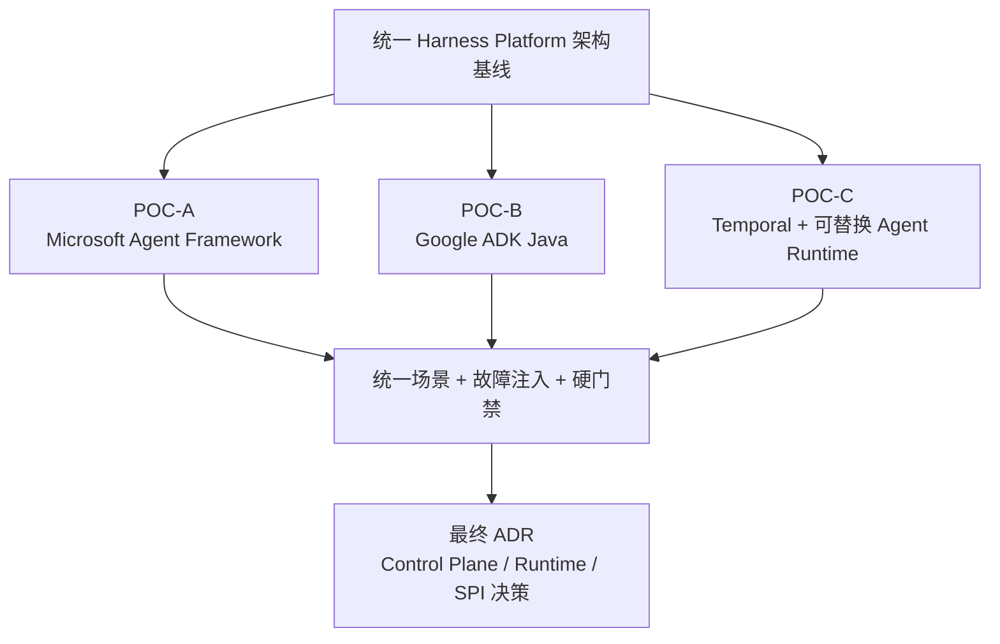

| 文档版本 | V1.0                                 |
|----------|--------------------------------------|
| 文档日期 | 2026-09-29                           |
| 适用范围 | 企业内部 Agent / Harness / PDLC 平台 |
| 状态     | 架构评审稿                           |

**架构基线：厂商无关、控制/执行解耦、协议优先、可恢复、可替换、可审计**

# 文档控制

| **版本** | **日期**   | **变更说明**             | **责任范围**                            |
|----------|------------|--------------------------|-----------------------------------------|
| V1.0     | 2026-09-29 | 首次形成正式架构/POC基线 | 首轮 POC 统一实施、验收、对比与退出标准 |

**说明：本文件记录的是截至 2026-09-29 的技术事实与首轮架构决策。框架能力、许可和托管策略变化较快，进入采购或正式落地前必须重新核验。**

# 执行摘要

本 POC 不以“谁的 Demo 最快跑起来”为目标，而是验证三条架构路线在企业内建场景下是否满足可自托管、可恢复、可替换、可审计、可桥接 UI 协议等关键约束。所有候选必须使用同一组场景和失败注入测试，避免因示例复杂度不同导致结论失真。

图 1 三条首轮 POC 路线

# 1. POC 范围与候选

| **方案**         | **主要验证对象**                              | **核心问题**                                                        | **当前优先级** |
|------------------|-----------------------------------------------|---------------------------------------------------------------------|---------------|
| POC-A MAF        | HarnessAgent + Workflow + Self-host           | 一体化框架能否在不依赖 Foundry 的情况下覆盖大部分 Harness，并通过公开扩展点补齐企业能力 | 1 |
| POC-C Temporal   | Durable Control Plane + Runtime Adapter       | Control Plane 与 Agent Runtime 完全解耦是否更稳、更适合企业长期建设 | 2 |
| POC-B Google ADK | Agent + Session/Event/A2A                     | 不依赖 Java 原生加分后，ADK 的 Runtime/Event/A2A 能力是否仍具有足够差异化价值 | 3 |

> 本轮不再把 Java Native / Java 原生支持作为评分或优先级因素。

# 2. 明确排除项

**LangGraph / Deep Agents 不进入本轮 POC。**

原因：本轮重点是企业内建与部署独立性。LangGraph 的生产部署路径容易进入 LangGraph Server / Platform、自托管依赖 PostgreSQL + Redis，以及 Lite/Enterprise/License 边界，对平台 Kernel 形成额外控制平面。该框架保留为设计参考，但不消耗本轮实施资源。[R8]

# 3. POC 一级硬门禁

| **主题**          | **约定**                                                                                                     |
|-------------------|--------------------------------------------------------------------------------------------------------------|
| G1 自托管         | 不使用厂商托管 Agent Platform，必须可在本地 Docker 或企业 K8s 运行核心流程。                                 |
| G2 状态自主       | 核心 Run/Session/Checkpoint/Artifact 必须可以落自有存储或企业掌控的持久化层。                                |
| G3 协议可桥接     | 必须能映射到平台自有 Responses-compatible + Harness Event Protocol。                                         |
| G4 模型可替换     | 至少证明模型调用层不是框架不可替换的单一云模型绑定；优先验证 LiteLLM/OpenAI-compatible 或 Provider Adapter。 |
| G5 Sandbox 可替换 | Shell/Code Execution 不得强制绑定唯一云 Sandbox；Docker 必须可作为基线。                                     |
| G6 恢复           | 中途杀 Worker/Runtime 后，能够恢复任务或明确定位由哪一层负责恢复。                                           |
| G7 HITL           | 能够暂停等待人工审批，并在批准后继续。                                                                       |
| G8 License Cliff  | POC 记录从 OSS 到生产是否存在关键 Enterprise/Cloud-only 功能断层。                                           |

任何方案未通过 G1/G2/G3/G6 中任意一项，即不得作为平台主架构进入第二轮；其余项若失败，需要形成明确替代实现与成本评估。

# 4. 统一 POC 基线环境

| **主题** | **约定**                                                                                 |
|----------|------------------------------------------------------------------------------------------|
| 部署     | Docker Compose 为最低基线；有条件追加企业 K8s。                                          |
| 存储     | PostgreSQL；对象存储可使用 MinIO/S3-compatible。                                         |
| 模型     | 优先通过企业现有 Model Gateway/LiteLLM；若框架限制则记录为 Gap。                         |
| Sandbox  | DockerSandbox 为基线；E2B 作为可选 Provider，不作为通过条件。                            |
| 代码仓   | 准备统一 Demo Repo，包含可复现缺陷、单测、E2E/集成测试与 lint。                          |
| UI       | 统一测试页面消费自有 SSE Event Protocol；不直接使用框架自带 Dev UI 作为最终结论。        |
| 观测     | 至少输出 run_id、step_id、model call、tool call、command、duration、status、cost/token。 |

# 5. 统一测试场景

| **编号** | **场景**                | **验收重点**                                                             |
|----------|-------------------------|--------------------------------------------------------------------------|
| S01      | Streaming Chat          | 流式文本输出；验证 TTFT、取消、重连。                                    |
| S02      | Multimodal              | 用户输入文本 + 图片 + 文件，产出文本 + Artifact。                        |
| S03      | Plan                    | 生成显式 Plan，并展示 Step 状态。                                        |
| S04      | Execute                 | 在 Sandbox 中读取 repo、修改文件、运行 shell。                           |
| S05      | Verify                  | 单测/lint/自定义验收失败时输出 Evidence，不允许只用 Agent 自我宣告成功。 |
| S06      | Replan                  | 制造错误实现，验证失败分类与 replan。                                    |
| S07      | Recovery                | 执行中杀 Worker/容器，再启动并观察是否从正确位置继续。                   |
| S08      | HITL                    | 模拟 git push / 高风险操作，进入 WAITING_APPROVAL 后跨进程恢复。         |
| S09      | Provider Swap           | 切换第二种模型/provider，不改 Harness 领域模型。                         |
| S10      | Sandbox Swap            | Docker → 第二 Sandbox Adapter，业务 workflow 不改。                      |
| S11      | UI Protocol             | 事件映射为 run/plan/tool/verification/artifact typed events。            |
| S12      | Deployment Independence | 完全禁用厂商托管平台后仍通过核心链路。                                   |

# 6. 统一目标业务任务

建议用一个“软件工程 correctness 修复任务”作为主任务，同时准备一个“文档分析/抽取任务”作为非 Coding 对照。Coding 主任务示例：修复一个可稳定复现的编辑器光标/状态恢复类缺陷；要求读取仓库规则、定位根因、修改代码、补测试、运行验证并输出 Diff 与测试证据。

- 禁止让不同方案使用不同难度 Demo。
- Acceptance Criteria 由平台侧固定，不允许框架自行改变。
- 测试失败必须触发明确 Failure Type，而不是把所有失败都归为“模型继续尝试”。
- 限制 max_iterations、max_replans、max_runtime、max_cost，观察每个框架的控制能力。

# 7. POC-A：Microsoft Agent Framework

## 7.1 验证假设

MAF 的价值在于 HarnessAgent、Workflow、Self-host、Responses/A2A/AG-UI 与 Durable Extension 组合得较完整。POC 重点验证：不用 Foundry Hosted Agents 时，是否仍能作为企业内建 Runtime/Harness 使用；生产所需持久化和 Durable 能否掌握在自有基础设施中。[R1][R2][R3]

## 7.2 建议拓扑

- MAF Runtime Service：Python 优先，降低 POC 开发成本；如果组织计划引入 .NET，可补做 C# 对照。
- HarnessAgent：开启 Plan/Todo/Compaction/Approval 等可用能力。
- Self-host：FastAPI/ASP.NET 仅作为宿主，不使用 Foundry Hosted Agent。
- SessionStore：实现 PostgreSQL-backed store，避免仅使用 in-memory。
- 协议：优先暴露 Responses-compatible endpoint；可补 AG-UI/A2A。
- 执行：Docker shell/自定义 Sandbox Adapter；所有命令输出形成 Evidence。

## 7.3 必测项

1. HarnessAgent 是否能稳定维护 plan/todo，并在多轮 session 中保持状态。
2. Workflow 是否能承担 Verify/Replan 的确定性状态迁移，而不是把控制权全部给 Harness。
3. Memory/Context 分层是否清晰：Session、Working Memory、Long-Term Memory、ContextProvider、Compaction 是否可以独立替换和持久化。
4. SessionStore/HistoryProvider 是否可完全使用自有数据库。
5. Self-host 模式下是否无需 Foundry 即可完成 Responses/AG-UI/A2A 接入。
6. Durable Extension 的 self-host / BYOC 路线需要哪些 Durable Task 基础设施，运维成本多少。
7. Python hosting/durable 相关包的 prerelease/stability 风险是否可接受。
8. 至少实现 Custom ContextProvider、SessionStore、CheckpointStorage、ChatClient、Workflow Executor、Middleware、Sandbox Adapter。
9. 所有企业补齐能力是否都能仅依赖 public extension points 完成，不 fork、不 monkey patch、不复制大量内部代码。

## 7.4 MAF 退出条件

若核心 Durable、Session、协议或 Harness 生产能力必须依赖 Foundry；或自托管 Durable Task 的运维/许可成本与自建 Control Plane 相当，则 MAF 降级为 Data Plane/Harness Runtime，而不作为平台 Control Plane。

# 8. POC-B：Google ADK

## 8.1 验证假设

ADK 的重点不再是 Java 原生优势，而是 Agent、Runner、Session、Event、A2A、Tool、Streaming 与部署独立性。POC 重点验证：在不依赖 Google Agent Runtime / GCP 特有托管能力的情况下，ADK 是否仍值得作为通用 Agent Runtime / Orchestration 组件。[R4][R5]

## 8.2 建议拓扑

- 使用 ADK 当前主力语言实现即可，不把语言作为评分因素。
- ADK Agent + Session/Event 模型；由平台侧生成 run_id/turn_id。
- A2A / ADK SSE 作为框架边界，外部再转换为统一 Conversation Protocol。
- 代码执行优先 ContainerCodeExecutor / Docker，不使用 Vertex Agent Runtime 作为通过条件。
- 模型层至少尝试 Gemini + 第二 Provider；如果第二 Provider 需要额外适配，记录真实工作量。
- 自有 PostgreSQL/Artifact Storage 接入；框架内置 Dev UI 仅用于调试。

## 8.3 必测项

1. Agent/Runner/Session/Event 完整性、生命周期和并发模型。
2. Sequential/Parallel/Loop 等编排能否表达 Plan/Execute/Verify/Replan，还是需要外置状态机。
3. Session、Artifact、Event 是否可替换为企业自有存储。
4. A2A、SSE、MCP/Tool 与企业 Gateway 的协议适配成本。
5. Container Code Executor 的安全边界、网络、文件挂载和资源限制。
6. 不使用 GCP Agent Runtime、Cloud Run/GKE 特有服务时是否仍具备完整核心能力。

## 8.4 ADK 退出条件

若关键 Session/Artifact/Sandbox/Observability 只能在 Google 托管能力中获得，或非 Gemini / 非 GCP 环境下适配成本明显高于收益，则 ADK 仅保留为备选 Agent Runtime，而不承担平台统一 Control Plane。

# 9. POC-C：Temporal + 可替换 Agent Runtime

## 9.1 验证假设

Temporal 不提供 Agent Harness，而提供 Durable Execution。该路线验证“平台 Control Plane 与 Agent Runtime 完全解耦”是否更适合长期企业建设。Temporal 官方支持自托管或 Temporal Cloud，Workflow 可在 Java 实现，Durable AI 也明确覆盖长任务 Agent、Tool、HITL 和框架集成。[R6][R7]

## 9.2 建议拓扑

- Java/Spring Boot：Platform API、Recipe、Policy、Artifact、SSE Gateway。
- Temporal Java Workflow：Plan → Execute → Verify → Replan 状态机。
- Activity：调用独立 Agent Runtime Service；POC 可选择 OpenAI Agents SDK 或极简自研 Adapter。
- Sandbox SPI：Docker 为默认实现；E2B 作为可选第二实现。
- Temporal Service：优先本地/self-host 基线，确保不是 Temporal Cloud 才能运行。
- HITL：使用 Signal/Update 等模式暂停并恢复。

## 9.3 推荐 Workflow 边界

**Workflow 只保存确定性状态和调度决策；所有模型调用、HTTP、Shell、Git、文件 I/O 都必须进入 Activity / Data Plane。**

这与平台原则完全一致：Temporal Workflow = Control Plane；Agent/Sandbox Activity = Data Plane。

## 9.4 必测项

1. 杀死 Agent Worker、Temporal Worker、API 服务，分别观察恢复行为。
2. Activity retry 与业务 Replan 的边界：基础设施失败自动 retry，语义失败进入 Verifier/Replan。
3. WAITING_APPROVAL 跨小时/跨进程恢复。
4. Workflow versioning / replay 对 Agent 平台长期升级的约束。
5. Task Queue/Worker 隔离能否用于 tenant、priority、runtime 类型。
6. Agent Runtime 从 A 实现切换到 B 实现时，Workflow 和 UI 是否保持不变。

## 9.5 Temporal 退出条件

若引入 Temporal Service、数据库和 Worker 体系带来的运维复杂度明显高于长任务可靠性收益，或团队无法接受 Workflow 的确定性/replay 编程约束，则 Temporal 不作为默认内核；但仍可作为高可靠长任务的专用执行层。

# 10. POC 统一数据采集

| **主题** | **约定**                                                     |
|----------|--------------------------------------------------------------|
| 部署     | 组件数量、镜像数量、外部依赖、配置项、启动时间、K8s 对象数量 |
| 可靠性   | 恢复成功率、重复执行次数、幂等问题、丢事件/丢状态情况        |
| 开发效率 | 核心场景代码量、Adapter 代码量、框架特殊代码占比             |
| 运行效率 | TTFT、总时延、额外 orchestration 开销、内存/CPU              |
| 可替换性 | 换模型/换 Sandbox/换 Runtime 的改动文件数与代码行            |
| 协议     | 映射到统一 Event Protocol 的字段损失与自定义事件数量         |
| 治理     | IAM/Policy/Approval/Secret/审计接入点完整度                  |
| 生产断层 | 需要商业版/托管平台才能获得的关键能力清单                    |

# 11. 故障注入矩阵

| **故障**           | **注入方式**         | **期望**                       | **不得发生**               |
|--------------------|----------------------|--------------------------------|----------------------------|
| Model timeout      | 让模型 endpoint 超时 | 按 RetryPolicy 重试，不丢 Run  | 整个任务重头执行           |
| Agent Worker crash | kill -9 worker       | 恢复到未完成 Step              | 已完成 Step 重复产生副作用 |
| Sandbox crash      | 销毁执行容器         | 按 Sandbox State/Step 策略恢复 | 控制平面状态丢失           |
| Verifier fail      | 固定测试失败         | 进入 RETRY/REPLAN              | Agent 自称成功并完成       |
| UI disconnect      | 断开 SSE 后重连      | sequence replay                | 看不到历史活动             |
| Approval wait      | 暂停后重启服务       | 仍保持 WAITING_APPROVAL        | 审批请求消失               |

# 12. 评分与决策规则

硬门禁先于评分。通过硬门禁的方案再进入加权比较。建议权重如下，评审时可以调整，但必须在看结果前冻结权重。

| **维度**               | **建议权重** | **核心证据**                         |
|------------------------|--------------|--------------------------------------|
| 部署独立性/生产断层    | 25%          | 无 Managed Platform 情况下的真实部署 |
| 恢复与可靠性           | 20%          | 故障注入结果                         |
| Harness 原生覆盖率     | 15%          | Plan/Context/Memory/Workflow/HITL 等直接覆盖 |
| 扩展稳定性             | 15%          | Public API 补齐能力；是否需要 fork/patch |
| 协议与可替换性         | 10%          | Provider/Sandbox/UI Adapter 替换     |
| 运维复杂度             | 10%          | 组件/依赖/升级/监控                  |
| 生态与成熟度           | 5%           | 版本、文档、社区、长期风险           |

# 13. POC 交付物

1. 三套独立可启动的 POC repo/目录，包含 Docker/K8s 启动说明。
2. 统一 Demo UI 或事件查看器，消费相同 Harness Event Protocol。
3. 统一 POC Task Dataset 和 Acceptance Criteria。
4. 故障注入记录、恢复证据、日志、截图/trace。
5. 各方案部署拓扑、依赖清单、License/Managed Feature Cliff 清单。
6. 最终对比矩阵与 ADR：选用、组合或放弃某方案的依据。

# 14. 建议实施顺序

1. 先定义统一 Run/Plan/Step/Event/Artifact 数据结构和 POC Demo Task，避免三组各自发挥。
2. **POC-A MAF 第一优先**：验证约 80% 原生覆盖是否成立，以及剩余企业能力能否只通过 public extension points 补齐。
3. **POC-C Temporal 第二优先**：验证更纯粹的 Durable Control Plane 是否值得增加组合与运维复杂度。
4. **POC-B ADK 第三优先**：在不计 Java-native 优势的前提下，验证其 Runtime/Event/A2A 的独立价值。
5. 所有 POC 完成后再决定最终组合，不在过程中因某个 Demo “看起来更快”提前定框架。

# 15. POC 前匹配度基线

以下为架构映射估算，不是实测：

| 方案 | 原生覆盖率 | 架构适配率 | 说明 |
|---|---:|---:|---|
| MAF | ~80% | ~89% | 当前完成度最高的一体化方案 |
| Temporal + Runtime | ~72% | ~92% | 架构边界最纯粹，但组合/运维复杂度更高 |
| Google ADK | ~68% | ~75% | Runtime 基础较好，Harness/Durable 仍需补 |

> 按 ±5 个百分点理解。POC 结束后必须用实测替换该表。

# 16. POC 完成定义（DoD）

- 12 个统一场景全部有 PASS/FAIL/Gap 结论。
- 6 个故障注入场景均有可重复证据。
- 部署独立性 8 个硬门禁有明确结论。
- 三组都完成统一 UI Event 映射。
- 三组均给出从开发到生产的额外基础设施清单。
- 最终 ADR 明确“Control Plane 选什么、Agent Runtime 选什么、哪些能力继续保留 SPI”。

# 参考资料与事实基线

以下资料用于确认框架当前能力、部署模式和许可/托管边界；访问日期均为 2026-09-29。

[R1] Microsoft Agent Framework - Self-host applications  
https://learn.microsoft.com/en-us/agent-framework/hosting/self-hosting

[R2] Microsoft Agent Framework - Agent Harness  
https://learn.microsoft.com/agent-framework/agents/harness

[R3] Microsoft Agent Framework - Durable Extension  
https://learn.microsoft.com/en-us/agent-framework/hosting/azure-functions

[R4] Google ADK Java Quickstart  
https://adk.dev/get-started/java/

[R5] Google ADK deployment / GKE example  
https://docs.cloud.google.com/kubernetes-engine/docs/tutorials/agentic-adk-vllm

[R6] Temporal Platform Documentation  
https://docs.temporal.io/

[R7] Temporal Durable AI  
https://docs.temporal.io/ai

[R8] LangGraph self-hosted model  
https://github.com/langchain-ai/langgraphjs/blob/main/docs/docs/concepts/self_hosted.md