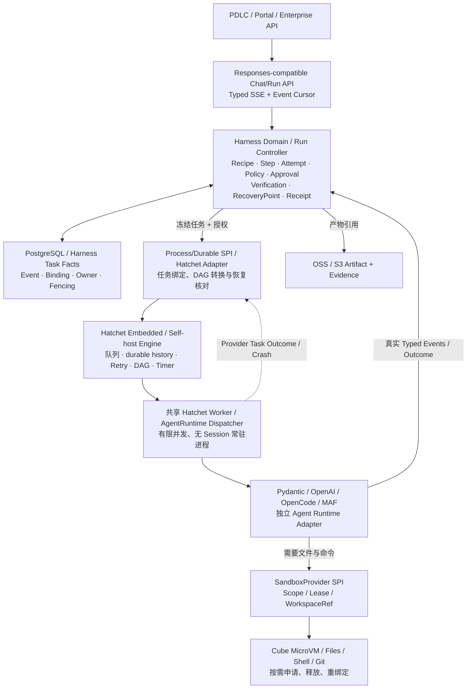

# Hatchet Process/Durable 目标架构调整（2026-10-10）

> 状态：**Architecture Candidate / Implementation Baseline（未 Accepted Production ADR）**。唯一对照与准入待办：[ARCH-TODO-028](../ARCHITECTURE_BACKLOG.md)。
>
> **2026-10-10 ARCH-TODO-030 / ADR-032 三合同 DECIDED：** [HC-01 运行映射与 Replan](HATCHET_WORKFLOW_MAPPING_CONTRACT_20261010.md)；[HC-02 可靠一致性](HARNESS_HATCHET_CONSISTENCY_CONTRACT_20261010.md)；[HC-03 Worker/Cube 执行授权](HATCHET_WORKER_SANDBOX_BINDING_CONTRACT_20261010.md)。执行段与 Provider ID 的多对多关系、Outbox 的不确定窗口和 Scope/Fencing 已有架构合同；具体 SDK 及真实 Cube POC 仍开放。
>
> **Control Plane 具体自研边界以 [ADR-031 薄控制层决议](THIN_HARNESS_CONTROL_PLANE_DECISION_20261010.md) 为准：Hatchet 是技术执行状态权威，Harness 仅保存必要领域事实/状态投影，不重复实现完整技术执行状态机。**
>
> 本文规定当前代码与架构图应遵循的**候选实现方向**，不是宣称目标架构整体已完成生产验收。DBOS 因许可证不符合本平台要求，已由决策**正式排除（REJECTED）**；其历史验证可以留档，但不得再次列为备选、开发分支或验收对象。Temporal、MAF Durable、手写 PG Worker 仅留历史调研，不作为本阶段并行研发路线。

## 1. 当前明确的架构选择

**一条业务 Run 由 Harness Domain 主导，一条或多条可恢复执行流程由 Hatchet 驱动；某一步选择哪个 Agent Runtime 与使用哪个 Cube Sandbox 均不由 Hatchet 决定。**

- **Process/Durable SPI 的唯一优先实现：Hatchet Embedded / self-hosted + PostgreSQL。** 利用 Hatchet 现成的 durable task / DAG / queue / retries / worker dispatch / run-history / engine-level failover，不另造第二个通用调度器、队列、计时器和 Worker 心跳协调产品。
- **Harness Domain/Control Plane：** 平台拥有 Conversation、Turn、Run、Recipe/Plan(vN)、Step、Attempt、Execution、Policy、Verification、Approval、RecoveryPoint、SideEffectReceipt、Artifact/EvidenceRef、Event Sequence 的权威含义与迁移决策。领域模型不得直接导入 Hatchet SDK。
- **Process/Durable Adapter：** 将已冻结的 Recipe/Step 依赖编译为 Hatchet 任务／DAG；用确定性、可追踪的 Binding 映射 platform_run_id / step_id / attempt_id ⇔ provider_workflow_run_id / provider_task_id；转换 ready/claimed/completed/failed/cancelled 状态，不允许 Hatchet 状态直接修改业务最终状态。审批/等待须明确 durable resume/wakeup 对应关系，未验收不能宣称自动解决。
- **AgentRuntime SPI：** Pydantic AI Harness、OpenAI Agents SDK、OpenCode 2、MAF 各自保持独立 Adapter；Hatchet Worker 通过统一 Dispatcher 执行具体 Runtime，不要求在 Pydantic 内执行其他 SDK。
- **SandboxProvider SPI：** 按 Scope/Lease/Fencing/Capability 映射 Session→WorkspaceRef/SandboxRef；轻任务 0 Sandbox，Coding 优先 Harness-in-Cube；同一 Sandbox 是否跨 Step 复用由平台授权判定，而非 Hatchet Worker 的宿主机缓存。
- **存储边界：** Harness Task Facts、域 Event、Binding、Receipt、RecoveryPoint 在平台自有 PostgreSQL 逻辑表／Schema；Hatchet 使用其独立的工作流/队列系统表（同一 PostgreSQL 实例是否同库同 Schema 均为部署参数；**绝不能混表或让 Hatchet Engine 成为领域事实源**）；大 Payload/Evidence 在外部 OSS/S3；Trace 在 OTel 外部后端。

## 2. 单 Run 执行链

**禁止直接依赖：** UI/API→Hatchet 工作流业务主键；Hatchet Engine→平台业务 Run 终态写入；Agent SDK→Hatchet 领域状态；Hatchet Worker→宿主机 Shell（当需要隔离）；Sandbox ID→授权；DBOS 依赖及任何双 Durable 包裹同一 Agent Execution。Hatchet 的 workflow_run_id 是 provider binding，不是平台 run_id。

## 3. 生命周期与恢复语义

1. **创建**：API 验证 Principal/Scope，平台事务冻结 Run/Recipe/Agent/Model/Policy/Environment 版本并持久化 Task Fact；经 Process SPI 幂等入队。跨域提交失败须采用可对账 outbox/重新投递机制设计，**不建立跨库 2PC**。尚未完成平台持久化对账的实现为 OPEN。
2. **领取**：Hatchet 选中 DAG 可运行 Task；共享 Worker 先向平台领取已授权 Execution（owner/fencing generation），校验 Grant 再经 AgentRuntime SPI 运行；未拿到可信授权 Fail Closed。
3. **输出**：Worker/Agent Adapter 向平台 Event Bridge 写真实 Typed Event；UI SSE 订阅由平台 Event Sequence 承担，不能用 Hatchet 自有日志或 Task Result 代替 Token 流。
4. **审批与外部输入**：Run 进入 WAITING_APPROVAL/WAITING_INPUT，持久化 Approval/RecoveryPoint，等待期间不占用执行中的 Agent 线程／Sandbox（除明确保留授权的 Workspace Lease）；授权 Principal 的决议恢复**原 Run**，不能因 Provider 回调再新建业务 Run。这是生产门禁，当前 **NOT TESTED**。
5. **Worker A Crash → B 接管**：Hatchet 层重调度与 DAG 已完成 Task replay 由引擎负责；Harness 必须使旧 Execution/Lease/Fencing 失效并核验 Task Facts、Receipt、Workspace Capability，再允许执行新 Attempt 或明确 Native Resume。**自动重执行仅适用于证明安全、可幂等/无副作用的操作**。
6. **不确定外部副作用**：工具可能已经成功但 ACK 丢失，一律 UNKNOWN → Reconciliation（查询 SideEffectReceipt/外部事务 ID/人工核对）→ 决定 Resume/Retry/Fail；绝不让 Hatchet retries 直接重放 Git push、提交工单、部署等不可确认的副作用。
7. **取消与恢复**：Cancel 是请求，不等于 Agent、Tool、Cube 已终止；必须向当前 Worker/Runtime/Sandbox 逐级传播，最后核对实际终态。平台恢复粒度上限取决于 Runtime-native checkpoint 和最近可信 Step 边界，不承诺从任意 Token 继续。

**双层恢复约束：** 默认只有**外围 Hatchet**作为统一 Process/Durable 驱动；Pydantic/其他 SDK 自带的 Runtime-native Durability/Checkpoint 并非平台默认任务引擎，不得为同一平台 Step 同时创建两个互相竞争的 durable owner。对真正需要原生 Runtime Resume 的运行，只保存其 Opaque CheckpointRef 并单独制定恢复 Adapter 契约。

## 4. 部署与资源拓扑（候选）

- API/Kernel 与 Hatchet Engine/Worker 可容器化同机启动演示，但**逻辑上分层**。生产私有化倾向 Engine 多实例（共享 PG）+ 弹性 Worker 池；单机 Embedded Sidecar 启动/停止资源回收，尤其 Python multiprocessing semaphore 泄漏警告，需要持续回归。
- Postgres 可以共用基础设施，但 Harness Schema 与 Hatchet 系统 Schema/用户/迁移权限隔离；OSS、Cube、LiteLLM、企业 IAM、MCP/Secret、APM 均消费外部服务。
- 历史 Session 持久化，但**不占用常驻 Worker、Agent 进程和 MicroVM**。100 个活动 Run、100 个空闲 Session 与 100 个需要编译的任务必须分开压测；Hatchet 队列并发、Worker 限流、重负载沙箱配额不得混为同一个阈值。
- 凡原生 OpenCode Shell/Git/PTY 等不能通过可信 Tool SPI 全部远程路由的，Coding 执行仍按需运行在 Cube Guest，不能切到共享宿主机。
- OSS 上传大结果，平台 Task Facts 保存 StorageRef/Digest/Lineage；恢复持久化不代表平台承担数据库/对象存储备份或灾备。

## 5. 实际 POC 证据与准入分级

| 门禁 | 2026-10-10 证据 | 状态 |
|---|---|---|
| Hatchet Embedded 真实 Engine + Pydantic/OpenAI 实际 SDK 逐 Step DAG | [CI #38020725053](https://github.com/Bulls1986/Agent-Harness-Platform/actions/runs/38020725053)；本地确定性模型，无外部真实模型 | **LIMITED LIVE PASS** |
| 两 Engine/Worker + 外部 PostgreSQL，A 被 SIGKILL 且不重启，B 接管原任务 | [CI #38021093089](https://github.com/Bulls1986/Agent-Harness-Platform/actions/runs/38021093089)；安全可重试 Step，已完成 Step 仅执行一次 | **LIMITED LIVE PASS** |
| 同一个业务 Run 同时跨 SDK + Cube + 故障恢复 | 尚未做完整一体化业务链路 | NOT TESTED |
| WAITING_APPROVAL/WAITING_INPUT 持久等待不占 Worker | 尚未完成 | NOT TESTED |
| 非幂等 ToolReceipt 的成功但 ACK 丢失 | 尚未完成 | NOT TESTED |
| Token 级 SSE / Replay Cursor / Cancel | 尚未完成 | NOT TESTED |
| Cube Session/WorkspaceRef + Lease/Fencing Fail Closed | 尚未整体验收 | NOT TESTED |
| 100 活跃 Run/空闲 Session、资源回收与私有化 HA | 尚未完成 | NOT TESTED |

**候选实施 GO；生产 NO-GO。** 在 P0 Gate 与架构评审完成前，Hatchet 是当前优先实现选择而非不可替代、已接受的生产 ADR。

相关记录：[DBOS 排除与 Hatchet 许可、故障实测](DURABLE_ENGINE_LICENSE_GATE_20261010.md) · [Accepted Domain Contract](DOMAIN_MODEL_AND_STATE_CONTRACT.md) · [Failure & Recovery](FAILURE_IDEMPOTENCY_AND_RECOVERY.md) · [Execution Lease/Fencing](EXECUTION_LEASE_FENCING_HEARTBEAT.md)。
