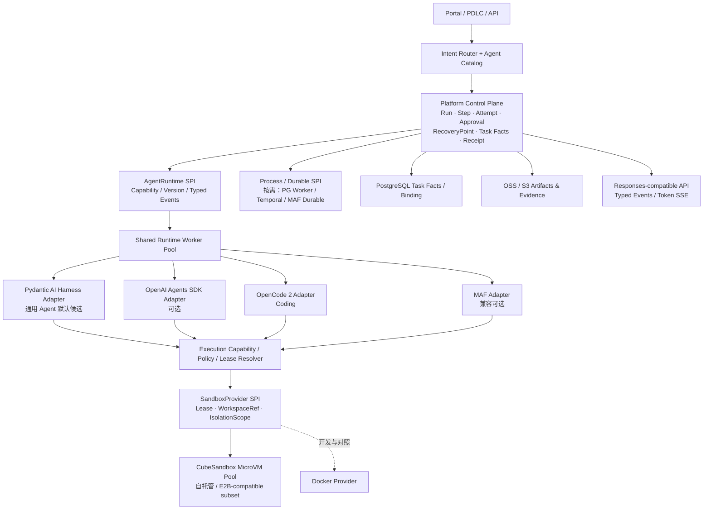

# 多 Harness 平台目标架构（2026-10-09 候选快照）

> **状态：Architecture Candidate / NOT ACCEPTED。** 本文保存最新技术评估与实际 POC 证据；
> 不覆盖既有 Accepted Contracts，也不代表已实施或生产准入。
> 主待办：[ARCH-TODO-024～028](../ARCHITECTURE_BACKLOG.md)；
> [现有技术比较](MULTI_HARNESS_TECH_SELECTION_20261009.md)；
> [Cube 实测细节](../../poc/opencode_sandbox/CUBE_E2B_COMPATIBILITY_FINDINGS.md)。

> **最新状态入口：** [分层准入报告](MULTI_HARNESS_ADMISSION_20261009.md)；准入开发/POC ≠ 生产 Accepted ADR。若后续增加真实接入证据，先更新该报告和对应专项 Findings，再决定是否更改目标架构候选。

## 1. 本轮选择与边界

- **Pydantic AI Harness 优先成为通用专业 Agent 的默认 Runtime Adapter 候选**；不是平台 Kernel，也不是其他 Agent SDK 的宿主。选择依据为同 Agent 实例 20 并发 Run、Run-scoped Workspace/Tool 路由、可选 Sandbox 的已有局部 POC。
- **OpenCode 2 保留专用 Coding Runtime Adapter**；已有 Skills/Subagents/Session/插件能力不强迫迁入 Pydantic；先验证 Harness-in-Cube，再根据全入口隔离证据讨论共享 Host。
- **OpenAI Agents SDK 作为独立可选 Adapter**；MAF 为兼容既有工作流/Executor 的可选 Adapter，退出通用默认框架的首选。两者都应能通过统一 Runtime SPI 被选择，而不是在 Pydantic 内“切 SDK”。
- **Temporal 不是 Agent SDK**；与 MAF Durable、轻量 PG/Worker 调度并列为 Process/Durable 候选实现。平台持久化自己的 Task Facts/RecoveryPoint；不以 Pydantic 的 Agent Loop 推断不需要 Durable，也不为同一 Run 随意叠多个 Durable 引擎。
- **CubeSandbox 为自托管 SandboxProvider 候选**；消费其 Control/Data Plane，不承建 MicroVM、MCP 治理、数据库/对象存储备份、IAM。SDK / Volume 不兼容时经公开 API/REST 的薄适配处理；不 fork Agent SDK。
- **按需隔离、节省资源**：非文件/Shell Agent 不分配 Sandbox；大量逻辑 Session 共享 Runtime Worker；需要执行时按授权 Isolation Scope 申请或复用 Sandbox Lease。不存在“一条历史 Session 永久一个 Agent 进程/VM”的强制映射。

## 2. 目标拓扑（候选）



**箭头说明：** SDK 的“切换”发生在 AgentRuntime SPI 的 Adapter 选择层，不是 Pydantic 内部切换 SDK。Tool 执行携带受信任 Run/Session/Scope/Lease；Sandbox 状态不拥有任务终态。Model Provider/LiteLLM Gateway 是另一个可替换维度，不等同于 AgentRuntime。

## 3. 两种执行拓扑不能混为一谈

| 拓扑 | 适用对象 | 当前结论 |
|---|---|---|
| **A：Harness-in-Sandbox** | OpenCode 2 这类原生 FS/Shell/Git/LSP/插件众多的 Coding Harness | **优先实施候选**：每个*活动的*执行隔离实例内运行 Harness，不等于每历史 Session 一个进程；需专用 Cube OCI Template 和真机验证 |
| **B：Shared Harness Host + Remote Sandbox Tools** | 所有执行入口可经公开 SPI 安全重定向的 Runtime（特别是 Pydantic 的 Run-scoped Tools） | Pydantic POSIX 工具路由已局部通过；**OpenCode 2 Host 原生 Shell 已有负例，不具生产隔离准入**，不能仅映射 Session ID 就称完全接入 |

## 4. 持久化绑定与资源逻辑

```text
Logical Run / Session (persisted, many)
    -> Trusted RuntimeExecutionContext
       [run_id, session_id, isolation_scope, lease_generation,
        sandbox_id?, workspace_ref?, capability, runtime_adapter]
    -> Shared Worker (bounded processes / concurrency)
    -> Sandbox Lease (only for permitted active execution)
    -> Cube MicroVM + Workspace (one or more authorized Agent stages)
```

- Session ID 是查找键而非授权凭据。获取既有 Sandbox 必须校验 Scope/Run/Fencing Generation；失配、未知、恢复不确定状态 **Fail Closed**，不得回退到宿主机 Shell。
- 工作阶段可以共享同一 Sandbox/Workspace，前提是**相同授权 Isolation Scope**；跨项目、用户、秘密边界不共享运行状态。
- 平台记录 Binding/Task Facts、Receipt 和 RecoveryPoint；Cube 负责 VM/文件/命令/生命周期。Sandbox ID 与 Framework 原生 ID 都是引用而非平台逻辑身份。
- Worker 故障后按已记录的 SandboxRef 尝试安全重新连接并核对 Tool Receipt；不自动重新执行有未知非幂等副作用的 Tool。

## 5. 截至 2026-10-09 的证据快照

| 结论 | 状态 | 范围与证据 |
|---|---|---|
| Cube 原生 SDK 0.7.0 在自建 Cube v0.7.2 创建/删除 MicroVM、Shell、文件 | **LIVE PASS** | 单实例，16 GiB XFS 最小 POC；不是容量/官方磁盘建议验收 |
| Cube 原生 SDK 对运行中相同 Sandbox ID 重新 connect 并读取原文件 | **LIVE PASS** | 非暂停、崩溃或跨 Worker 恢复 |
| OpenAI Agents SDK 0.23.1 公开 FunctionTool → Cube Native Sandbox | **LIVE LIMITED PASS** | 无模型 Agent Loop；文件/Shell 经公开 Tool 扩展点 |
| E2B Python SDK 2.53.1 在 Cube v0.7.2 创建 | **LIVE FAIL** | `SandboxException: HTTP 405`；客户端使用 `POST /v2/sandboxes`，需核对 Cube 支持版本和 API 网关 |
| OpenAI 原生 E2BSandboxClient 使用上述 E2B SDK | **LIVE FAIL** | 同样 405；不得以 FunctionTool PASS 替代 Native PASS |
| OpenCode 2.0.24 在 Docker Sandbox 的 V2 Session/FS/Shell，与 OpenAI Tool 接力 | **DOCKER LIMITED PASS** | 零模型；非 Cube |
| OpenCode 2 在 Cube MicroVM 中实际运行 | **BLOCKED** | 当前 `sandbox-code` 模板中没有 opencode/node/npm/bun，需专用 OCI 模板；共享 Host Shell 有执行在 Host 的反向证据 |
| Pydantic AI Harness 0.54.0 单 Agent 20 并发 Run、Run-scoped LocalWorkspace 工具 | **OFFLINE + Linux CI PASS** | E2B WorkspaceRef 重连仅 Mock；在真实 Cube 上未测试 |
| Pydantic AI Agent Tool Loop → Cube 原生 SDK → OpenAI FunctionTool 接力 | **LIVE LIMITED PASS** | 1 个 Pydantic Agent 实例、2 Run/6 Tool 调用、1 Cube MicroVM、OpenAI Tool 同 Workspace 读取 PASS；FunctionModel 零远程模型调用，非 Pydantic Harness 内置 E2B/Coder，非原生 E2B |
| AgentRuntime SPI 跨 Pydantic/OpenAI/OpenCode 的真实协议与取消/恢复替换 | **NOT TESTED** | 仍是候选架构，不代表已经支持透明切换 |
| Cube Volume、pause/resume、跨 Worker 非幂等 Receipt、隔离/10～1000 密度 | **NOT TESTED** | 不是本轮最小 MicroVM POC 所证明的能力 |

## 6. 进入 Accepted 的门禁

1. **Runtime Adapter**：同一平台 Run/Typed Events/Token SSE/ToolReceipt，分别经 Pydantic、OpenAI SDK、OpenCode 2 公开接口执行；任一 Adapter 失败不污染其他任务。
2. **Cube 兼容**：明确通过或明确标记不支持的 E2B SDK 与 Cube API 版本矩阵；同真实 Sandbox 的多 SDK 接力；优先验证公开 API 薄适配，不对 SDK 内部猴子补丁。
3. **OpenCode 2**：专用 OCI 模板，真实 Cube 内 V2 Session/FS/Shell/至少一种 Git 操作；对共享 Host 全入口隔离严格保留 NO-GO 门禁。
4. **资源/恢复**：无执行需求零 Sandbox；多 Session 共 Worker；异 Scope 不串租约；Task Crash/Worker B 接管/UNKNOWN Tool Receipt/HITL 恢复可核对。
5. **Durable 选择**：仅依据任务级恢复与开发维护/运维成本的等价验证，在 Temporal、MAF Durable、平台 PG/Worker 最小实现之间做决定；并同步 Accepted ADR 后才改变基线。

这些是 **POC 门禁与架构候选**，不是新增企业 IAM/Quota/Backup/治理产品的实现任务。
