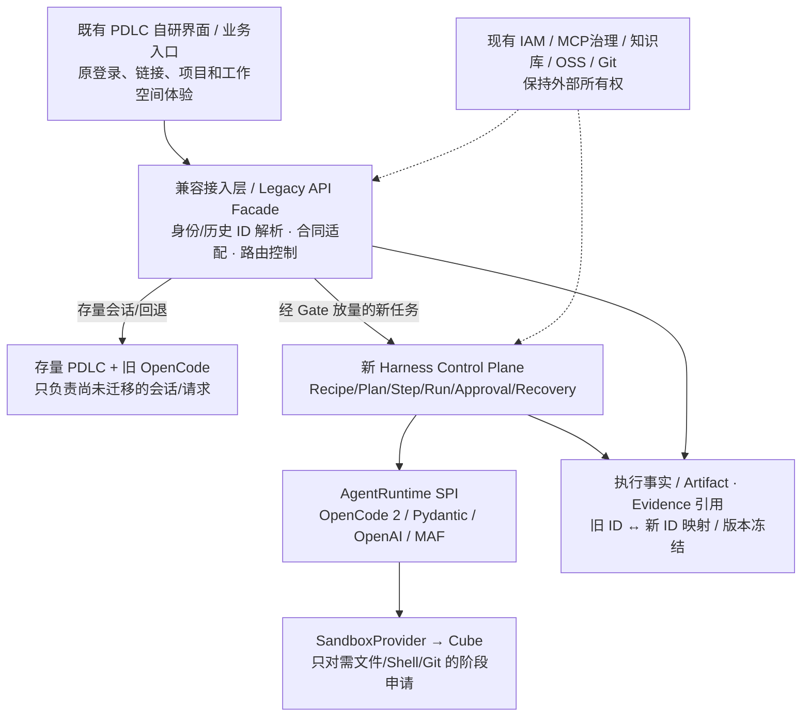

# 现有 OpenCode PDLC 平台替换与无感迁移方案（2026-10-10）

> **状态：业务目标确认 / 迁移设计候选，尚未验证旧平台真实代码与现网数据。** 本文件是 [根目录 README 总体架构](../../README.md) 的迁移专题，不能覆盖 Accepted Domain/State、Workspace、Security、Recovery Contract。
>
> **正式业务目标：** 新 Agent Harness Platform **替换现有基于 OpenCode 的 PDLC 平台运行架构**，在尽可能不改变用户操作、业务功能和既有数据的前提下平滑迁移，并新增**跨 Agent 任务串联能力**。PDLC 是第一个必须迁移的产品，不是新平台唯一可支持的业务。

**现有架构准确描述：** 产品、研发、测试、文档和业务 Agent **目前统一使用 OpenCode**，不是已经各自运行在 Pydantic、OpenAI 或 MAF 等不同 SDK 上。OpenCode 作为 Coding Agent 快速提供文件、代码、Shell 与 Git 能力；随着业务 Agent 扩展到类型化输出、数据抽取和流程协作，继续在同一个 Coding Harness 上叠加能力的改造成本逐步上升，因此采用多专业 Runtime + 统一 Harness，而非强制让所有 Agent 继续使用 OpenCode。

> **2026-10-10 执行安排：** 本文 M0–M4 不再作为 HC-01/02/03 架构收口阻塞条件；旧平台实码接口/会话/Schema 盘点已列入 [Development Backlog · DEV-PDLC-01～05](../DEVELOPMENT_BACKLOG.md)，须在实际迁移开发时从真实旧系统只读提取。业务目标/单 Writer/安全迁移和生产验收要求不降低。

## 1. 先区分“替换平台”和“替换 OpenCode”

本次替换对象是**现有 PDLC 的平台层、执行管理方式及其架构约束**，不是一开始就删除 OpenCode：

- **既有体验/产品能力保留：** 用户入口、页面、组织权限、会话、项目、业务资产、扩展能力等，先通过兼容适配继续使用。
- **控制面替换：** 由平台统一持有 Run/Plan/Step/Attempt、跨 Agent 编排、事件、Policy、Approval、Artifact/Verification/Recovery；不再把这些业务事实隐含在 OpenCode Session 或 Prompt/Skill 中。
- **执行面解耦：** 第一阶段 OpenCode 仍可承担 Coding Runtime，采用经过 POC 的 OpenCode 2 + Cube Harness-in-Sandbox；Pydantic/OpenAI/其他 Runtime 经同一个 SPI 接入。
- **存量迁移与新任务分开：** 已有用户资产和历史会话必须可用；**历史交互上下文不保证可跨 SDK 原地继续**，需兼容读取、继续留在旧 Runtime 执行，或者经实际验证的快照恢复策略；绝不能静默丢失历史/执行证据。

因此第一期成功标准是 **“原有 PDLC 不退化 + 新 Agent 串联可用”**，不是“全站不再含任何 OpenCode 代码”。

## 2. 用户能够感知到什么？

| 用户视角 | 迁移后目标 | 不合格例子 |
|---|---|---|
| 访问与身份 | 旧入口/深链接、既有 SSO/企业组织 Group 与授权范围持续有效 | 必须更换网址、重新注册或群组权限丢失 |
| 产品功能 | 原有产品/研发/测试业务页面、项目、需求/迭代/用户故事/任务关系和操作保留 | 需要用户手工重新建项目或重新整理任务关联 |
| Agent 资产 | 现有 Agent、Skills、Prompts、Instructions、Subagents、Hooks、Plugins、MCP/扩展、代码库关联继续可发现和执行 | 原配置导入后不生效或行为默默改变 |
| 对话历史 | 原会话可查、顺序/附件/引用/审计关系一致；活动会话不中断或由原执行服务完成 | 历史对话无故消失、上下文归零 |
| 文件/代码 | Workspace/路径、仓库、Branch/Worktree、差异、测试产物及对象存储引用保持可用 | 路径变化破坏工具、错误项目读取到别人的代码 |
| 执行与反馈 | 消息发送/模型流/工具调用/取消/审批/重试的用户语义保持；有变化时显式提供适配 | 新旧界面相同但提交命令被重复执行 |
| 新增能力 | Recipe 驱动 Agent A→B→C 的受控结果交接、验证、审批与恢复 | 仅靠 Prompt 要求 Agent 自行转交，无法审计或恢复 |

> **证据分级：** 上表是**迁移验收合同候选**，不是“已经全部完成的功能清单”。既有 PDLC 的真实代码、数据库 Schema、接口版本和线上功能开关不在本 Agent-Harness-Platform 仓库内，必须在迁移前按现网盘点确认。本表综合既有设计讨论中出现过的能力，**不代表逐项已验证上线**。

## 3. 推荐替换拓扑：保留体验，渐进替换内核

**核心策略：绞杀式替换（Strangler Pattern），而非全量停机重写。** 先让旧前台沿用旧 API 合同，经兼容 Facade 按**用户/项目/会话/任务**稳定路由到旧或新执行端；新平台逐渐接管新 Run。旧端仅服务尚未转移的会话，最后在实际完成迁移后退休。

**数据一致性原则：同一执行对象只允许一个权威写入者。** 旧、新平台不能同时对同一个 Tool 指令、Git Push、MR、审批或外部业务操作双写。影子模式只能做**只读请求比对或无副作用的干跑**；有副作用的执行须明确 RouteOwner、IdempotencyKey 和可信 Receipt。

## 4. 必须补齐的“存量资产与 API 合同”清单

迁移前先从现有 PDLC 仓库与部署中导出**只读**事实，形成每项的 Owner、存储位置、读取接口、写入接口、对应旧 ID、迁移新对象、关联业务、测试与回退。

| 盘点领域 | 需要读取的事实 | 迁移规则 |
|---|---|---|
| UI / API / 身份 | 路由、请求/响应、错误码、事件/SSE、Auth/SSO、组织 Group、可见性 | 优先原界面+原合同；保持用户和权限，拒绝跨用户/项目会话泄漏 |
| Agent 配置与包 | Agent 角色、模型/Prompt、Skill/Instructions/Subagents/Hook/Plugin/Commands/MCP、版本与权限 | 通过 Registry/Adapter 引用与冻结原版本；不把 Skill 变硬编码流程 |
| 会话与消息 | Session/Message/附件、压缩摘要、Provider Session ID、活动状态、模型/上下文 | 历史只读可回溯，LegacyID→PlatformID 稳定映射；活动会话原端留存到安全切换点 |
| 项目与工作区 | Project/Repo/Worktree/Branch、路径、历史 Workspace、Git revision、文件资产 | 指向同一受控 Repository Workspace；验证路径与读写行为，不能凭拷贝 Session 认定可继续执行 |
| PDLC 业务模型 | 产品/研发/测试工作区、需求/迭代/用户故事/Task、依赖、知识上下文 | 既有业务对象保留在其 Owner 服务；Harness 只存 Run/Step 与外部对象 Reference |
| 知识/扩展/文件存储 | MCP、知识校准、知识库/检索、代码反推、MinIO/OSS、附件及大日志 | 保留外部平台；通过受控 Adapter/Reference 消费，核对 Digest、引用与权限 |
| 审批、审计与模型路由 | 操作记录、用户身份、模型配置、限额/费用引用、异常会话 | 历史审计不可重写或丢失；不复制 IAM/计费产品，新平台记录新执行事实 |

**请注意**：以上仅是迁移核对维度。其中企业微信组织 Group、开发者界面、Skills/CLI、扩展、知识库等具体名称来自先前建设讨论；旧系统是否在当前正式环境已上线、启用哪些功能和真实 Schema，需接入旧平台代码/部署后逐项确认，不能直接标全部 PASS。

## 5. 领域与 API 映射：兼容不是直接拷贝 OpenCode Session

| 旧平台概念（待实码确认） | 新架构落点 | 兼容策略 |
|---|---|---|
| PDLC User/Group/权限 | 外部 IAM 输入 + SecurityContext | 继续使用既有 IdP；保护旧资源授权语义 |
| Session / Message | Conversation/Turn，LegacySessionMapping | Legacy ID 保持稳定解析；原消息、顺序和附件只读展示 |
| 一次交互请求/任务执行 | Run/Plan/Step/Attempt/Execution | 对新执行建立真实任务事实，**不能将历史聊天简单等价为已执行 Run** |
| OpenCode Server Session | RuntimeBinding.provider_session_id | 可继续由 OpenCode 服务管理，不把 Provider ID 当平台唯一业务 ID |
| Project、Requirement、Story、Task | 既有业务服务 + Workspace/Artifact/Reference | 不将 PDLC 所有业务对象重建进 Harness Domain |
| Agents/Skills/Prompts/MCP | 既有资产中心/Registry + Runtime Adapter | 资产升级显式版本冻结；工具权限按实际 Execution 授权 |
| Git/Workspace/MinIO | Repository Workspace / Artifact Storage References | 原有代码和文件可以继续被引用；迁移时校验权限、修订与 Hash |

**迁移表为兼容 Facade 的 Adapter Metadata，不在 Harness Kernel 平白新增第二套 Session 或 PDLC 领域状态机。** 旧 Session 可能缺少恢复到新的 OpenCode 2/Cube 所需的运行上下文；**支持“历史可看”不等于支持“正在运行的 Turn 无缝切执行引擎”**。必须分别给出 Gate。

## 6. 演进阶段与切换门禁

| 阶段 | 具体交付 | 必过 Gate |
|---|---|---|
| **M0：现网基线** | 对旧 PDLC 执行只读功能、API、数据和事件清单；导出当前版本与流量，确定“无感”验收用户样本 | 关键功能/接口覆盖完整；存量会话、项目、资产、权限引用可核对；尚无事实不宣称通过 |
| **M1：兼容外壳** | 保留旧 PDLC 界面与公开 URL；Legacy API Facade + 旧 ID 查找/路由；新平台可读存量资源引用 | 历史浏览、旧链接、登录、项目与资源权限完全回归；不得触发任何第二次外部副作用 |
| **M2：影子与灰度** | 对明确白名单的新任务切到新 Run；保留未迁移会话由旧 OpenCode 执行；双路输出比较仅针对只读/无副作用动作 | 同一请求恰好一个 Writer；旧/新输出、事件、配置差异可量化；未知副作用不可自动重试 |
| **M3：新增 Agent 串联** | 一个 Run 以 Recipe 调用 ≥2 不同 Runtime，带版本化交接 Artifact/Evidence；审批暂停/失败恢复 | 第一条真实 PDLC 用例端到端 PASS；后继仅在上一步 Verification 合格后运行；Worker 中断后结果/副作用可对账 |
| **M4：扩量切换与回退演练** | 按用户/团队/项目逐步切流；核对历史数、对象映射、变更回执、权限差异；清退旧处理器 | 既有正式功能无丢失；会话继续策略验收；生产监控与回退演练通过；不批准就保留旧端 |

建议先用**同一批代表性用户和场景**验证：老用户查看历史→进入旧项目→继续聊天/开发→修改文件→Git 提交→检索知识→调用已授权 Skills/MCP→审批→新 Agent 串联。不能只用“新建空对话 + 运行 hello world”证明无感迁移。

### 可回退的准确含义

- 切换点以前：旧系统仍是旧会话的唯一写入者；新系统只做可读校验。
- 切换点以后：新 Run/Tool 只由新平台授权执行，明确记入 Task Facts 和可信 Receipt。若需恢复到旧前台，**先停新执行并对账已产生的写操作**；不会自动删除新平台执行事实。
- 活动 Run 或 OpenCode Session 无法安全倒灌到旧版时，保持在原执行端直到安全结束或要求用户显式重建执行；不能为了“无感”丢失执行状态、复制副作用或跳过审批。

## 7. 验收的两个彼此独立的目标

**A. 既有 PDLC 无感兼容（迁移 P0）：** 功能/界面/API/历史会话/项目与工作空间/权限/资产/审计均通过 M0 基线的等价回归。历史对象和活动会话分别验收。未确定的时间 SLA、数据差异容忍度、回退窗口、允许的界面微变更，由现网基线与业务方冻结，不猜数字。

**B. 新增 Agent 串联（能力 P0）：** 一个 Run 的 A→B→C 依赖由 Harness 拥有状态，Artifact/Evidence 可追踪、跨 Runtime 版本冻结、权限一致；失败阻断后继、人工审批、任务级恢复不丢事实、不重复外部非幂等 Tool。第一条示范优先**已有 PDLC 中的一条真实需求/研发/测试流程**，但机制必须可配置以供其他 Agent 场景复用。

**生产 GO = A 和 B 分别 PASS + 原有平台生产安全/容量/数据回退要求 PASS。** 已有 Cube/OpenCode/E2B/Pydantic/OpenAI 技术真机 POC 可作为底座技术证据，**不能替代 A/B 的迁移端到端验收**。

## 8. 当前已知 / 待核对 / 不做什么

**已知：** 现有 PDLC 使用 OpenCode；目标迁移后原有已建设能力尽量保持不变，新增跨 Agent 串联；已有自研开发者 UI 与 Agent 资产/项目场景的历史讨论；新方案的 Cube/OpenCode V2/E2B/公开 Tool 接力已通过专项 POC。

**尚缺旧系统一手证据：** 旧 PDLC 源码仓库/当前生产版本和部署、API OpenAPI、数据库及存储结构、现有业务配置/启用功能、历史 Session 格式、当前 Active Session 的恢复合同、现网用户使用的 URL/SSE/WebSocket；尚不能给迁移完成百分比。

**明确不做：** 为迁移而重写已有产品界面、企业 IAM/组织同步、MCP Marketplace、知识库/资产中心、MinIO、Git Server，或在 Harness 内复制现有需求/迭代/用户故事领域模型。只建设兼容边界与 Harness 自己的任务事实，旧平台服务能复用的优先复用。

**工程执行建议：** 将本专题作为 [ARCH-TODO-029](../ARCHITECTURE_BACKLOG.md) P0，首先获取旧平台源码与部署的只读访问做 M0 实码清单。只有在这个输入齐备后，才允许定义是否需要自动历史会话迁移器或数据写入切换器，并给“无感迁移”做可证实的具体承诺。
